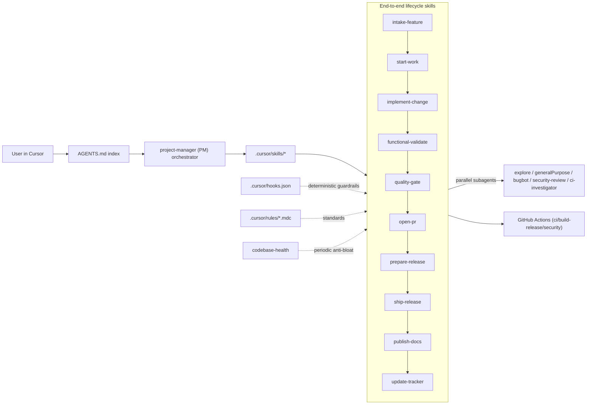
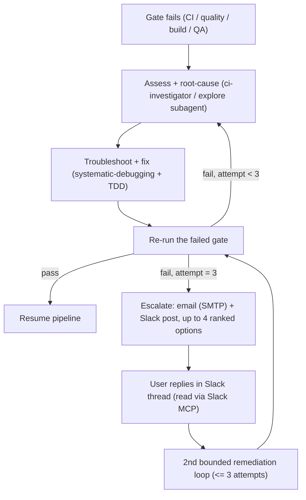

# Agentic End-to-End CI/CD Pipeline

## Assumptions (from skipped scoping questions — override any)

- Scope: this repo first, assets designed portable.
- Tracking: keep local `docs/TODO-ROADMAP.md` + `docs/issues/<ID>/`, restructured.
- Mechanism: Skills (user-invokable) + a few deterministic Hooks + `AGENTS.md`.

## Assessment: current state

**In place (keep):** 4 workflows ([ci.yml](.github/workflows/ci.yml), [build-release.yml](.github/workflows/build-release.yml), [security.yml](.github/workflows/security.yml), [pages.yml](.github/workflows/pages.yml)); local gates ([.pre-commit-config.yaml](.pre-commit-config.yaml), [pyproject.toml](pyproject.toml) 60% floor, [.flake8](.flake8)); 16 `.cursor/rules/*.mdc`; [scripts/check-version-sync.sh](scripts/check-version-sync.sh); [docs/TODO-ROADMAP.md](docs/TODO-ROADMAP.md). This infra was originally stood up by the completed `ci_cd_pipeline_implementation` plan (7/7 done) — this plan *extends* it into an agent-driven, user-invokable pipeline.

**Prior plans already covering parts of this scope (build on, don't duplicate):**
- `ci_cd_pipeline_implementation` — Done: created ci.yml/security.yml, pre-commit, coverage gate, rule alignment.
- `protect_main_branch` — ✅ Resolved (M5, SEC-2): branch protection applied on `main` via API — required status checks (`quality-gate`, `unit-tests (3.11/3.12)`, `integration-tests`), `enforce_admins:false` (admin bypass), force-push + deletion disabled.
- `bug_tracking_documentation_update` — Not-started (0/4): proposed a "Known Issues" register in roadmap/CHANGELOG; likely superseded by `fix_pre-release_bugs` (Done). Reconcile into the new tracking model.

**Missing:**

- Agentic orchestration layer: no repo-local `SKILL.md`, no `.cursor/hooks.json`, no [AGENTS.md](AGENTS.md). Rules are advisory only — nothing composes them into a repeatable, user-triggered flow.
- GitHub collaboration scaffolding: no PR template, no `.github/ISSUE_TEMPLATE/`, no `CODEOWNERS`, no `dependabot.yml`, no labels config.
- Plan hygiene: ~96 prior plan files for this project live in the shared `~/.cursor/plans/` dir (not indexed in-repo), including several empty/duplicate stubs and many "Not-started" plans whose work actually shipped (frontmatter status was never written back). No single index reconciles plans against actual release state.

**Redundant / drifting:**

- Stale rules vs reality: `ci-pipeline-13.mdc` says 49% coverage (CI enforces 60%); `release-packaging-12.mdc` calls `src/app.py` canonical, but [scripts/check-version-sync.sh](scripts/check-version-sync.sh) treats `src/__init__.py` as canonical.
- [docs/TODO-ROADMAP.md](docs/TODO-ROADMAP.md) is monolithic (~400 lines mixing session-history narrative + Done archive + live backlog).
- `docs/README.md` tree omits still-referenced `docs/issues/`.

**Live process drift (to remediate as first run of the new process): ✅ Resolved (M5).** The 1.6.0 work was landed on `develop`, `RELEASE_NOTES_v1.6.0.md` created under `docs/releases/`, `develop`→`main` merged (`2c9368b`), tagged `v1.6.0`, and shipped via the new `prepare-release`/`ship-release` flow — the pipeline's own first production release.

**Optimize (decided — block on quality): ✅ Resolved (M5).** [build-release.yml](.github/workflows/build-release.yml) `quality-gate` + `test` jobs are now BLOCKING (`continue-on-error` removed) and `build` declares `needs: [quality-gate, test]`, so release artifacts build only after gates pass. Verified on the v1.6.0 run.

## Target architecture

Skills = the repeatable procedures the agent follows; Rules = the standards they enforce; Hooks = hard, non-bypassable guardrails; AGENTS.md = the single discoverable entry point.

## Implementation sequence (milestones + MVP)

Execution is milestone-ordered to respect dependencies (skills before AGENTS.md/capabilities-catalog; lifecycle skills before the autonomous loop; portability before ADF extraction). Each milestone ends green (quality gate passes) and is independently valuable, so we ship incrementally rather than big-bang.

**Progress (as of 2026-08-01):** M0 ✅ · M1 ✅ · M2 ✅ · M3 ✅ · M4 ✅ · M5 ✅ done and pushed to `origin/develop`+`origin/main`. **v1.6.0 shipped** (tag `v1.6.0`, merge `2c9368b`, build-release run `30703978929` green, 3 artifacts published as latest). Next: **M6 (ADF portability extraction)**. See `docs/PROJECT-STATUS.md`/`docs/DECISIONS.md` for recorded gates; commits: M0 baseline, M1 foundation, M2 `724d1a7` lifecycle skills, M3 `6763630` orchestration, M4 `c89172d` tracking/docs, M5 release hardening + `95dc881` test network guard.

- **M0 — Baseline (§0): ✅ DONE.** Segmented + committed 1.6.0 work to `develop`, documented known state (`docs/PROJECT-STATUS.md` + roadmap), recorded green gate.
- **M1 — Foundation: ✅ DONE.** Rule reconciliation (§4: coverage 60, `src/app.py` canonical version-sync, `agentic-workflow-16.mdc`), `AGENTS.md` (§1), hooks (§3: `guard-git.sh` + `hooks.json`), GitHub scaffolding (§5: PR/issue templates, CODEOWNERS, dependabot, labels), repo-structure rule + `REPO-STRUCTURE.md` (§11 standard).
- **M2 — Lifecycle skills (§2): ✅ DONE.** Authored the 11 stage skills, `.cursor/skills/CATALOG.md` capabilities-catalog + authoring standard, and `scripts/check-skill-conformance.py` conformance check wired into `ci.yml` (§34). Core prior-art patterns 1–6 woven into the skills.
- **M3 — Orchestration: ✅ DONE.** `project-manager` skill (§15, PM commands + guardrailed autonomy + portfolio; global `~/.cursor/pm/projects.md` seeded), `deliver-autonomously` (§13 intake→ship loop driven by the state machine + budgets), `remediate-failure` (§16 bounded 3-attempt loop) + `src/utils/notifier.py` (SMTP escalation, 20 tests) + Slack-reply model + `notifications:` config, `docs/DECISIONS.md` (§24 decisions + memlog), governance/kill-switch/budgets (§22), single-writer + crash-recovery (§27), flaky-quarantine marker (§21 partial). Meta-governance/precedence (§25) via AGENTS.md/`agentic-workflow-16`.
- **M4 — Tracking & docs consolidation: ✅ DONE.** Register restructure (§6: roadmap trimmed + state machine + `ROADMAP-ARCHIVE.md`), plan-index reconciliation (§9: 174 plans → `PLANS-INDEX.md`, 12 obsolete deleted, SEC-2/OPS-1 promoted), master doc (§8: `AGENTIC-CICD-PIPELINE.md`), multi-surface docs-accuracy audit (§10), structural cleanup (§11: `docs/releases/`, `CHANGELOG-ARCHIVE.md`, `.archive/` untracked, `clean-workspace.sh`, workspace file renamed), metrics scaffold (§20: `PIPELINE-METRICS.md`).
- **M5 — Release hardening: ✅ DONE.** Blocking release gates (§5: removed `continue-on-error`, `build` needs `quality-gate`+`test`; branch protection on `main` SEC-2 admin-bypass), `hotfix`/`rollback` skills (§18), `maintain` skill (§28), `.cursor/pipeline.yml` manifest (§30 seed), cross-OS QA plan + `qa-cross-os` CI job + update-pill readiness tests, then formally **shipped `v1.6.0`** via `prepare-release`/`ship-release` (§7). Post-ship: `tests/conftest.py` network guard fixed the local suite-hang (§21).
- **M6 — ADF extraction (portability): ⬜ NEXT.** §29-§35 + rollout Phases B-D. `.cursor/pipeline.yml` exists (M5) but skills don't yet read commands from it via an adapter.

**MVP (ship value early):** M0 + M1 + M2 + a minimal release path = a usable, repeatable, user-invokable pipeline. **M0–M5 are complete and v1.6.0 shipped through the pipeline**, proving the full intake→ship→hardening path end-to-end. Only M6 (portable ADF extraction) remains.

## Work plan

### 0. Pre-implementation baseline (RUN FIRST — establish a known state)

Before any pipeline work begins, snapshot the repo in a clean, documented state so the build starts from a known baseline and current in-flight development is segmented as its own commit:
- **Segment current work:** commit the uncommitted working-tree + `1.6.0` changes as a self-contained, conventional commit on the correct branch (move off `main`→`develop` per `change-control-07` if needed). This isolates existing development from the pipeline build in git history. Confirm before touching branches/history. **This step ONLY commits + documents (lands the work safely on `develop`); it does NOT tag or publish a release** — the formal `1.6.0` release runs later through `prepare-release`/`ship-release` in §7 once those skills exist.
- **Document the known state:** update `docs/TODO-ROADMAP.md` (status + "Last updated"), `CHANGELOG.md` (`[Unreleased]`/`[1.6.0]` entries for the current changes), and a pre-plan tracking note (`docs/PROJECT-STATUS.md` baseline snapshot) so the code state and what it contains are clearly recorded.
- **Verify green:** run the quality gate (version-sync, black, flake8, mypy, pytest) and record the result as the baseline.
- Only after this baseline is committed and documented does §1 onward begin. This step is itself a first manual rehearsal of the `prepare-release`/`update-tracker` skills.

### 1. Orchestration entry point — `AGENTS.md`

- Root `AGENTS.md` indexing the lifecycle, which skill to invoke per stage, where canonical files live, the golden path (intake→ship), and the Pipeline Menu (§17). Portable header + repo-specific section. Kept current automatically via the `continual-learning` skill + `agents-memory-updater` subagent (mines chat transcripts at session end).

### 2. Repo-local Skills (`.cursor/skills/<name>/SKILL.md`)

Each skill: trigger description, preconditions, deterministic numbered steps, subagent-delegation notes, and a completion checklist mirroring the relevant rule.

- `intake-feature` — capture a feature/bug request into the single tracking register with an ID, priority (P0–P3), risk, and acceptance criteria; present it for user review/approval; on approval it can hand off to autonomous delivery. Uses Atlassian MCP if the item mirrors to Jira/Confluence. Produces a minimal `spec.md` (Why/Capabilities/Constraints/Non-goals/Success-signal) for non-trivial items (prior-art pattern; consumed by §13/§23).
- `start-work` — create `feature/*` or `fix/*` off `develop`, add register entry (Planned→In progress), optional `.cursor/plans/*.plan.md`, `docs/issues/<ID>/`.
- `implement-change` — TDD loop, architecture/module-boundary guardrails (`architecture-03`), docstring/logging standards; dispatches parallel `explore` subagents for research.
- `functional-validate` — for UI/behavior changes, run Playwright/`test_ui.py` functional checks + capture screenshots; verify the change works end-to-end before review.
- `quality-gate` — run local equivalent of CI: `check-version-sync.sh`, black, flake8 (+E722), mypy, pytest with coverage floor + regression tests; **iterate-until-green** loop; report pass/fail before commit.
- `open-pr` — conventional-commit, push to `develop`, open PR via `gh` using the new template; dispatch `bugbot` + `security-review` subagents in parallel and fold results back.
- `prepare-release` — bump all 6 version locations (incl. in-app `APP_VERSION`/README badge), fold `[Unreleased]`→`[X.Y.Z]`, generate `RELEASE_NOTES_vX.Y.Z.md`, run full quality gate, produce release checklist.
- `ship-release` — merge develop→main, tag `vX.Y.Z`, push, verify [build-release.yml](.github/workflows/build-release.yml) artifacts via `gh`.
- `publish-docs` — multi-surface doc consistency: (a) GitHub README/CHANGELOG/`docs/`, (b) the in-app documentation section (`frontend/templates/` docs modal content), and (c) Confluence page `6664028496` via the Atlassian MCP — **drafts/updates then PAUSES for user confirmation before publishing** (Confluence is customer/exec-facing). Verifies version/feature/workflow text reflects actual current product state.
- `codebase-health` — periodic anti-bloat sweep: detect orphan/unreferenced files, dead code, duplication, oversized modules, and content stored in inconsistent locations; propose archival to `.archive/` per the structure standard. Delegates scanning to parallel subagents.
- `update-tracker` — maintain the single register (live backlog + Done archive + plans index), "Last updated", Next steps; keep CHANGELOG/register in sync.
Portability: keep repo-specific paths in a clearly marked block per skill. Every skill states which existing rules/subagents/MCPs it leverages.
- **Skill-authoring standard (prior-art pattern):** keep each `SKILL.md` under ~500 lines with deep content moved to a `references/` subfolder; register every skill in a single `capabilities-catalog` routing index (used by the PM and `AGENTS.md` to select skills); a credential-free CI check validates each skill's frontmatter + required sections (§34).

### 3. Deterministic guardrails — `.cursor/hooks.json`

- Pre-commit-style hook(s) that block on: secrets (gitleaks), version-sync mismatch ([scripts/check-version-sync.sh](scripts/check-version-sync.sh)), and warn on direct commits to `main`. Keep hooks minimal and fast; heavy checks stay in the `quality-gate` skill + CI.

### 4. Reconcile rules with reality

- Update `ci-pipeline-13.mdc` (49%→60%). **Decision: `src/app.py` `APP_VERSION` is the single canonical version source** — update `scripts/check-version-sync.sh` (which currently treats `src/__init__.py` as canonical) plus the wording in `release-packaging-12.mdc`/`change-control-07.mdc` so all three agree on `src/app.py`. Add a short new rule `agentic-workflow-16.mdc` pointing at `AGENTS.md`/skills as the process entry point.

### 5. GitHub collaboration scaffolding

- Add `.github/PULL_REQUEST_TEMPLATE.md`, `.github/ISSUE_TEMPLATE/{bug_report,feature_request}.yml` + `config.yml`, `CODEOWNERS`, `.github/dependabot.yml` (pip + actions), and a `.github/labels.yml` (or document the `security` label the workflow expects).
- **Decided — blocking release gates:** make [build-release.yml](.github/workflows/build-release.yml) quality-gate + test jobs BLOCKING for all tags (remove `continue-on-error: true`); artifacts build only after gates pass. Branch protection keeps `main` green, so this rarely bites.
- Complete the pending `protect_main_branch` items: enable branch protection on `main` (+ optionally `develop`) requiring `quality-gate`, `unit-tests`, `integration-tests` status checks and 1 approval. This is an org/GitHub-settings action the agent can guide but not fully self-apply.

### 6. Consolidate project tracking into ONE auto-maintained register

- Declare a single source of truth for all work items. Recommended: keep [docs/TODO-ROADMAP.md](docs/TODO-ROADMAP.md) as the register but restructure it — live backlog (Planned/In progress) up top; move the Done history to `docs/ROADMAP-ARCHIVE.md`; strip the inline session-history narrative (CHANGELOG covers it); merge the scattered `docs/issues/<ID>/` and the new `docs/PLANS-INDEX.md` into it by reference so there is exactly one place to look.
- Every item carries: ID, type (BUG/FEAT/CHG), priority (P0–P3), status, acceptance criteria, links. The `intake-feature` and `update-tracker` skills keep it current automatically on every change; CI structural validation still passes. Fix `docs/README.md` tree to include `docs/issues/`.
- **Work-item state machine (prior-art pattern):** each item advances through a canonical lifecycle — `draft → ready-for-dev → in-progress → in-review → done → blocked`. The delivery loop (§13) is driven off this state field so unattended runs are resumable and "where is everything" is unambiguous. Non-trivial items reference a minimal `spec.md` (§13) from the register.

### 7. Remediate current in-flight `1.6.0` drift (first real run of the new process)

- Use `prepare-release` + `ship-release` skills to land the uncommitted 1.6.0 work properly: move to `develop`, create `RELEASE_NOTES_v1.6.0.md`, fast-forward `develop`, then merge→tag→verify. (Confirm before executing since it touches git history/branches.)

### 8. Master reference doc

- `docs/development/AGENTIC-CICD-PIPELINE.md`: the end-to-end map, when to invoke each skill, the golden path, and how to port the framework to other repos.

### 9. Plan-inventory reconciliation — validate AND act (decision: act-with-gate)

Not just an index — a validated, action-taking pass over all ~96 prior plans. For each, verify actual state against code + release tags (v1.5.0/v1.5.7/v1.5.8) and current workflows, then act per category:

- **Shipped but frontmatter never updated** (e.g. `v1.5.8_release_prep`, `v1.5.8_release_batch`, `pre-release_cleanup`, `rpt-6_net-2_diagram_fixes`, `macos_intel_support`): confirm via tags/code, then **auto-correct** — mark plan frontmatter Done, move to the Done archive, add/confirm CHANGELOG coverage. No new code.
- **Superseded / duplicate / empty stubs** (e.g. `ui_and_software_mgmt_enhancements_e6c62c5d` 0/0; `vnetmap_port_mapping`->`vnetmap_+_network_diagram`; `one-shot_mode_advanced_ops`->`oneshot_mode_aligned_plan`; `health_check_module`->`health_check_full_build`; `dashboard_mechanical_odometer`->`vast_logo_progress_indicator`; legend/portrait mockups; `bug_tracking_documentation_update`->`fix_pre-release_bugs`; `reporter_page_staging`): **auto-delete empty/dupes and annotate superseded** with the surviving plan reference (deletions surfaced as a reviewable batch per the PM guardrail).
- **Mostly shipped, minor residual tails** (`tech-port_stack_v1.5.7` 17/18, `tp-1_fix_+_ui_investigation` 6/7, `switch_discovery_workflow` 6/7, `nav_devmode_and_log_levels` 9/10, `pre-release_readiness_plan` 7/10): validate the residual item; if already done, close it; if genuinely open, promote the single tail into the tracker.
- **Genuinely open / worth revisiting** (`node_management_map_table`, `ui_and_software_mgmt_enhancements`, `segment_results_by_psnt`, `port_mapping_and_diagram_fixes`, `expose_asbuilt-reporter_remotely`, `one-shot_switch_placements`, `cnode_management_status_check`, `post_install_validation_gap_analysis` 10/13, `protect_main_branch` 1/4): validate remaining scope, then **present a prioritized list for your sign-off before implementing** (implementation runs through the autonomous delivery loop once approved).
- Output: `docs/PLANS-INDEX.md` recording each plan's reconciled state + action taken, and the restructured `docs/TODO-ROADMAP.md` register carrying the promoted open items. Associated documentation/tracking corrections (CHANGELOG, roadmap, `docs/issues/`) are applied as part of the same pass.

### 10. Multi-surface documentation consistency (GitHub + in-app + Confluence)

- One-time audit + ongoing `publish-docs` skill ensuring every doc surface reflects the actual current product: (a) GitHub `README.md`/`CHANGELOG.md`/`docs/`; (b) the in-app documentation section rendered from `frontend/templates/` (e.g. the docs/tabbed modal); (c) Confluence page `6664028496` via the Atlassian MCP (`getConfluencePage`/`updateConfluencePage`) — staged as a draft that requires user confirmation before publishing. Version, feature list, and operational-workflow text are cross-checked so all three surfaces agree.

### 11. Repository structure standard + baseline consolidation + orphan/stale sweep

**Audit result (current state).** Docs organization (`docs/{deployment,development,api,confluence,marketing,issues}/`) and `tests/`, `.github/`, `.cursor/rules/`, `packaging/`, `scripts/`, `assets/hardware_images/` are already sound. Concrete problems to fix: (a) five `RELEASE_NOTES_v*.md` sprawled at repo root and a 185 KB unbounded `CHANGELOG.md`; (b) `.archive/` is still **tracked in git** despite the pre-1.5.8 intent to stop pushing it; (c) stray loose docs at `docs/` root (IPv6 findings + Slack notes, PRE-RELEASE-QA, POST-INSTALL, TELEPORT-MODE) not indexed by `docs/README.md`; (d) generated/runtime dirs balloon the working tree (`reports/` 909, `logs/` 483, `import/`, `clusters/`, `output/`, `telemetry/`, `build/`, `dist/`, `test_output/`, `tracer-output/`) plus stray root `web_app.log`/`app.log`/`.coverage`/`coverage.xml`/`.DS_Store` — all gitignored but no single runtime root and no clean script; (e) naming drift (`ps-deploy-report.code-workspace` and the GitHub Pages one-pager path vs the `vast-asbuilt-reporter` repo); (f) flat `src/` (~28 top-level modules, several 100–260 KB) that does not reflect the layered architecture in `architecture-03`.

**Canonical streamlined baseline (target).** Documented in a new rule `repo-structure-17.mdc` and `docs/development/REPO-STRUCTURE.md`:
- Repo root holds only config + entry docs (`README.md`, `CHANGELOG.md`, `AGENTS.md`, `requirements*.txt`, `pyproject.toml`, dotfiles). No release notes, logs, or generated artifacts at root.
- `src/` application code; layered-package map documented (pipeline: `api_handler`/`data_extractor`/`report_builder`; portmap: `port_mapper`/`enhanced_port_mapper`/`external_port_mapper`/`vnetmap_parser`; diagrams: `network_diagram*`/`rack_diagram`; advanced: `advanced_ops`/`oneshot_runner`/`script_runner`/`tool_manager`/`session_manager`/`result_*`; web: `app.py`). **Decision: existing `src/` stays flat; the layered map is enforced for NEW modules only.** A phased subpackage refactor of existing modules is logged as a deferred backlog item (out of this pipeline's scope due to 40+ test-import churn).
- `tests/` mirrors `src/`; `docs/` holds all documentation with the new sub-homes below; `config/` (runtime gitignored); `packaging/`, `scripts/`, `frontend/`, `assets/`, `.github/`, `.cursor/`.
- **New pipeline artifacts land in fixed homes:** `AGENTS.md` (root), skills in `.cursor/skills/`, and under `docs/`: `DECISIONS.md`, `PIPELINE-METRICS.md`, `PLANS-INDEX.md`, `PROJECT-STATUS.md`, `ROADMAP-ARCHIVE.md`, `CHANGELOG-ARCHIVE.md`, `releases/`, and `development/AGENTIC-CICD-PIPELINE.md` + `development/REPO-STRUCTURE.md`.
- **Generated/runtime convention:** a single documented, gitignored set (`logs/ output/ clusters/ reports/ import/ telemetry/ build/ dist/ test_output/ tracer-output/ archive/`) plus a `scripts/clean-workspace.sh` (`make clean`) to purge them.

**Baseline consolidation actions (decided — one-time cleanup PR, in git history + `pre-1.5.8-cleanup` tag for safety):**
1. Create `docs/releases/`; move the five root `RELEASE_NOTES_v*.md` there. `prepare-release`/`ship-release` write new notes here going forward.
2. Split `CHANGELOG.md`: keep the most recent minor lines, move older entries to `docs/CHANGELOG-ARCHIVE.md` (link from the top).
3. Remove `.archive/` from git tracking (`git rm --cached`); keep it gitignored + local-only. Content survives in history + the cleanup tag. This makes the archival convention actually true.
4. Relocate/index stray top-level docs: working notes (IPv6 findings + Slack) → `docs/development/` or `docs/issues/<ID>/` (or drop if ephemeral); keep TELEPORT-MODE / PRE-RELEASE-QA / POST-INSTALL as guides but list them in `docs/README.md`.
5. Purge stray working-tree artifacts (`web_app.log`, `app.log`, `.coverage`, `coverage.xml`, `.DS_Store`) and add `scripts/clean-workspace.sh`.
6. Rename `ps-deploy-report.code-workspace` -> `vast-asbuilt-reporter.code-workspace`; log the GitHub Pages path rename as a low-priority follow-up (external URL).

**Enforcement + reuse.** `repo-structure-17.mdc` + `codebase-health` (anti-bloat + structure/orphan sweep) run the recurring orphan/dead-file/duplication/drift sweep (proposing archival or consolidation with a diff for approval); a lightweight `hooks.json` warn fires when a new file lands outside the standard; the `bootstrap-pipeline` installer (§26) seeds the same baseline in sibling repos. AGENTS.md and the master doc reference `REPO-STRUCTURE.md` so every new skill/agent/workflow/doc adheres to the optimized structure by default.

### 12. Code review and anti-bloat workflow

- Recurring agentic code-review pass (triggered per PR and on a periodic cadence) using the `bugbot` and `security-review` subagents plus targeted `explore` subagents to flag: dead code, high-complexity/oversized modules, duplication, and boundary violations (`architecture-03`). Output is a prioritized refactor list added to the tracker — cleanup ships as small `refactor(...)` PRs, never batched indefinitely. This keeps operation optimized and prevents bloat accumulation.
- **Independent reviewer (prior-art pattern):** reviews are performed by a FRESH subagent that did NOT write the code; two rejections escalate to the §16 remediation loop. This applies per-task during implementation as well as per-PR, so defects are caught and bounded early rather than only at release.

### 13. Autonomous feature-enhancement delivery loop (minimal intervention)

- End-to-end loop the user triggers once per approved item: `intake-feature` (submit + user approval gate) → `start-work` → `implement-change` (TDD, parallel research subagents) → `functional-validate` (Playwright/UI) → `quality-gate` (iterate-until-green) → QA/regression tests → `open-pr` (bugbot + security-review) → merge → `publish-docs` → `update-tracker`. The only required human touchpoints are submission and approval; the agent + subagents run the rest. Reuses the existing `reusable_improvement-loop_skill` iterate pattern.
- **Spec-first + consistency (prior-art pattern, right-sized):** for non-trivial items the loop first produces a minimal `spec.md` (Why/Capabilities/Constraints/Non-goals/Success-signal) and runs a cross-artifact consistency check (spec ↔ plan ↔ tasks ↔ code) before `implement-change`; trivial fixes skip the ceremony (adjustment A). The loop is driven by the §6 work-item state machine, enabling resumable unattended execution.

### 14. QA and coverage policy (enforced by skills + CI)

- Mandatory: every FEAT adds tests for new behavior; every BUG adds a failing-first regression test; coverage floor ratchets upward over time (60% now → toward 80% per `docs/TODO-ROADMAP.md` TSE items), never downward. `quality-gate` and CI enforce it; bug-fix PRs are rejected without a regression test.

### 15. Cross-project Project Manager (PM) agent

A single, highly-capable orchestrator that sits above the lifecycle skills, maintains project awareness, and drives work with guardrailed autonomy. Reusable across all your projects (this repo, VAST Plan Analyzer, recipe app, install dashboard).

**Form (decision: hybrid state):**
- Global skill `~/.cursor/skills/project-manager/SKILL.md` — the PM procedure/brain, available in every workspace.
- Per-project committed `docs/PROJECT-STATUS.md` — that project's source of truth: current status, outstanding issues, priorities, next steps, pending questions/decisions, and recommendations. The PM reads and maintains it.
- Global index `~/.cursor/pm/projects.md` — registry of known projects, each pointing at its `PROJECT-STATUS.md` and repo path, so the PM can answer cross-project.

**Capabilities:**
- Report on demand: current status, outstanding issues, priorities, next steps, open questions/decisions, and recommendations (reads `PROJECT-STATUS.md` + tracker + git + CI state).
- Plan and assign: decompose plan items into tasks and dispatch **parallel subagents** (`explore`/`bugbot`/`security-review`/`ci-investigator`) and lifecycle skills; integrate results.
- Assess new requirements: intake, classify, prioritize (P0–P3 with pros/cons), and route through `intake-feature` -> autonomous delivery loop.
- Gap detection + efficiency recommendations: continuously flags drift, redundancy, and optimization opportunities with tradeoffs.
- Proactively follows and leverages ALL available resources: the 16 Rules, repo-local + global Skills, SubAgents, Plugins/Tools, Hooks, and MCPs (Atlassian/Slack/GitLens) — choosing the right tool per task.

**Guardrailed autonomy (decision: guardrailed):** the PM autonomously researches, plans, tracks, writes docs/tests, creates branches, and opens PRs. It PAUSES for explicit approval before: merging to `main`, releasing/tagging, deleting files, and any force/destructive git operation. Every pause is surfaced with a concise decision brief (options + pros/cons + recommendation).

**Invocation:** user-triggered via the skill (e.g. "PM: status", "PM: next", "PM: intake <request>", "PM: run <plan item>"). Optional phase-2 Automation runs a scheduled PM sweep (status refresh + drift/CI/security check) — deferred unless you want it.

**Relationship to the rest:** the PM is the entry point `AGENTS.md` points to; it composes the lifecycle skills (§2) rather than duplicating them, and it owns keeping `PROJECT-STATUS.md` + the tracker (§6) in sync.

### 16. Failure remediation loop + escalation notification

Any failed gate (`quality-gate`, CI, blocking `build-release`, `functional-validate`, QA/regression) triggers a bounded, agent-driven assess → troubleshoot → solve loop, escalating to a human when automated attempts are exhausted. This wraps and bounds the "iterate-until-green" behavior in §2/§13.

- **Bounded auto-remediation (max 3 attempts per issue):** new `remediate-failure` skill that **composes the local `iterative-improvement-loop`** (its `stop.maxCycles` enforces the exact 3-attempt bound and gives ready-made scoring/plateau/stop scripts) plus `systematic-debugging` and `dispatching-parallel-agents` — (a) classify the failure (lint/type/test/build/security/runtime), (b) delegate root-cause to the `ci-investigator` subagent (CI) or `explore`/`generalPurpose` (local), (c) apply a fix per systematic-debugging + TDD, (d) re-run the failed gate. Repeat up to 3 iterations for the SAME issue. Each attempt (hypothesis, change, result) is logged to `docs/issues/<ID>/` and the tracker. The same bounded assess→fix→re-run pattern — with a FRESH reviewer/debugger subagent — also runs at the per-task level inside `implement-change`/`quality-gate`, not only on release gates (prior-art pattern: independent reviewer + bounded auto-debug), so defects are caught and bounded early.
- **Escalation after 3 failures:** stop auto-attempts and send a structured escalation containing (1) failure description (what/where/which gate), (2) assessment / root-cause hypothesis, (3) actions taken across the 3 attempts, (4) up to 4 ranked next-step options/recommendations with pros/cons. Redact secrets via the existing `SensitiveDataFilter`. Mirror to the tracker (and optionally Slack).
- **Notifier:** new `src/utils/notifier.py` sends the escalation **email via SMTP** (Gmail/O365 app password), config-driven via a `notifications:` block in `config/config.yaml` (recipient, from-addr, SMTP host/port; app-password + creds via env vars per `config-security-11`, never hardcoded). Reuses log-sanitization so no tokens/passwords leak into the email.
- **Reply-driven 2nd loop (via Slack):** the escalation is ALSO posted to Slack via the Slack MCP (`slack_send_message`) with the up-to-4 ranked options; the user replies in that Slack thread, and the agent reads it (`slack_read_thread`) to capture the chosen option and launch a second bounded (<=3) remediation loop scoped to that path. Email is the formal record/notification; Slack is the interactive reply channel (an agent can read Slack threads, unlike an inbound mailbox).

**Decided:** escalation email via SMTP; interactive reply over Slack via the Slack MCP. Both fire on the same escalation event.

### 17. Pipeline menu (grouped, discoverable)

A single discoverable menu of every invokable pipeline option so the user always knows what is available and how to trigger it. Delivered as (a) a "Pipeline Menu" section in `AGENTS.md` and (b) a `PM: menu` command on the PM orchestrator that prints it live. Grouped by function:

- **Intake & planning:** `intake-feature`, `brainstorming`, `writing-plans`, `PM: intake <request>`, `PM: status`, `PM: next`.
- **Develop:** `start-work`, `implement-change` (TDD), `using-git-worktrees`, parallel `explore` research.
- **Validate & QA:** `functional-validate` (Playwright), `quality-gate`, coverage ratchet, `verification-before-completion`.
- **Review & change-control:** `open-pr`, `review-bugbot`, `review-security`, `requesting/receiving-code-review`, branch protection.
- **Release:** `prepare-release`, `ship-release`, `finishing-a-development-branch`.
- **Docs & consistency:** `publish-docs` (GitHub + in-app + Confluence), docs-drift audit, `generate-status-report`.
- **Tracking:** `update-tracker`, `triage-issue`, `spec-to-backlog`, plan-inventory reconciliation (§9).
- **Hygiene & health:** `codebase-health` (anti-bloat + structure/orphan sweep), `continual-learning` (AGENTS.md refresh).
- **Failure handling:** `remediate-failure` (bounded loop) + SMTP/Slack escalation (§16).
- **Orchestration:** `PM: run <item>`, `orchestrating-subagents`, `dispatching-parallel-agents`, `subagent-driven-development`.

### 18. Rollback and hotfix path

- `hotfix` skill: branch `hotfix/<id>` off the released tag (not `develop`), apply the minimal fix + failing-first regression test, run a fast-tracked quality gate, cut a patch release, then back-merge to `develop` and `main`.
- `rollback` procedure: re-point the GitHub Release "latest" to the prior good tag and/or replace a broken artifact; document how users downgrade. Rollback is the FIRST option offered when a post-release smoke test fails.
- The post-release smoke test feeds the §16 remediation/escalation loop, which chooses rollback vs hotfix.

### 19. Pipeline secrets and credentials strategy

- One documented model: local secrets in a gitignored `.env` (via `python-dotenv`, already a dependency) + env vars; CI secrets in GitHub Actions repository secrets; MCP auth via the plugin auth flow. Nothing in git (the gitleaks hook enforces).
- Documented secrets registry (values never committed): `SMTP_*`, Slack (via MCP or `SLACK_*`), `gh`/`GITHUB_TOKEN`, Atlassian MCP auth, optional `CURSOR_API_KEY`. Aligns with `config-security-11`.
- The new notifier + Slack + Confluence integrations get a `security-review` pass (new attack surface: template injection into emails, credential handling).

### 20. Pipeline metrics and observability

- Track + report (via the PM using `generate-status-report`): DORA-style lead time, change-failure rate, MTTR (from §16 remediation logs), plus coverage trend, test pass rate, escalation count, and backlog open/close velocity.
- Sourced from git history, CI runs (`gh run list`), the tracker, and `docs/issues/<ID>/` logs; refreshed into `docs/PIPELINE-METRICS.md` (or a PROJECT-STATUS section) each release. This is how we verify drift is actually decreasing over time.

### 21. Test reliability: flaky quarantine + budgets

- Flaky-test policy: a failure that passes on re-run is flagged, marked `@pytest.mark.flaky`/quarantined (excluded from the blocking gate but tracked as a BUG to fix) so the §16 loop never burns attempts on nondeterminism. Reuse the existing `pytest-timeout` setup to bound hangs.
- Budgets: every autonomous loop carries a wall-clock/turn/cost ceiling; on exhaustion it escalates (§16) instead of spinning.

### 22. Autonomy governance + kill switch

- Global budget per autonomous run (max cost/turns, max parallel subagent fan-out) in the PM config; exceeding it pauses and escalates.
- Explicit human controls: `PM: pause` / `PM: stop` halt an in-flight run; every destructive/irreversible action (merge to `main`, tag/release, file deletion, force git) already pauses for approval (§15). A dry-run/`--check` mode previews actions before executing.

### 23. Definition of Done (DoD) gate

- One canonical DoD checklist every FEAT/BUG must satisfy before it can close: tests added/updated (failing-first for BUGs), coverage not decreased, docs + CHANGELOG updated, review subagents clean, tracker/register updated, `functional-validate` passed for UI changes. Enforced by `quality-gate`/`open-pr` and mirrored in the PR template.
- **Strict acceptance validation (prior-art pattern):** the item's `spec.md` must contain testable GIVEN/WHEN/THEN acceptance criteria, and the DoD rejects items whose acceptance scenarios are missing or unverifiable — locking intent to verifiable outcomes before an item can close. Right-sized per adjustment A (skipped for trivial fixes).

### 24. Decision / audit log

- Append-only `docs/DECISIONS.md` (ADR-lite): every approval, plan decision, superseded/deleted plan, and escalation resolution recorded with date + rationale + approver. The PM maintains it; it is the traceability backbone for change-control and the "open decisions" list.
- **Memlog (prior-art pattern):** implemented as an append-only working-memory primitive that ALL skills and subagents append to (not just the PM) — shared, chronological, and machine-readable — so it doubles as the coordination + crash-recovery ledger consumed by §27.

### 25. Meta-governance + source-of-truth precedence

- The pipeline governs itself: changes to rules/skills/hooks/`AGENTS.md` go through the same branch → PR → review → gate flow (they are code).
- Declared precedence to prevent meta-drift — instructions: user > `AGENTS.md` > `.cursor/rules/*` > skills > defaults; project state: `docs/TODO-ROADMAP.md` (live register) + `docs/issues/<ID>/` (per-item spec/plan/tasks/evidence), `CHANGELOG.md` (shipped history), `PROJECT-STATUS.md` (PM snapshot), `PLANS-INDEX.md` (plan reconciliation) — each with one clear owner.

### 26. Portability bootstrap installer

- A `bootstrap-pipeline` skill/script that drops the portable assets (AGENTS.md template, `.cursor/skills/*`, `.cursor/hooks.json`, `.github/` templates, rule stubs) into a new repo, parameterizes repo-specific paths, and runs a self-check (gates present, version-sync wired). Validated by adopting it in one sibling project (e.g. the VAST Plan Analyzer).

### 27. Concurrency, single-writer, and crash recovery

- Single-writer rule: never dispatch two implementer subagents editing the same files; partition parallel work by file/domain (per `dispatching-parallel-agents`). Coordinate with the running Flask dev server (stop/restart around git-affecting changes).
- Crash recovery: long runs use the durable ledger from `subagent-driven-development`, so a compaction/interruption resumes at the last completed task instead of redoing work. This ledger is the same append-only memlog as §24, so decisions, task state, and progress share one recoverable source of truth (prior-art pattern).

### 28. Ongoing maintenance (promoted from phase-2, now in scope)

- **Dependency updates:** agent triages Dependabot PRs — runs the full gate, reviews changelog/breaking changes, merges or escalates; keeps `requirements*.txt` current and pinned.
- **Success/stakeholder comms:** on a successful release, post a Slack announcement + a Confluence release page (draft-then-confirm) — not only failure escalations.
- **Config/data migration:** when config keys change (e.g. the new `notifications:` block), ship a migration/backfill so upgrading users' `config.yaml` updates safely; tracked in the `prepare-release` checklist.

## Packaged methodology: the portable Agentic Dev Framework (ADF)

This layer elevates the work from a repo pipeline to a distributable, versioned methodology applied to new and existing projects for consistent, repeatable outcomes ("rinse and repeat"). This repo is the **reference implementation**: build everything here first, designed portable (no hardcoded repo specifics; read from the manifest), then extract.

### 29. Framework core vs project instance (single source of truth)

- **Decision: a dedicated repo `agentic-dev-framework` (ADF)** is the canonical, versioned home of the portable core — global/shareable skills, the PM brain, templates (skills, rules, hooks, `.github`, `AGENTS.md`, `.env.example`, `REPO-STRUCTURE`), the structure standard, and the handbook. Projects adopt from it and never fork the core.
- **Project instance** = the parameterized assets stamped into each repo: `AGENTS.md` (framework base + project section), `.cursor/skills/` (adopted + local overrides), rules, `docs/PROJECT-STATUS.md`, tracker, and the manifest (§30). Precedence extends §25: user > project overrides > framework core > defaults.

### 30. Project manifest / capability profile

- One declarative `.cursor/pipeline.yml` per repo that every skill reads to adapt without modification: language + test/lint/format/type/build/release commands, coverage floor, release artifacts (dmg/zip | npm | docker | none), doc surfaces (GitHub / in-app / Confluence toggles), notification channels, branch strategy, version-source file(s), available MCPs, and adoption tier.
- **Decision: Python-first** — ship a working Python adapter (today's pytest/flake8/black/mypy/PyInstaller commands moved behind manifest keys, overridable), but design the manifest schema and skill seams to be **stack-agnostic** so future/parallel projects (Node, Go, Docker, etc.) plug in a new adapter without editing skills.

### 31. Framework versioning + propagation + overrides

- ADF carries its own semver + CHANGELOG and **dogfoods its own pipeline** (it is itself a project instance); it declares a deprecation policy for retired skills/rules.
- `update-framework` skill pulls a newer core version into an adopted project, merging (never clobbering) local overrides and presenting a diff for approval; each project records its adopted ADF version in the manifest so the portfolio view (§34) can flag drift.

### 32. Adoption flows: greenfield scaffold + brownfield adopt-existing

- `new-project` skill: scaffold a fresh repo with ADF pre-installed at a chosen tier + stack adapter (structure, gates, `AGENTS.md`, hooks, `.github`, manifest).
- `adopt-existing` skill: **idempotent, non-destructive, dry-run-first** brownfield onboarding — inventory current state, gap-analysis vs the standard, then incremental migration that reconciles (not replaces) existing CI/docs/structure, with rollback on request. This is the primary path for "all other projects." Both flows are re-runnable and preview changes before writing (ties to §22 dry-run + §27 crash-safety).

### 33. Adoption maturity tiers

- L1 (AGENTS.md + quality gates + release), L2 (+ PM + consolidated tracking + multi-surface docs), L3 (+ autonomous delivery loop + failure remediation + metrics + Confluence). The installer targets a tier so existing projects adopt incrementally instead of all-or-nothing.

### 34. Conformance doctor + portfolio dashboard

- `framework-doctor` scores a project's adherence (gates wired, version-sync present, required docs/structure/hooks present, manifest valid, ADF version current) and emits a compliance score + remediation list. Conformance also runs the credential-free `SKILL.md` schema/frontmatter check (prior-art pattern: skill-eval harness) so every skill is structurally valid and discoverable via the capabilities-catalog (§2) — this also "tests the pipeline itself."
- The PM (§15) gains a **portfolio roll-up** across `~/.cursor/pm/projects.md`: per-project tier, compliance score, ADF-version adoption, and cross-project metrics (§20) — the measurable proof of consistent outcomes across the fleet.

### 35. Methodology handbook + framework governance

- ADF ships `HANDBOOK.md`: principles, lifecycle map, roles (PM + subagents), invocation/menu, manifest reference, tier guide, greenfield + brownfield adoption guides, and the golden path — the "full packaged methodology" deliverable.
- Framework governance: changes to ADF go through ADF's own pipeline (meta-governance §25 applied to the framework itself).

### Rollout sequence (rinse and repeat)

- **Phase A** — implement the full pipeline in this repo as the portable reference implementation (all assets manifest-driven, no hardcoded specifics).
- **Phase B** — extract the portable core + handbook into the `agentic-dev-framework` repo; wire `update-framework`.
- **Phase C** — pilot `adopt-existing` on one sibling (VAST Plan Analyzer) to validate portability + the Python adapter; refine manifest/skills from real friction.
- **Phase D** — roll out to all remaining projects at their appropriate tier; the PM portfolio dashboard tracks adoption + compliance.

## Leverages existing assets (reuse and refine — do not rebuild)

Concrete mapping of existing resources to plan components (composition, not duplication):

**Superpowers plugin skills:**
- `subagent-driven-development` → the execution engine for §13 and the PM (§15): fresh implementer subagent per task + per-task spec/quality review + final whole-branch review + a durable progress ledger. **Decided: default engine for multi-task plan execution; lightweight in-session edits only for trivial 1-2 file changes.**
- `dispatching-parallel-agents` → parallel subagent delegation in §12/§16 and the PM.
- `test-driven-development` → `implement-change` + §14 QA policy (failing-first tests).
- `systematic-debugging` → `remediate-failure` (§16) root-cause loop.
- `verification-before-completion` → `functional-validate` and every "done" claim.
- `requesting-code-review` / `receiving-code-review` → `open-pr` alongside `bugbot`/`security-review`.
- `finishing-a-development-branch` → `ship-release` / branch completion.
- `brainstorming` → `intake-feature` design for non-trivial FEATs.
- `writing-plans` / `writing-skills` → authoring §2 skills and future plans.
- `using-git-worktrees` → isolation for parallel/experimental work.
- `using-superpowers` → the always-invoke-skills discipline embedded in `AGENTS.md`.

**Continual-learning plugin:**
- `continual-learning` skill + `agents-memory-updater` subagent → keep `AGENTS.md` and PM awareness current by mining chat transcripts. **Decided: run at session end / on request only, and propose the `AGENTS.md` changes for review before applying** (no silent auto-writes).

**Local skills (`~/.cursor/skills/`):**
- `iterative-improvement-loop` → mechanics for §16 remediation (its `stop.maxCycles` = the 3-attempt bound) and the §14 coverage/QA ratchet — config-driven with scoring + plateau/stop scripts. Reuse rather than hand-roll.
- `orchestrating-subagents` → PM task decomposition + dispatch.
- `reviewing-vast-deployment-plans`, `vast-data-brand-assets` → domain skills the pipeline calls when relevant.

**Atlassian MCP skills** (adapted to the LOCAL register + Confluence; Jira optional):
- `generate-status-report` → PM status reporting (§15) + Confluence publish path in `publish-docs` (§10).
- `triage-issue` → `intake-feature` de-dup/triage.
- `spec-to-backlog` → convert Confluence RFEs into tracker items.
- `search-company-knowledge` → PM cross-project/Confluence awareness.

**Rules (16):** reuse `architecture-03`, `change-control-07`, `documentation-08`, `todo-tracking-09`, `config-security-11`, `release-packaging-12`, `ci-pipeline-13`; add `agentic-workflow-16` + `repo-structure-17`.

**Subagents:** `explore`, `generalPurpose`, `bugbot`, `security-review`, `ci-investigator`, `agents-memory-updater` — dispatched in parallel where independent.

**MCPs:** Atlassian (Confluence publish; Jira optional), Slack (escalation replies §16 + notifications), GitLens/GitKraken (git/PR ops), nanobanana/stitch/magic (image/UI assets when needed).

**Existing CI:** the 4 workflows + `check-version-sync.sh` remain the enforcement backbone; skills mirror them locally.

**Note on Jira:** the Atlassian status/triage/backlog skills are Jira-oriented; per the local-tracking decision they will target `docs/TODO-ROADMAP.md` + `docs/issues/<ID>/` + Confluence page 6664028496. Wiring them to real Jira is a future toggle, not required.

## Bespoke enhancements from prior-art patterns

Decision: **Plan A (fully bespoke).** The mechanics below are adopted as PATTERNS we implement ourselves — no external code, packages, or tooling — informed by leading agentic frameworks. Core patterns 1-6 are woven into §2/§6/§12/§13/§16/§23/§24/§27/§34 above.

**Core (woven, in scope):** (1) minimal per-item `spec.md` + cross-artifact consistency check; (2) work-item state machine; (3) fresh independent-reviewer + bounded per-task auto-debug; (4) strict acceptance validation; (5) skill-conformance CI + capabilities-catalog + <500-line authoring standard; (6) append-only memlog working memory.

**Phase-2 / optional (adopt if/when they earn their keep):**
- **(7) Dependency graph + "next actionable" selector** in the tracker (§6/§15) — from Task Master's `next` model.
- **(8) Dedicated `fix-bug` workflow path** (reproduce → failing test → fix → regression), distinct from `intake-feature` (§13/§14) — from Spec Kit Agentic Bug Fix / claude-code-spec-workflow.
- **(9) CI/CD principles baked into rules** — Shift-Left, feature-flags/staged-rollout, failure-feedback-loops, "code as a liability" — encoded in `quality-gate`/`codebase-health`/rollback (§12/§18/§28) — from addyosmani/agent-skills.
- **(10) Formalized `docs/issues/<ID>/` three-file contract** (`spec.md` + `plan.md` + `tasks.md` + `evidence/`) (§6/§10) — the SDD artifact-separation convention.

**Process adjustments (decided):**
- **A. Right-size the process.** Keep specs to the 5-field minimum; make spec/consistency/validation steps proportional to item size and skip them for trivial fixes — avoid the "work about work" trap. Bespoke freedom is used deliberately to stay lean.
- **B. Budget the build honestly.** Staying bespoke means WE build these mechanics (reviewer, state machine, memlog, skill-eval CI). Sequence patterns 1-6 as core; 7-10 stay optional/phase-2 so scope stays realistic.
- **C. Prior-art refresh.** Since no upstream is tracked, the PM runs a periodic (~quarterly) re-scan of these frameworks so the bespoke stack does not silently fall behind ecosystem standards.

## Prior art (patterns adopted, not dependencies)

Provenance for the enhancements above — referenced for design inspiration ONLY; no external code, packages, CLIs, or MCP servers are adopted (consistent with Plan A / fully bespoke):
- **GitHub Spec Kit** — spec→plan→tasks→implement phasing + cross-artifact `/analyze` consistency check.
- **cc-sdd** — fresh per-task independent reviewer, bounded auto-debug, safe resumable sessions.
- **BMAD-METHOD** — 5-field spec, work-item state machine, append-only `memlog`, layered override precedence.
- **OpenSpec** — strict acceptance validation (GIVEN/WHEN/THEN completeness), brownfield-first mindset.
- **KS-Cursor-Orchestrator** — capabilities-catalog routing index.
- **agent-engineering-handbook** — credential-free skill-eval/frontmatter CI harness.
- **addyosmani/agent-skills** — CI/CD best-practice principles (Shift-Left, feature flags, staged rollout, rollback, code-as-liability).
- **Task Master** — dependency-aware "next task" selection.

## Out of scope (unless you say otherwise)

- Migrating tracking to GitHub Issues/Jira (kept local per assumption).
- Rewriting existing GitHub workflows beyond the small optimizations above.
- Scheduled Automations (can be a phase 2 if you pick the "full stack" mechanism).
