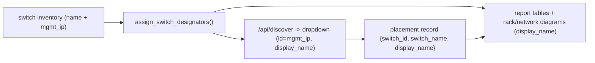

# Allow Same-Named Switches with Unique Designators

## Root cause

Switch identity is keyed by **name** end-to-end. Two `Spine-B` switches collide because:

- [`src/app.py`](src/app.py) `/api/discover` (lines ~1741-1751) returns only `{name, model, serial, height_u}` — it strips `mgmt_ip`, so the UI cannot distinguish duplicates.
- [`frontend/templates/reporter.html`](frontend/templates/reporter.html) `rptRenderSwitchDropdown()` (lines ~2033-2058) builds `placedNames[p.switch_name]` and skips every switch whose `s.name` matches a placed name, and uses `opt.value = s.name`.
- Placement records store only `switch_name`; downstream [`src/report_builder.py`](src/report_builder.py) (`sw_by_name` ~2391), [`src/network_diagram_v2.py`](src/network_diagram_v2.py) (`_extract_manual_switch_to_rack` ~1260, rack assign ~1315), and [`src/rack_diagram.py`](src/rack_diagram.py) (~1170) also key by name.

## Design

- **Stable unique key:** management IP (`mgmt_ip`), with fallback to `serial`/`name` when absent. Exposed as `switch_id` on switch objects and placement records.
- **Designator:** for any name shared by >1 switch, assign letter suffixes `(a)`, `(b)`, ... ordered by `mgmt_ip`, producing `display_name = "Spine-B (a)"`. Unique names keep `display_name == name`.
- **Dropdown label:** `"{display_name} ({mgmt_ip}, {model}, {height_u}U)"` so the operator sees both the report designator and the IP.
- **Report/diagram labels:** use `display_name` so the two switches read as `Spine-B (a)` / `Spine-B (b)` everywhere.

## Shared helper (new)

Add `assign_switch_designators(switches: list[dict]) -> list[dict]` in a small new module `src/utils/switch_identity.py` (pure function, no I/O). For each switch dict it sets:

- `switch_id` = `mgmt_ip` or fallback (`serial`, then `name`),
- `display_name` = `name`, plus `(a)`/`(b)`/... when the name is shared, ordered by `mgmt_ip` (lexicographic on dotted-quad is acceptable; numeric-aware sort optional).
Single source of truth used by both backend discovery and the report pipeline.

## Backend changes

- [`src/app.py`](src/app.py) `/api/discover` switch loop (~1741-1751): include `mgmt_ip` and `id`/`serial` from `switch_inv`, run `assign_switch_designators`, and emit `{id, name, display_name, mgmt_ip, model, serial, height_u}` per switch.
- [`src/report_builder.py`](src/report_builder.py) ~2389-2406: resolve manual placements by `switch_id` (mgmt_ip) first, then fall back to `switch_name`; carry `display_name` into `sw_data` so the rack diagram labels the correct physical switch.
- Apply `assign_switch_designators` once on the canonical switch inventory used by report tables/diagrams (where the `switches` list is assembled for `report_builder`/`data_extractor`) so `display_name` is consistently available. Update the Port Mapping and Switch Config table builders to render `display_name`.
- [`src/network_diagram_v2.py`](src/network_diagram_v2.py): key `_extract_manual_switch_to_rack` (~1260) and the rack-assignment lookup (~1315) by `switch_id`/`mgmt_ip`; use `display_name` for switch labels.
- [`src/rack_diagram.py`](src/rack_diagram.py) ~1170: use `display_name` for the rendered switch label.

## Frontend changes

[`frontend/templates/reporter.html`](frontend/templates/reporter.html):

- `rptRenderSwitchDropdown()` (~2033-2058): filter by `placedIds[p.switch_id]`; set `opt.value = s.id` and label = `display_name (mgmt_ip, model, height_uU)`.
- `rptAddSwitchPlacement()` (~2060-2084): look up the chosen switch by `id`; store `{switch_id, switch_name, display_name, rack_name, u_position, model_key, model, height_u}`.
- `rptDiscoverSwitches()` re-hydration (~1975-1978): match saved placements by `switch_id` with fallback to `switch_name` (back-compat for old profiles).
- `rptSyncManualPlacements()` (~2115-2128): persist `switch_id` and `display_name`.
- Manual-IP entries: set `id`/`switch_id` = the entered IP (already unique).

Mirror the minimal id-keying fix in the legacy [`frontend/templates/generate.html`](frontend/templates/generate.html) (`renderSwitchDropdown`/`addSwitchPlacement`, ~388-420) so it does not regress.

## Backward compatibility

Existing profiles store placements with only `switch_name`. On load, match by `switch_id` when present, else by `switch_name` (prior behavior). New saves include `switch_id`, so re-saving a profile upgrades it.

## Tests

- New `tests/test_switch_identity.py`: duplicate names get `(a)/(b)` by mgmt_ip order; unique names unchanged; missing `mgmt_ip` falls back to serial/name; `switch_id` is stable.
- Extend `tests/test_app.py` `/api/discover`: response includes `mgmt_ip`, `id`, and `display_name`; two same-named switches both present with distinct ids.
- Extend report_builder/diagram tests: manual placement with two same-named switches resolves to distinct inventory entries and distinct `display_name` labels.

## Docs

- `CHANGELOG.md` under Unreleased: Fixed entry describing duplicate-name switch placement and `(a)/(b)` designators.
- Note new switch object fields (`id`/`mgmt_ip`/`display_name`) where the discovery payload is documented, if applicable.
