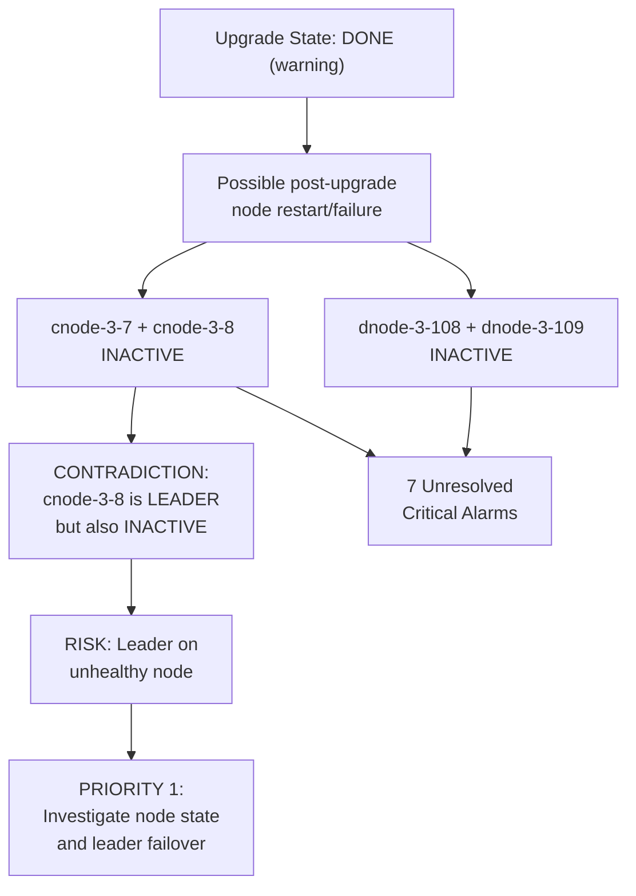

# API Health Check Report -- <lab-cluster>

## Cluster Overview

- **Cluster**: <lab-cluster>
- **IP**: <ip>
- **Version**: <ip>
- **Report Timestamp**: 2026-03-19 04:47:55 PDT
- **Tier**: 1 (API-level checks)
- **Results**: 14 Pass, 3 Fail, 6 Warning, 1 Skipped, 0 Error

## Critical Relationship: The Interconnected Issues

Before listing individual findings, the most important insight is that several issues are likely **related to a single root event**. The data tells a story:

**Key observation**: cnode-3-8 is reported as the **cluster leader** (Leader State = UP) but is **also listed as INACTIVE** in the CNode Status check. This is contradictory and the highest-priority concern -- the cluster leader may be running on a degraded node.

---

## Report Structure (what will be produced)

A Markdown report file with the following sections:

### Section 1 -- FAIL Items (3 issues, Priority: Immediate)

**FAIL-1: CNode Status -- 2 inactive nodes**

- Timestamp: 04:47:28
- Nodes: cnode-3-7, cnode-3-8
- Leader conflict: cnode-3-8 is both leader AND inactive
- Likely cause: Post-upgrade node restart incomplete, or nodes failed to rejoin
- Resolution steps: SSH to nodes, check vast service status, review /var/log/vast, check if reboot is pending post-upgrade, verify leader election health
- Escalation: If nodes don't recover after service restart, engage VAST support with logs

**FAIL-2: DNode Status -- 2 inactive nodes**

- Timestamp: 04:47:29
- Nodes: dnode-3-108, dnode-3-109
- Correlation: Both DNodes likely in the same chassis/subsystem as the inactive CNodes (3-108, 3-109 map to the same physical tray as cnode-3-7, cnode-3-8)
- Likely cause: Same root event as CNode failures
- Resolution steps: Check DNode service status, verify backend connectivity from active nodes, check RAID state on these specific DNodes

**FAIL-3: Active Alarms -- 7 critical/major unresolved**

- Timestamp: 04:47:30
- Details: 7 of 14 total alarms are unresolved critical/major
- Correlation: Likely generated BY the CNode/DNode failures (node down, services unavailable, possible VIP rebalance)
- Resolution steps: Pull full alarm list via API (`/api/alarms/`), categorize, expect most to auto-resolve once nodes recover
- Note: Events endpoint was SKIPPED (not available on this version), so event correlation must be done via alarms and logs

### Section 2 -- WARNING Items (6 issues, Priority: Review)

**WARN-1: RAID Rebuild Progress** (04:47:28)

- NVRAM and Memory at 100%, SSD at 0%
- RAID State is HEALTHY -- the 0% SSD likely means no rebuild was needed (not that it failed)
- Action: Informational only if RAID state remains HEALTHY. Monitor after node recovery.

**WARN-2: Leader State** (04:47:28)

- Leader cnode-3-8 is UP but node is INACTIVE
- This is the critical contradiction noted above
- Action: Covered in FAIL-1 resolution

**WARN-3: Upgrade State = DONE** (04:47:28)

- Upgrade completed but flagged as warning
- Likely trigger: A recent upgrade may have caused node restarts that didn't complete cleanly
- Action: Verify upgrade completion logs, confirm all nodes received the upgrade, check if rolling restart is still pending

**WARN-4: Network Settings -- Missing DNS, NTP, Gateway** (04:47:52)

- All three are null
- Could be lab environment (selab = SE lab), or configuration was lost/never set
- Action: Configure DNS, NTP, and gateway. NTP is especially important for cluster time sync and log correlation.

**WARN-5: License -- No license found** (04:47:52)

- Null license info
- Could be lab/eval environment or license expired
- Action: Verify if this is expected for SE lab. If production, apply valid license.

**WARN-6: Monitoring -- Syslog not configured** (04:47:54)

- SNMP is configured, Syslog is not
- Action: Configure syslog forwarding for centralized log collection. Critical for troubleshooting issues like the current node failures.

### Section 3 -- PASS Items (14 checks, for reference)

Brief summary confirming healthy items: RAID state, cluster online, no expansion in progress, DBox active, firmware consistent, VIP pools (20/21 enabled), capacity 52.9%, handle usage 7.7%, device health clean, 714 snapshots (none failed), 15 quotas (none blocked), 55 active protection policies, DR not enabled.

### Section 4 -- Manual Verification Checklist (3 items)

Items that require hands-on testing after issues are resolved:

- Failover Testing (VMS migration + leader reboot)
- VIP Movement / ARP Validation
- Password Management (default passwords)

### Section 5 -- Recommended Action Plan (Priority Order)

1. **Investigate cnode-3-7 and cnode-3-8** -- SSH, check services, review logs
2. **Investigate dnode-3-108 and dnode-3-109** -- likely same root cause
3. **Review the 7 active alarms** -- categorize and track
4. **Verify upgrade completion** -- confirm all nodes upgraded, no pending reboots
5. **Resolve leader contradiction** -- once nodes recover, verify leader election
6. **Configure network settings** -- DNS, NTP, gateway
7. **Configure syslog** -- for future troubleshooting
8. **Address license** -- if not expected for lab
9. **Run manual checks** -- failover, VIP, passwords

---

## Deliverable

A single Markdown file at `Debrief-Reports/health-check-<lab-cluster>.md` containing the full report with all sections above, formatted for easy reading and sharing.