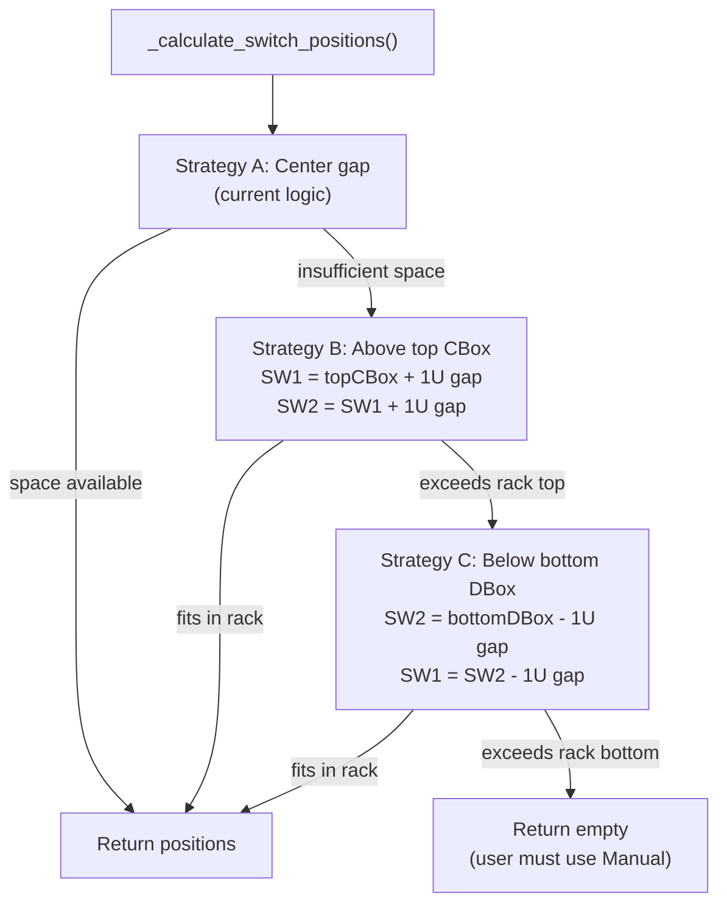

# Enhanced Auto Switch Placement

## Current Behavior

The existing `_calculate_switch_positions()` in `[rack_diagram.py](src/rack_diagram.py)` (lines 422-528) only tries **one strategy**: place both switches in the center gap between CBoxes (top) and DBoxes (bottom). When the gap is too small (e.g., 1U gap for two 1U switches), it logs a warning, returns `[]`, and the switches get `FAILED` status / no U Height in the Hardware Inventory table.

## Proposed Change: Cascading Fallback

Replace the single strategy with a three-step cascade:




### Strategy Details (1U switches)

- **A — Center gap** (existing): Place switches centered between lowest CBox and highest DBox. Requires gap >= 2U.
- **B — Above top CBox**: SW1 at `topCBox + 2` (1U gap above top CBox), SW2 at `SW1 + 2` (1U gap above SW1). Must not exceed rack height.
- **C — Below bottom DBox**: SW2 at `bottomDBox - 2` (1U gap below bottom DBox), SW1 at `SW2 - 2` (1U gap below SW2). Must be >= U1.

### Strategy Details (2U switches)

Same cascade, but each switch occupies 2U and requires 1U gap spacing. Strategy B needs `topCBox + 3U + 3U` headroom. Strategy C needs `bottomDBox - 3U - 3U` floor room.

## Files to Modify

### 1. `src/rack_diagram.py` — Core placement logic

Refactor `_calculate_switch_positions()` (lines 422-528) into sub-methods:

- `_try_center_placement(cboxes, dboxes, switch_height, num_switches)` — current logic extracted
- `_try_above_placement(cboxes, switch_height, rack_height)` — new Strategy B
- `_try_below_placement(dboxes, switch_height)` — new Strategy C

The main method calls them in order and returns the first success. Log which strategy was used at INFO level.

Key existing code that must be preserved:

- `_get_device_height_units()` (lines 187-233) — model-to-U mapping (1U for MSN3700, MSN2100; 2U for Arista)
- `generate_rack_diagram()` (lines 530-661) — no changes needed, it already consumes position list from `_calculate_switch_positions()`

### 2. `src/report_builder.py` — Pass rack height to position calculator

Currently `_calculate_switch_positions()` doesn't know the rack height. Strategy B needs it to validate positions don't exceed the top. Update the call site at line ~1996 to pass `rack_height_u`:

```python
calculated_positions = temp_rack_gen._calculate_switch_positions(
    cboxes_data, dboxes_data, len(switches), switches=switches,
    rack_height=rack_height_u  # new parameter
)
```

### 3. `frontend/templates/generate.html` — Auto/Manual toggle (prep)

Add a "Switch Placement" section with a toggle defaulting to "Auto". Manual is disabled/greyed with "(coming soon)" label. This sets up the UI for Option 2 later without blocking Option 1.

```
<legend>Switch Placement</legend>
<select id="switch_placement" name="switch_placement">
    <option value="auto" selected>Auto (recommended)</option>
    <option value="manual" disabled>Manual (coming soon)</option>
</select>
```

### 4. `src/app.py` — Pass switch_placement param through

Add `switch_placement` to the `params` dict in `generate_start()` so it's available for future Manual mode routing.

## What Does NOT Change

- `generate_rack_diagram()` — already consumes position lists generically
- `_create_device_representation()` — draws devices at given U position regardless of how it was calculated
- `_get_device_height_units()` — model mapping stays the same
- API endpoints — no new API calls needed for Auto mode
- Hardware Inventory table logic — already reads `self.switch_positions`

