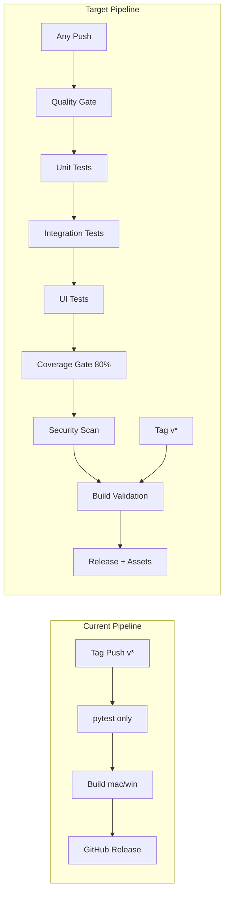
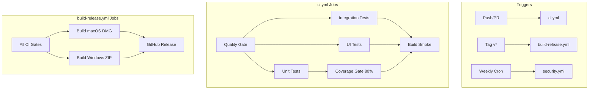

# CI/CD Pipeline Implementation Plan

## Current State vs. Target



## Architecture: Three Workflow Files

### Workflow 1: `ci.yml` — Continuous Integration (every push/PR)

Triggers on every push to `develop`, `main`, `feature/*`, `fix/*`, and all PRs.

**Job 1: Quality Gate (fast, ~30s)**

- Flake8 lint (`flake8 src/ tests/`)
- Black format check (`black --check --line-length 120 src/ tests/`)
- Mypy type check (`mypy src/ --ignore-missing-imports`)
- Secrets detection via `gitleaks` or `truffleHog`

**Job 2: Unit Tests (parallel matrix, ~2min)**

- Python 3.11 + 3.12 matrix (cross-version validation)
- `pytest tests/ -v --ignore=tests/test_ui.py --cov=src --cov-report=xml`
- Coverage enforcement: fail if below 80%
- Upload coverage report as artifact

**Job 3: Integration Tests (~2min, depends on Job 1)**

- New test file: `tests/test_integration.py`
- Full pipeline test: mock API responses -> VastDataExtractor -> VastReportBuilder -> verify PDF output
- Data consistency validation: raw API dict in -> structured data -> verify all sections present

**Job 4: UI Tests (~3min, depends on Job 1)**

- Install Playwright browsers
- `pytest tests/test_ui.py -v`
- Screenshot artifacts on failure

**Job 5: Build Smoke Test (matrix: macOS + Windows, depends on Jobs 2-4)**

- Run PyInstaller build to verify packaging works
- Do NOT create release — just validate the build succeeds
- Upload build artifacts for manual inspection

### Workflow 2: `build-release.yml` — Release (tag push only)

Triggers on `v`* tags. Largely the existing workflow but enhanced:

- Inherits all quality/test gates from `ci.yml` via `workflow_call` or runs them inline
- Builds macOS DMG + Windows ZIP
- Creates GitHub Release with assets
- Extracts release notes from `RELEASE_NOTES_vX.Y.Z.md` or `CHANGELOG.md`

### Workflow 3: `security.yml` — Weekly Security Audit

Triggers on schedule (weekly cron) and manual dispatch:

- `pip-audit` or `safety` for dependency vulnerabilities
- `bandit` for Python security issues (`bandit -r src/ -ll`)
- Opens a GitHub issue if vulnerabilities are found



## New/Modified Files

### New GitHub Workflows

- `[.github/workflows/ci.yml](.github/workflows/ci.yml)` — New continuous integration workflow
- `[.github/workflows/security.yml](.github/workflows/security.yml)` — New weekly security scan
- Modify `[.github/workflows/build-release.yml](.github/workflows/build-release.yml)` — Add quality gates before release

### New Test Infrastructure

- `[tests/conftest.py](tests/conftest.py)` — Shared fixtures (mock API data, config, temp dirs)
- `[tests/test_integration.py](tests/test_integration.py)` — Full pipeline integration tests
- `[tests/test_port_mapper.py](tests/test_port_mapper.py)` — Unit tests for the 4 untested port mapping modules
- `[tests/data/mock_api_responses.json](tests/data/mock_api_responses.json)` — Shared mock API response fixtures

### New Quality Tooling

- `[.pre-commit-config.yaml](.pre-commit-config.yaml)` — Pre-commit hooks (black, flake8, mypy, secrets detection)
- Update `[requirements-dev.txt](requirements-dev.txt)` — Add `mypy`, `bandit`, `pip-audit`, `pre-commit`, `types-requests`, `types-PyYAML`
- Update `[pyproject.toml](pyproject.toml)` — Add mypy config, pytest coverage options

### Rule Alignment Fixes

- Update `[change-control-07.mdc](.cursor/rules/change-control-07.mdc)` — Align version source to `src/app.py`, remove stale release branch references
- New `[ci-pipeline-13.mdc](.cursor/rules/ci-pipeline-13.mdc)` — Rule defining CI/CD expectations and quality gates

### Bug Fixes

- Fix `[tests/test_app.py](tests/test_app.py)` — Replace hardcoded version `b"1.4.0"` with dynamic import from `src/app.py`

## Test Strategy: Layered Pyramid

| Layer           | Tests                                          | Purpose                                         | Speed         |
| --------------- | ---------------------------------------------- | ----------------------------------------------- | ------------- |
| **Unit**        | ~250+ (current 195 + new port mapping + fixes) | Isolated module behavior with mocks             | Fast (~30s)   |
| **Integration** | ~15-20 new                                     | Full pipeline: API mock -> extract -> build PDF | Medium (~60s) |
| **UI**          | 19 existing + expand                           | Flask app + Playwright browser interactions     | Slow (~90s)   |
| **Security**    | Automated scans                                | bandit + pip-audit + secrets detection          | Medium (~45s) |

### Integration Test Scenarios (new `test_integration.py`)

- Full pipeline: mock cluster API -> VastDataExtractor -> VastReportBuilder -> verify PDF exists and is valid
- Partial data: missing API sections -> verify graceful degradation -> report still generates
- Data consistency: raw API response fields -> extracted sections -> verify all data appears in output JSON
- Config variations: different config.yaml settings -> verify report respects config
- Multi-rack: mock multi-rack API data -> verify correct rack diagrams generated

### Port Mapping Tests (new `test_port_mapper.py`)

- `port_mapper.py`: Basic port mapping extraction
- `enhanced_port_mapper.py`: Enhanced SSH-based mapping
- `external_port_mapper.py`: External device mapping
- `vnetmap_parser.py`: VNetMap file parsing

## Pre-Commit Hooks (local quality gates)

```yaml
# .pre-commit-config.yaml
repos:
  - repo: https://github.com/psf/black
    hooks: [{ id: black, args: [--line-length=120] }]
  - repo: https://github.com/pycqa/flake8
    hooks: [{ id: flake8 }]
  - repo: https://github.com/pre-commit/mirrors-mypy
    hooks: [{ id: mypy, args: [--ignore-missing-imports] }]
  - repo: https://github.com/gitleaks/gitleaks
    hooks: [{ id: gitleaks }]
```

## Dev Dependency Additions

| Package                          | Purpose                                                |
| -------------------------------- | ------------------------------------------------------ |
| `mypy`                           | Static type checking (referenced in rules but missing) |
| `types-requests`, `types-PyYAML` | Type stubs for mypy                                    |
| `bandit`                         | Python security linter                                 |
| `pip-audit`                      | Dependency vulnerability scanner                       |
| `pre-commit`                     | Git hook manager                                       |

## Rule Changes

### Update `change-control-07.mdc`

- Fix version source: `src/main.py` (APP_VERSION) -> `src/app.py` (APP_VERSION)
- Align release workflow with `release-packaging-12.mdc` (merge develop -> main -> tag, no release branches)
- Add reference to CI pipeline requirements

### New `ci-pipeline-13.mdc`

Defines:

- All pushes to `develop`/`main` must pass CI before merge
- Quality gates: lint + type check + security scan must pass
- Coverage floor: 80% enforced in CI
- Build validation: PyInstaller builds must succeed on both platforms
- UI tests required for any changes to `src/app.py` or `frontend/`
- Security scans run weekly; critical vulnerabilities block releases

## Implementation Order

The work is organized into 7 phases, each independently shippable:

1. **Foundation** — `conftest.py`, `requirements-dev.txt`, `pyproject.toml` updates
2. **Quality Gate** — `.pre-commit-config.yaml`, `.flake8` alignment, mypy config
3. **Test Gaps** — `test_port_mapper.py`, `test_integration.py`, fix `test_app.py` version
4. **CI Workflow** — `.github/workflows/ci.yml` with all jobs
5. **Security Workflow** — `.github/workflows/security.yml`
6. **Release Enhancement** — Update `build-release.yml` to require CI gates
7. **Rule Alignment** — Update `change-control-07`, create `ci-pipeline-13.mdc`
