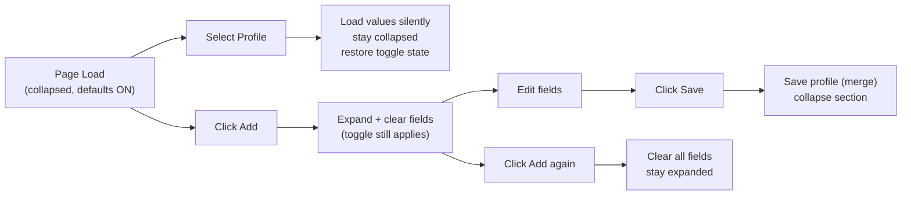
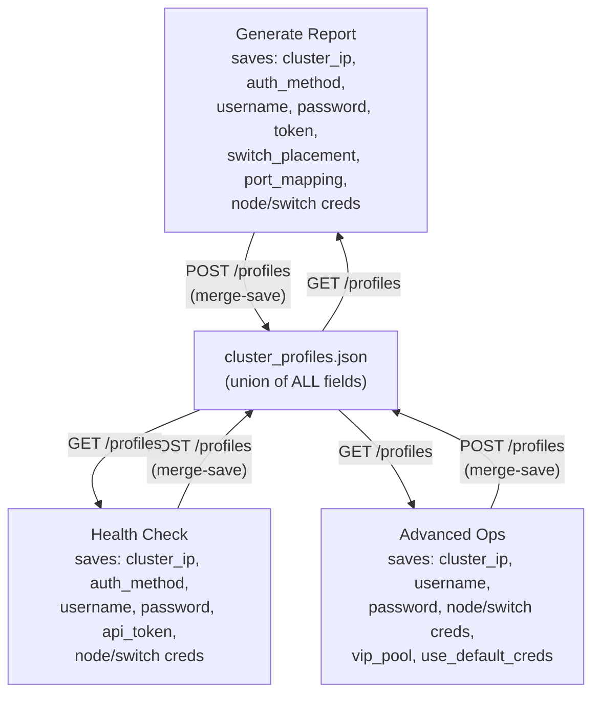

# Advanced Ops Layout + Default Credentials + Unified Profiles

## Overview

Three interrelated changes:

1. **Collapsible credential section** in Advanced Ops with Add button
2. **Default Credentials toggle** that pre-fills known defaults
3. **Unified profile storage** so profiles are fully portable across all pages

---

## Part 1: Unified Profile Storage

### Problem

All three pages use the same `/profiles` endpoint and `cluster_profiles.json` file, but:

- **Server doesn't store**: `vip_pool`, `switch_placement`, `use_default_creds`
- **Field name mismatch**: health.html sends `api_token`, server stores as `token`
- **Data loss on save**: When Advanced Ops saves a profile, it overwrites the entire profile object, wiping out `auth_method`, `token`, `enable_port_mapping` etc. that Generate previously stored. Same problem in reverse.

### Solution: Merge-Save Pattern

**Backend** (`[src/app.py](src/app.py)` line ~527): Update `profiles_save` to store the union of all fields, and merge incoming data with existing profile data instead of replacing it:

```python
profiles[name] = {
    **profiles.get(name, {}),   # preserve existing fields from other pages
    **{k: v for k, v in {
        "cluster_ip": data.get("cluster_ip"),
        "auth_method": data.get("auth_method"),
        "username": data.get("username"),
        "password": data.get("password"),
        "token": data.get("token") or data.get("api_token"),  # fix health mismatch
        "output_dir": data.get("output_dir"),
        "enable_port_mapping": data.get("enable_port_mapping"),
        "switch_user": data.get("switch_user"),
        "switch_password": data.get("switch_password"),
        "node_user": data.get("node_user"),
        "node_password": data.get("node_password"),
        "vip_pool": data.get("vip_pool"),
        "switch_placement": data.get("switch_placement"),
        "use_default_creds": data.get("use_default_creds"),
    }.items() if v is not None},  # only overwrite fields the page actually sent
}
```

This means:

- Advanced Ops saves `vip_pool`, `use_default_creds` without wiping `token`, `auth_method`
- Generate saves `switch_placement`, `enable_port_mapping` without wiping `vip_pool`
- Health saves `api_token` (mapped to `token`) without wiping anything

**Frontend (all pages)**: Each page's `loadProfile()` already ignores fields it doesn't have UI for (just skips unknown keys), so no load-side changes needed. Each `saveProfile()` just sends the fields it has -- the backend merge handles the rest.

### Field name fix for health.html

`[frontend/templates/health.html](frontend/templates/health.html)` line ~177: The `profileFields` array uses `api_token` but the backend stores `token`. On load, add a mapping:

```javascript
// In loadProfile(), after setting fields:
const tokenEl = document.getElementById('api_token');
if (tokenEl && p.token) tokenEl.value = p.token;
```

On save, send `api_token` as-is -- the backend merge handler accepts both `token` and `api_token`.

---

## Part 2: Collapsible Layout (Advanced Ops only)

### Target file: `[frontend/templates/advanced_ops.html](frontend/templates/advanced_ops.html)`

### New HTML Structure (lines 17-72)

```
Connection Settings Card
├── card-header: "Connection Settings"
├── card-body
│   ├── Profile Bar (always visible)
│   │   ├── #profileSelect dropdown (flex: 1, reduced width)
│   │   ├── Save button (btn-secondary)
│   │   ├── Add button (btn-success, green, NEW)
│   │   └── Delete button (btn-danger)
│   ├── Default Credentials toggle (always visible, centered below buttons)
│   │   └── checkbox #useDefaultCreds (checked by default)
│   └── #credentialFields (collapsible div, hidden by default)
│       ├── form-row: Cluster IP | API Username | API Password  (3 equal cols)
│       └── form-row: Node User | Node Pass | Switch User | Switch Pass | VIP Pool (5 equal cols)
```

### Collapse/Expand Rules

- **Page load**: collapsed
- **Add button**: expand + clear all fields. If already expanded, just clear fields.
- **Save button**: save profile + collapse
- **Select profile**: load values silently, stay collapsed
- **Delete button**: delete, no expand/collapse change

### Field Width Rebalancing

Replace current `.form-row .form-group { flex: 1; min-width: 200px; }` with:

```css
#credentialFields .form-row .form-group { flex: 1; min-width: 0; }
```

This lets both 3-col and 5-col rows fill to equal widths across the full card width, right-aligned with the profile bar.

Profile dropdown changes from `width: auto; min-width: 200px` to `flex: 1` within a flex profile-controls container, sharing the row with the three buttons.

### Dynamic Output Pane Height

When collapsed (default), add class to output pane:

```css
.output-pane.creds-collapsed { max-height: calc(100vh - 460px); }
```

Current: `max-height: calc(100vh - 600px)` -- gains ~140px when credential rows are hidden.

---

## Part 3: Default Credentials Toggle

### Placement

Below Save / Add / Delete buttons, centered. Always visible (outside collapsible section).

### Credential Defaults

```javascript
const DEFAULT_CREDENTIALS = {
    username: 'admin',       password: '<redacted>',
    node_user: 'vastdata',   node_password: '<redacted>',
    switch_user: 'cumulus',  switch_password: '<redacted>'
};
const SWITCH_PASSWORD_MAP = {
    'cumulus': '<default-password>',
    'admin': 'admin'    // Onyx, Cisco, Arista
};
```

### Toggle Behavior

```javascript
function toggleDefaultCredentials() {
    const on = document.getElementById('useDefaultCreds').checked;
    if (on) {
        for (const [key, val] of Object.entries(DEFAULT_CREDENTIALS))
            setField(key, val);
    } else {
        setField('username', '');
        ['password','node_password','switch_password'].forEach(k => setField(k, ''));
    }
}
```

### Switch User onchange

When toggle is ON and user changes `switchUser`, auto-lookup password:

```javascript
document.getElementById('switchUser').addEventListener('input', function() {
    if (document.getElementById('useDefaultCreds').checked) {
        const pw = SWITCH_PASSWORD_MAP[this.value] || '';
        document.getElementById('switchPassword').value = pw;
    }
});
```

### Profile Integration

- `saveProfile()`: sends `use_default_creds: checkbox.checked`
- `loadProfile()`: sets checkbox from `p.use_default_creds ?? true`, calls `toggleDefaultCredentials()`

---

## Interaction Flow



## Cross-Page Profile Flow


