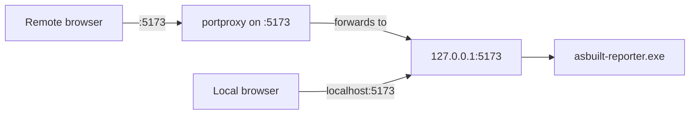

# Expose asbuilt-reporter Remotely via netsh portproxy

## The observed catch-22 cycle

```
1. Launch vast-reporter.exe
   -> binds 127.0.0.1:5173
   -> works locally, NOT remotely

2. Add portproxy: listenaddress=0.0.0.0 listenport=5173
   -> NOW works remotely (both 0.0.0.0:5173 and 127.0.0.1:5173 coexist)

3. Exit vast-reporter.exe
   -> portproxy still holds 0.0.0.0:5173

4. Relaunch vast-reporter.exe
   -> FAILS: "socket in a way forbidden by its access permissions"
   -> because 0.0.0.0 covers 127.0.0.1, so the app can't rebind

5. Delete portproxy to unblock the app
   -> App starts, but remote access is gone

6. Repeat from step 1
```

## Why nginx / Docker changes won't help

- **nginx reverse proxy** (already tested): We proxied `/app/vast-reporter/` through nginx via `host.docker.internal:5173`. The HTML shell loaded but the app's internal API calls broke -- profiles, reports, cached tools, and discovery details all showed empty/unavailable. The app must be accessed directly on its native port.
- **Docker parameters**: Not applicable -- the app is a standalone `.exe`, not a container.
- **Firewall**: Necessary but not sufficient -- even with port 5173 open, the OS has nothing listening on the external IP.

## The fix: specific-IP portproxy (breaks the cycle)

The root cause of the cycle is `listenaddress=0.0.0.0`. The wildcard `0.0.0.0` binds ALL interfaces including `127.0.0.1`, which blocks the app from rebinding after a restart.

The fix: bind portproxy to **only the external IP**, not the wildcard:

| listenaddress | Covers 127.0.0.1? | Conflicts with app? |
|---|---|---|
| `0.0.0.0` | Yes (all interfaces) | YES -- app cannot rebind after restart |
| `<ip>` (static IP) | No (single NIC) | NO -- different socket address |



Both listeners coexist permanently because they bind different addresses on the same port. The app can start, stop, and restart freely without touching the portproxy.

## Integration with Phase 1 re-IP plan

The [re-IP plan](mission-control-phase-1-re-ip_cdaff8ee.plan.md) changes the VM from DHCP `<ip>` to static `<ip>`. This portproxy step slots in **after the re-IP is complete** (after plan step 10, before step 11 validation):

- Step 9 of the re-IP plan already creates firewall rules for TCP 5173 -- no additional firewall work needed.
- The portproxy uses the NEW static IP `<ip>` so it only needs to be configured once.
- If testing before re-IP, substitute `<ip>` for the listenaddress.

## Pre-implementation checklist (no file changes required)

All code/config is already IP-neutral:

- [docker/home/index.html](docker/home/index.html) portal tile: `location.hostname + ':5173'` (dynamic JS)
- [docker/nginx.conf](docker/nginx.conf) fallback: `return 302 http://$host:5173/;` (dynamic)
- [docker/docker-compose.yml](docker/docker-compose.yml): `${PORTAL_PORT:-80}:80` (IP-agnostic)
- `mission-control:v1.3.0` already pushed to Docker Hub with all dynamic links

**Zero file changes, zero container rebuilds needed.** This is purely a Windows VM networking task.

## Execution (elevated PowerShell on the VM)

**Step 1 -- Clean up old rules:**
```powershell
netsh interface portproxy delete v4tov4 listenaddress=0.0.0.0 listenport=5173
netsh interface portproxy delete v4tov4 listenaddress=<ip> listenport=5173
netsh interface portproxy delete v4tov4 listenaddress=<ip> listenport=5173
netsh interface portproxy show all
```

**Step 2 -- Ensure IP Helper service is running and persistent:**
```powershell
Set-Service iphlpsvc -StartupType Automatic
Restart-Service iphlpsvc
Get-Service iphlpsvc | Select-Object Status, StartType
```

**Step 3 -- Add portproxy on the specific static IP:**

After re-IP (use `<ip>`):
```powershell
netsh interface portproxy add v4tov4 listenaddress=<ip> listenport=5173 connectaddress=127.0.0.1 connectport=5173
```

Before re-IP (testing only, use current DHCP IP):
```powershell
netsh interface portproxy add v4tov4 listenaddress=<ip> listenport=5173 connectaddress=127.0.0.1 connectport=5173
```

**Step 4 -- Confirm firewall rule exists** (should already be present from re-IP plan step 9):
```powershell
Get-NetFirewallRule -DisplayName "MissionControl-TCP-5173" -ErrorAction SilentlyContinue |
  Format-Table DisplayName, Enabled, Action
# If missing:
# New-NetFirewallRule -DisplayName "MissionControl-TCP-5173" -Direction Inbound -Protocol TCP -LocalPort 5173 -Action Allow -Profile Any
```

## Verification (the critical test)

**Step 5 -- Confirm both listeners coexist:**
```powershell
netsh interface portproxy show all
netstat -an | findstr :5173 | findstr LISTEN
```
Expected output (two rows, different addresses):
```
TCP  <ip>:5173   0.0.0.0:0   LISTENING
TCP  127.0.0.1:5173      0.0.0.0:0   LISTENING
```

**Step 6 -- Prove the restart cycle is broken:**
```
1. Confirm app is running:        netstat -an | findstr :5173 | findstr LISTEN  (2 rows)
2. Stop vast-reporter.exe
3. Confirm portproxy persists:    netstat -an | findstr :5173 | findstr LISTEN  (1 row: static IP only)
4. Relaunch vast-reporter.exe     <-- THIS IS THE TEST -- must NOT fail
5. Confirm both listeners return: netstat -an | findstr :5173 | findstr LISTEN  (2 rows again)
```

If step 4 fails with "socket forbidden", the specific-IP approach does not work on this Windows build, and we fall back to Option B below.

**Step 7 -- Remote access test:**

From a VPN-connected machine:
```bash
curl -s -o /dev/null -w "HTTP %{http_code}" http://<ip>:5173/
# or after DNS:
curl -s -o /dev/null -w "HTTP %{http_code}" http://<lab-host>:5173/
```

Open in browser and verify profiles, reports, cached tools, and discovery details all load (unlike the nginx proxy approach).

## Fallback: Option B (different external port)

If the specific-IP approach still produces a socket conflict on Windows, the guaranteed fallback is to use a **different external port**:

```powershell
netsh interface portproxy add v4tov4 listenaddress=0.0.0.0 listenport=5174 connectaddress=127.0.0.1 connectport=5173
```

This uses `0.0.0.0` safely because port 5174 never conflicts with the app's port 5173. It would require updating the portal tile and nginx redirect from `:5173` to `:5174` and pushing a new container image. Only pursue this if Step 6 above fails.
