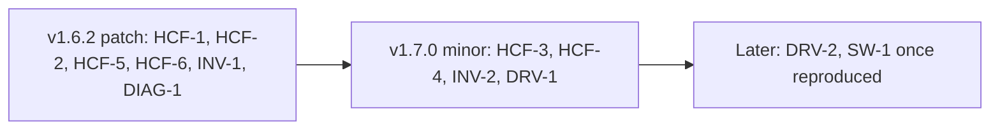

# Field feedback triage (2026-09-23)

v1.6.1 is merged and tagged: `main` = `develop` = `7095ccb`. The Build & Release gates passed and the three platform builds are running.

## Assessment

### Health check findings (`src/health_checker.py`)

There is one root cause across several of these items: `HealthCheckResult.details` is collected but never shown. The PDF (`_create_health_check_section`, [src/report_builder.py](src/report_builder.py) ~L5330) and [frontend/templates/health.html](frontend/templates/health.html) render only name, status and message. That is why alarms and the performance baseline look empty or unexplained. The design already calls for these sub-tables ([docs/development/HEALTH-CHECK-MODULE-IMPLEMENTATION-GUIDE.md](docs/development/HEALTH-CHECK-MODULE-IMPLEMENTATION-GUIDE.md) L661-662); they were never built.

- **HCF-1 Upgrade State "UNKNOWN" gives a warning. Bug, valid.** `_check_upgrade_state` (L991) passes only on `""/NONE/NULL/DONE`; any other value warns, including the idle value `UNKNOWN`. There is no test for it. Fix: treat `UNKNOWN` as idle, map `FAILED`/`ABORTED` to fail, and keep warning for genuinely active states. Add a failing-first test. P1, size S.
- **HCF-2 EBox cluster: CBox skipped, DBox and EBox pass. Bug (misleading output), valid.** Each check is internally correct: `dboxes/` really does return the EBox storage enclosures, and `cboxes/` is empty. But the report never explains the topology. Fix: detect an EBox cluster once (non-empty `eboxes/`). CBox then reads "Not applicable — converged EBox cluster (covered by EBox Status)" and DBox reads "All N EBox storage enclosures ACTIVE". Status values are unchanged. P2, size S.
- **HCF-3 Active Alarms: 17 critical/major alarms give a warning. Valid, but it reverses a deliberate decision.** v1.5.0 (HC-1, CHANGELOG ~L1807) downgraded this from fail to warning as "informational". There is also a render-time fixup that re-downgrades old JSON. Critical and major share one bucket, there is no threshold, and it is not configurable. Recommendation (a policy change, not a plain revert): critical goes to **fail**, major stays warning. Controlled by `health_check.alarms.fail_on: critical` (options `critical`, `major`, `none`) in [config/config.yaml.template](config/config.yaml.template), and the render-time fixup is updated to honour it. Render the alarm sub-table (up to 20 summaries are already in `details`). P1, size M. Needs your sign-off because it reverses HC-1.
- **HCF-4 License: a Trial license passes. Gap, valid.** `_check_license` (L1817) fails only on `EXPIRED`/`INVALID`; Trial and Evaluation pass, and no expiration date is read. Fix: Trial/Eval becomes a **warning** ("verify before go-live"), and days-remaining is shown if the API exposes it. The live probe (see DIAG-1) must confirm the field names first. P2, size S-M.
- **HCF-5 Performance Baseline "captured (informational)" shows no data. Bug, valid.** `_check_performance_baseline` (L2052) returns pass even when it captured nothing, and the fields it does capture are dropped at render time. Fix: return `skipped` when no metrics are present, and render the captured metrics as a small sub-table. P2, size S.
- **HCF-6 Render check `details` in the PDF and the web page.** This is the enabler for HCF-3 and HCF-5: per-check sub-tables for alarms, performance metrics and inactive lists. It stays bounded — only non-empty details, with caps on row counts. P1, size M.
- **SW-1 "Issues connecting to one of the switches". Possible bug, unconfirmed.** There is not enough detail to act on. Triage: ask the reporter for the switch vendor/OS, the error text from Output Results, and the ops log. Likely candidates are the Onyx web-API login or a non-default credential. P2, blocked on information.

### Node serials and MACs (feature request, adds value)

- **INV-1 Node serial numbers. Quick win.** `serial_number` is already collected for every CNode and DNode ([src/api_handler.py](src/api_handler.py) L1102, L1213). It just isn't displayed: the inventory "Name/Serial Number" column shows the node name. Add a Serial column to the Hardware Inventory and to the CNode/DNode Management Map ([src/report_builder.py](src/report_builder.py) ~L1864, ~L3591). Include box chassis serials where available. P1, size S.
- **INV-2 MAC addresses. Needs verification.** No MAC field is collected by the API path, and none appears in the captured reports. MACs exist only through the SSH port-mapping path (`external_port_mapper._collect_node_macs_via_clush`, L1167). Method: DIAG-1 probes `cnodes/`, `dnodes/` and candidate NIC/port endpoints. If the API has them, follow the standard `api_handler` then `data_extractor` then `report_builder` path. Otherwise surface the port-mapping MACs, which only appear when vnetmap/SSH runs. Open question: which MACs customers want — management, IPMI/BMC, or data NICs. P2, size M-L.

### NVMe drive firmware section (feature request, high value)

- **DRV-1 Drive inventory and firmware section, net new.** Nothing is collected today: no `ssds/`/`nvrams/` calls, only RAID-state aggregates, and the Prometheus device check keeps counts only. Method:
  - DIAG-1 confirms the endpoints and fields (vendor, model, part number, firmware, serial, capacity, box, slot).
  - `api_handler.get_drive_inventory()` with retry and graceful degradation.
  - `data_extractor.extract_drive_inventory()` groups drives by box, vendor, model and firmware.
  - `report_builder._create_drive_inventory_section()` builds a summary table (Box | Vendor | Model | Firmware | Qty) with a `PageMarker` TOC entry.
  - The full per-drive list goes to JSON only; PDF volume is bounded for large clusters.
  - Tests cover all three layers.
  - Coordinate with PROM-1, which also handles per-device data.
  - P1, size L.
- **DRV-2 Firmware advisories. Follow-on.** A config-driven `hardware_advisories.known_firmware` list (vendor + model + firmware, then severity and note) flags matching rows in DRV-1. Nothing is hardcoded. P3, size S.

### Shared enabler

- **DIAG-1 Live API probe.** `tests/diag_api_fields.py` follows the existing `tests/diag_prometheus_metrics.py` pattern. It dumps the keys of `cnodes/`, `dnodes/`, `ssds/`, `nvrams/`, `licenses/` and `clusters/` (upgrade and license fields) from a lab cluster. It unblocks HCF-4, INV-2 and DRV-1. P1, size S.

## Proposed releases

HCF-3 goes in v1.7.0 because it changes check semantics and adds a config key.

## Roadmap change (what executes on approval)

On `docs/field-feedback-2026-09` off `develop`, open a PR:

- Add a section "Planned — Field feedback (2026-09-23)" to [docs/TODO-ROADMAP.md](docs/TODO-ROADMAP.md). It lists the 12 items above with ID, type, priority, status (`Planned`, or `Deferred` for SW-1 awaiting logs), target release and notes.
- Refresh the "Last updated" date. Add the field-feedback batch to "Next steps".
- Record in [docs/DECISIONS.md](docs/DECISIONS.md): the v1.6.1 ship (tag, artifacts), and the triage decision including the pending HC-1 reversal.
- Record v1.6.1 as shipped in [docs/PROJECT-STATUS.md](docs/PROJECT-STATUS.md) once the build-release artifacts are verified.

No code changes in this plan; implementation follows the golden path per item.
