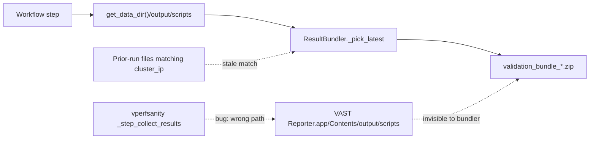

# Fix Test Suite bundle collection gaps

## Root-cause analysis (from `import/Assets-2026-04-20/Output-Results-2026-04-20.txt`)

- `vperfsanity` actually ran to completion (`22:18:10 Performance tests completed`, `22:18:21 Results saved to: /Applications/VAST Reporter.app/Contents/output/scripts/vperfsanity_results_10.143.11.202_20260420_151821.txt`). Result file is written **inside the .app bundle**, so the bundler — which reads from `get_data_dir()/output/scripts` (`/Applications/output/scripts/...` on this install) — can't find it and writes the `vperfsanity_NOT_FOUND.txt` placeholder.
- `VAST Support Tools` stopped at Step 2: `cp /tmp/vast_scripts/vast_support_tools.py /vast/data/vast_support_tools.py` → `Permission denied`. Steps 3–5 never ran, no archive was produced.
- `VAST vnetmap` Step 4 failed (`Unable to determine suitable switch API for <ip> / 154` → `Failed to connect to switch <ip>`, rc=1). **Root cause: wrong switch password** — the Reporter passed `-u cumulus -p '<default-password>'` from Connection Settings; vnetmap.py couldn't auth against the switches so API probing failed. The customer has since corrected the VMS switch password and the Reporter → Connection Settings → Switch Password; a re-run should now complete all 6 vnetmap steps with no code change. The bundle nonetheless contained `vnetmap_results_10.143.11.202_20260406_204312.json` from **two weeks ago**, silently picked by `_pick_latest` in `ResultBundler.collect_results` — that staleness is a real bundler bug that survives the password fix and is addressed in Fix 3.

Plan covers all three defects, plus a bundle-integrity improvement so stale data can never silently slip into a customer deliverable again.



## Fix 1 — vperfsanity writes results to the wrong directory

File: [`src/workflows/vperfsanity_workflow.py`](src/workflows/vperfsanity_workflow.py), in `_step_collect_results` around line 445.

Replace the hand-rolled path with the same helper every other workflow uses (`get_local_dir()` from `ScriptRunner`, which calls `get_data_dir()`):

```python
local_dir = self._script_runner.get_local_dir()
```

This is the single-line fix that gets today's vperfsanity results into the bundle. Verify by comparing to the correct pattern in `src/workflows/vnetmap_workflow.py:741` and `src/workflows/support_tool_workflow.py:506`.

Add a unit test in `tests/test_workflows.py` that patches `get_data_dir` and asserts `_step_collect_results` writes to `get_data_dir()/output/scripts/vperfsanity_results_<ip>_<ts>.txt` (not a path derived from `__file__`).

## Fix 2 — Support Tools Step 2 fails on write-protected `/vast/data/`

File: [`src/workflows/support_tool_workflow.py`](src/workflows/support_tool_workflow.py), `_step_set_permissions` at line 247.

The `vastdata` user does not have direct write access to `/vast/data/` on this cluster. Other cluster-side writes in the codebase already wrap in `sudo` (e.g. the log-bundle workflow uses `sudo tar` / `sudo chmod`). Update the copy to use `sudo` and also the chmod, matching the idiom already used elsewhere:

```python
copy_cmd = f"sudo cp {remote_script} {self.CONTAINER_SCRIPT_PATH} && sudo chmod 644 {self.CONTAINER_SCRIPT_PATH}"
```

Apply the same change to the two `chmod +x` paths (lines 281, 314) so the script is executable regardless of the default umask. Leave the `_scp_to_vms` path alone — that already uses paramiko and lands in the VMS, not the CNode `/vast/data/`.

Add a note in the step's error hint if the copy still fails so the user sees `"/vast/data/ is not writable by {user}; confirm passwordless sudo is configured on the CNode"` instead of a bare `Permission denied`.

## Fix 3 — Bundler silently includes stale prior-run results

File: [`src/result_bundler.py`](src/result_bundler.py), specifically `collect_results` (uses `_pick_latest` for every category).

Today `_pick_latest` returns the newest file on disk matching the cluster IP — no staleness check. Introduce a `since` timestamp the one-shot runner passes in (the timestamp when it started), and require collected files to be newer. Sketch:

```python
def collect_results(
    self,
    results_dir: Optional[Path] = None,
    cluster_ip: Optional[str] = None,
    since: Optional[datetime] = None,
) -> Dict[str, Path]:
    ...

def _pick_latest(self, candidates, cluster_ip, match_fn, *, since=None):
    for f in sorted(candidates, reverse=True):
        if since is not None and datetime.fromtimestamp(f.stat().st_mtime) < since:
            continue
        if cluster_ip is None or match_fn(f, cluster_ip):
            return f
    return None
```

Caller site: `src/oneshot_runner.py` — pass the run-start timestamp when invoking the bundler. For the manual `/results/bundle` path (Results page), keep the old behaviour by leaving `since=None`.

Also extend the manifest / `SUMMARY.md` to record per-category status. Minimum change in `ResultBundler.create_bundle`:

- In `manifest.json`, add a sibling dict `"categories": {name: "ok"|"stale"|"missing", ...}` populated from what was collected vs. what the runner declared it expected.
- In `SUMMARY.md`, replace the flat "Included Files" list with a status-aware section (ok / stale / not produced) so the reader can immediately see that e.g. vnetmap data came from a prior run.

The one-shot runner already knows which workflows it actually ran and which failed — thread that state through to the bundler instead of relying on filename globs alone.

## Fix 4 — UX signal on the Test Suite page when a workflow fails

File: [`frontend/templates/advanced_ops.html`](frontend/templates/advanced_ops.html) + the status payload in `src/app.py`'s `/advanced-ops/oneshot/status` route.

Today the footer says "Bundle Generated Successfully" even when 3 of 6 operations failed. Change the completion banner to reflect per-operation status (`3 of 6 operations succeeded`) and colour it warn rather than success when any selected operation failed or was bundled with stale data. Re-uses the new manifest `categories` map from Fix 3.

## Not in scope (credentials, not code)

- The vnetmap Step 4 failure was a wrong switch password fed into `vnetmap.py`. The customer has corrected it in the VMS and in Reporter → Connection Settings → Switch Password. A re-run will confirm all 6 vnetmap steps now succeed; no reporter code change is needed for vnetmap. Fix 3 still stops stale April 6 vnetmap files from sneaking in should any future run fail.

## Verification checklist

- Re-run the Test Suite against `<ip>` with the corrected Switch Password and confirm:
  - vnetmap produces a fresh `vnetmap_results_10.143.11.202_<today>.json` under `topology/` in the new bundle.
  - vperfsanity (after Fix 1) produces `vperfsanity_results_10.143.11.202_<today>.txt` under `performance/`.
  - Support Tools (after Fix 2 + passwordless sudo for `vastdata`) produces a `*support_tool_logs*.tgz` under `diagnostics/`.
- `python3 -m pytest tests/test_workflows.py tests/test_result_bundler.py -v` passes, including a new regression test for Fix 1 and new staleness tests for Fix 3.
- Deliberately re-run with vnetmap unchecked and confirm the bundle shows vnetmap as "not produced" rather than pulling in `_20260406_204312.*` files.
- `CHANGELOG.md` updated (`### Fixed`) and version bumped per `release-packaging-12.mdc`.
