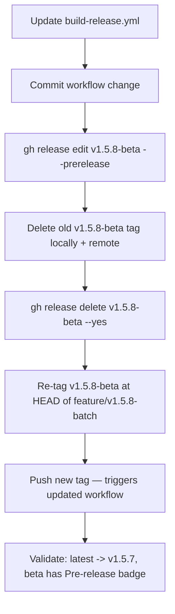

# Fix Beta Release "Latest" Designation

## Problem

`v1.5.8-beta` was marked as `isPrerelease: false` by GitHub because [`.github/workflows/build-release.yml`](.github/workflows/build-release.yml) uses `softprops/action-gh-release@v2` without setting `prerelease` or `make_latest` inputs. GitHub defaults to making any non-prerelease the "latest."

## Root Cause in Workflow

```yaml
- name: Create GitHub release
  uses: softprops/action-gh-release@v2
  with:
    body_path: ${{ steps.notes.outputs.body_path }}
    files: |
      VAST-Reporter-*.dmg
      VAST-Reporter-*.zip
```

No `prerelease:` or `make_latest:` key is specified. The action needs to detect tags containing `-beta`, `-rc`, or `-alpha` and set `prerelease: true` + `make_latest: false`.

## Plan

### Step 1: Update `build-release.yml` to detect pre-release tags

Add a step in the `release` job that determines whether the tag is a pre-release and exposes outputs consumed by `softprops/action-gh-release`:

```yaml
- name: Detect pre-release tag
  id: prerelease
  run: |
    TAG="${GITHUB_REF#refs/tags/}"
    if [[ "$TAG" == *-beta* || "$TAG" == *-rc* || "$TAG" == *-alpha* ]]; then
      echo "is_prerelease=true" >> "$GITHUB_OUTPUT"
      echo "make_latest=false" >> "$GITHUB_OUTPUT"
    else
      echo "is_prerelease=false" >> "$GITHUB_OUTPUT"
      echo "make_latest=true" >> "$GITHUB_OUTPUT"
    fi

- name: Create GitHub release
  uses: softprops/action-gh-release@v2
  with:
    prerelease: ${{ steps.prerelease.outputs.is_prerelease == 'true' }}
    make_latest: ${{ steps.prerelease.outputs.make_latest }}
    body_path: ${{ steps.notes.outputs.body_path }}
    files: |
      VAST-Reporter-*.dmg
      VAST-Reporter-*.zip
```

### Step 2: Fix the existing v1.5.8-beta release to be a prerelease

Use `gh release edit` to mark the existing release as a prerelease. This automatically restores v1.5.7 as "latest":

```bash
gh release edit v1.5.8-beta --prerelease
```

### Step 3: Re-tag v1.5.8-beta to include the support tools fix

The support tools fix (commit `2ce3bf4`) is on `feature/v1.5.8-batch` but after the current `v1.5.8-beta` tag. Move the tag forward:

```bash
git tag -d v1.5.8-beta                      # delete local tag
git push origin :refs/tags/v1.5.8-beta       # delete remote tag
git tag -a v1.5.8-beta -m "Release v1.5.8-beta — includes support tools fix"  # re-tag at HEAD
git push origin v1.5.8-beta                  # push new tag (triggers rebuild)
```

### Step 4: Validate

After the workflow runs on the new tag:

- Confirm `v1.5.8-beta` release shows `Pre-release` badge on GitHub
- Confirm `https://github.com/rstamps01/ps-deploy-report/releases/latest` resolves to `v1.5.7`
- Confirm all three platform artifacts (mac-arm64, mac-x64, win) are attached

## Execution Order


