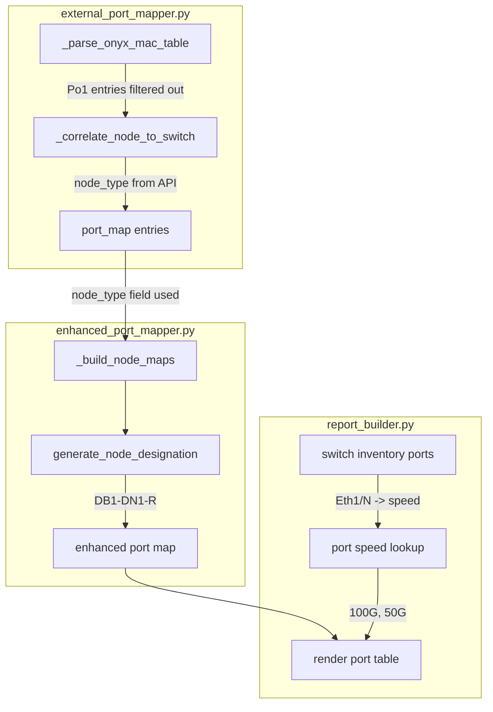

# Fix Port Mapping: Speed, Port Channels, and DBox Discovery

## Root Cause Analysis

### Issue 1: Hardcoded 200G Port Speed

In [report_builder.py](src/report_builder.py) at line 3976:

```python
speed = "200G"  # Default, would need to get from switch port data
```

This is a placeholder that was never replaced with actual lookup logic. The switch inventory data **does** have per-port speed information available (the switches on this cluster are MSN2700-CS2F with 100G and 50G ports — no 200G at all). The switch port data is stored in `ports` list on each switch object in `raw_switch_inventory`, with per-port fields like `{"name": "Eth1/5", "speed": "100G"}`.

**Fix:** Build a switch IP + port name -> speed lookup from the `switches` parameter already passed to `_create_port_mapping_section`. The Onyx MAC table parser converts `Eth1/N` to `swpN`, so we need to map back: `swpN` -> `Eth1/N` to match the port names in the switch inventory. For `Po*` (port channel) ports, default to "N/A" or aggregate from member ports.

### Issue 2: PPo1 Port Channels Showing All Node Connections

The Onyx MAC table includes port channels (Po1, Po2) which are aggregated logical ports — typically used for inter-switch links (ISL/IPL) or MLAG peer links. In the MAC table, **every** MAC that is reachable through the port channel shows up as associated with `Po1`. This is expected switch behavior: all MACs learned via the port-channel are listed against the port-channel interface.

Currently `_parse_onyx_mac_table` keeps Po1 entries, and `_correlate_node_to_switch` treats them like regular switch ports. This results in every node MAC appearing as if it's connected to Po1 on each switch.

**Fix:** Filter out `Po*` (port channel) entries from the MAC correlation. Port channels between switches are already handled separately by `_collect_ipl_connections` (LLDP-based). The Po1 entries in the MAC table represent learned MACs via the inter-switch link, not direct physical connections. In `_parse_onyx_mac_table`, skip entries where the port starts with `"Po"`.

### Issue 3: DNodes/DBoxes Not Identified

Two layers are failing:

**Layer 1 — `enhanced_port_mapper.py` `_build_node_maps()` (lines 85-102):** The heuristic to classify CNode vs DNode from the external port map uses interface patterns:

```python
if "enp129" in interface or "cnode" in hostname.lower():
    cnode_ips.append(...)
elif "enp3" in interface or "dnode" in hostname.lower():
    dnode_ips.append(...)
else:
    cnode_ips.append(...)  # Default: assume CNode
```

This cluster's DNodes use interfaces like `ens3`, `ens14`, `enp65s0f*` — none match the `"enp3"` pattern. Meanwhile, hostnames like `"Rack-DB1-UU7-bottom"` and `"aidc-vast01-d-128-106"` don't contain the substring `"dnode"` (they use `-d` or `Rack-DB`). So all 8 DNodes fall through to the `else` default and get classified as CNodes.

**The external port mapper (`_correlate_node_to_switch`) correctly sets `node_type` to `"Dnode"` from the API**, but the enhanced mapper ignores this field and re-derives node type from interface heuristics.

**Fix:** Use the `node_type` field from the external port map entries (already set by `_correlate_node_to_switch` from the API's `vast_install_info.node_type`). This is the authoritative source. The heuristic should only be a fallback when `node_type` is missing. Update the classification logic:

```python
node_type_raw = entry.get("node_type", "").lower()
if node_type_raw in ("cnode", "dnode"):
    # Trust the API
else:
    # Fall back to interface/hostname heuristic
```

**Layer 2 — DBox numbering:** The `dbox_num` in `_build_node_maps` is hardcoded to `1` for all DNodes from external data (`"dbox_num": 1`). When supplementing from API data, it reads `dnode.get("dbox_id")` which gives the real DBox ID. The external-data path needs the same: use the `box_name` field (e.g., `"dbox-225PF029"`) from the port map entry to derive a DBox number, or pass through `dbox_id` if available. However, the external port map entries do contain `"box_name"` from the inventory, so we can use that to determine unique DBox IDs and assign proper numbering.

## Files to Modify

1. **[src/external_port_mapper.py](src/external_port_mapper.py)** — `_parse_onyx_mac_table`: Filter out `Po*` port channel entries from MAC correlation
2. **[src/enhanced_port_mapper.py](src/enhanced_port_mapper.py)** — `_build_node_maps`: Use `node_type` field from external port map for CNode/DNode classification; improve DBox numbering
3. **[src/report_builder.py](src/report_builder.py)** — `_create_port_mapping_section`: Replace hardcoded `speed = "200G"` with actual per-port speed lookup from switch inventory data
4. **Tests** — Update/add tests for all three changes

## Data Flow


