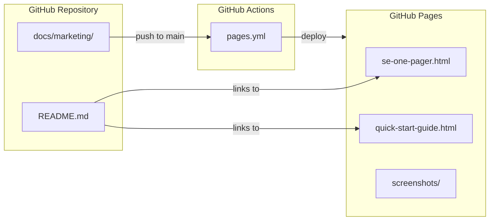

# GitHub Pages Deployment + README Visual Banner

## Context

GitHub only renders `README.md` on a repo's main page -- raw HTML files cannot be displayed inline. To make the one-pager and Quick Start Guide accessible, we will:

1. Deploy `docs/marketing/` as a GitHub Pages site at `https://rstamps01.github.io/ps-deploy-report/`
2. Add a visual banner near the top of `README.md` with preview images linking to the Pages site

The HTML files already use relative paths (`screenshots/filename.png`), so deploying the entire `docs/marketing/` directory as-is will preserve all image references.

---

## Part 1: GitHub Pages Deployment

### 1a. Create landing page

Create [docs/marketing/index.html](docs/marketing/index.html) as a hub page that links to both assets:

- Links to `se-one-pager.html` (one-pager) and `quick-start-guide.html` (quick start)
- Uses the same dark-navy design language for visual consistency
- Alternatively, a simple meta-redirect to `se-one-pager.html` (simpler approach)

### 1b. Create GitHub Actions workflow

Create [.github/workflows/pages.yml](.github/workflows/pages.yml):

- **Trigger**: pushes to `main` that touch `docs/marketing/`**
- **Job 1** (`build`): uses `actions/upload-pages-artifact` to upload `docs/marketing/` as the site artifact
- **Job 2** (`deploy`): uses `actions/deploy-pages` to deploy the artifact
- Uses `permissions: pages: write, id-token: <redacted>` for OIDC-based deployment
- Runs on `ubuntu-latest` (cheapest runner, per CI cost policy)

```yaml
name: Deploy Marketing Pages
on:
  push:
    branches: [main]
    paths: ['docs/marketing/**']
  workflow_dispatch:
permissions:
  pages: write
  id-token: <redacted>
concurrency:
  group: pages
  cancel-in-progress: false
jobs:
  build:
    runs-on: ubuntu-latest
    steps:
      - uses: actions/checkout@v4
      - uses: actions/upload-pages-artifact@v3
        with:
          path: docs/marketing
  deploy:
    needs: build
    runs-on: ubuntu-latest
    environment:
      name: github-pages
      url: ${{ steps.deployment.outputs.page_url }}
    steps:
      - id: deployment
        uses: actions/deploy-pages@v4
```

### 1c. Manual step (repo owner)

After the workflow is merged to `main`, enable GitHub Pages in repo settings:

- **Settings > Pages > Source**: select **GitHub Actions**
- This is a one-time configuration; the workflow handles all future deployments

### 1d. Clean up old AI-generated screenshots (optional)

The `docs/marketing/screenshots/` directory contains ~2.7 MB of old AI-generated mockups (`screenshot-dashboard.png`, `screenshot-reporter.png`, etc.) that are no longer referenced by the HTML files. Removing them reduces repo bloat:

- `screenshot-advanced-ops.png`
- `screenshot-dashboard.png`
- `screenshot-library.png`
- `screenshot-reporter.png`
- `screenshot-results.png`

---

## Part 2: README Visual Banner

### 2a. Add visual preview section

Insert a new section in [README.md](README.md) immediately after the opening paragraph (line 3) and before the `---` separator (line 5). This section will include:

- A clickable preview image of the Dashboard screenshot linking to the one-pager on GitHub Pages
- Two prominent call-to-action links:
  - "View Product Overview" -> `https://rstamps01.github.io/ps-deploy-report/se-one-pager.html`
  - "Quick Start Guide" -> `https://rstamps01.github.io/ps-deploy-report/quick-start-guide.html`

Example Markdown:

```markdown
> **New to asbuilt-reporter?** Check out the
> [Product Overview](https://rstamps01.github.io/ps-deploy-report/se-one-pager.html) |
> [Quick Start Guide](https://rstamps01.github.io/ps-deploy-report/quick-start-guide.html)

[](https://rstamps01.github.io/ps-deploy-report/se-one-pager.html)
```

### 2b. Update existing Quick Start links

Update any existing README links that point to the installation guide to also reference the Quick Start Guide on GitHub Pages, so users have both options.

---

## Diagram: Deployment Flow



---

## Cost and Risk Notes

- **Runner cost**: `ubuntu-latest` only, triggers only on `docs/marketing/`** changes to `main` -- minimal Actions usage
- **Repo size**: The 7.7 MB of images in `docs/marketing/screenshots/` will be committed; removing unused AI mockups saves ~2.7 MB
- **No breaking changes**: This adds a new workflow and modifies the README; no existing CI/CD workflows are affected
- **Branch**: Work should be done on the current `feature/health-check-v2` branch and merged through the normal flow to `main` before Pages will deploy
