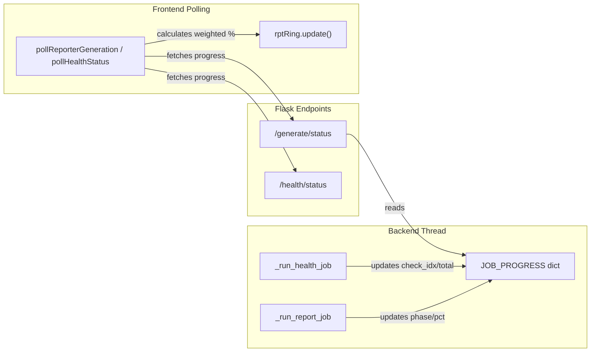

# Granular Progress Tracking for VAST Logo Indicator

## Problem

The progress indicator treats each operation (Pre-Validation, Report Generation, Health Check) as a single unit. With 2 operations selected, progress jumps 0% -> 50% -> 100%. Users see no movement while a long operation (like report generation) is running.

## Architecture



## Approach: Backend Progress Dict + Frontend Weighted Segments

### Part 1: Backend — Report Generation Progress

In [src/app.py](src/app.py), add a `JOB_PROGRESS` config key (dict with `phase`, `percent`, `label`). Update `_run_report_job` to set progress at each major phase:

- **Phase weights** (totaling 100):
  - `auth` — 5%
  - `data_collection` — 20%
  - `health_check` — 15% (skipped if not enabled, weight redistributed)
  - `port_mapping` — 10% (skipped if not enabled, weight redistributed)
  - `data_extraction` — 20%
  - `json_save` — 5%
  - `pdf_generation` — 25%
- Add a helper `_update_progress(app, phase, percent, label)` that writes to `JOB_PROGRESS` under the existing `JOB_LOCK`.
- Insert calls at each phase boundary in `_run_report_job` (~line 1582+).
- Expose in `/generate/status` response: add `"progress"` field alongside `"running"` and `"result"`.

### Part 2: Backend — Health Check Progress

In [src/health_checker.py](src/health_checker.py), add a `progress_callback` parameter to `HealthChecker.__init`__ and `run_all_checks`.

- In `run_api_checks` (line 671 loop), call `progress_callback(i, len(checks), fn.__name__)` after each check completes.
- In `run_switch_ssh_checks` (line 2644 loop), do the same.
- In [src/app.py](src/app.py) `_run_health_job`, pass a callback that updates `HEALTH_JOB_PROGRESS` (new config key, same pattern as `JOB_PROGRESS`).
- Expose in `/health/status` response alongside existing fields.

### Part 3: Frontend — Weighted Segment Mapping

In [frontend/templates/reporter.html](frontend/templates/reporter.html), modify `runReporterChecklist` (~line 2004):

- **Assign each operation a weighted percentage range** based on what's selected:
  - Pre-Validation only: 100%
  - Report Generation only: 100%
  - Pre-Validation + Report: 15% + 85%
  - Pre-Validation + Report + Health: 10% + 75% + 15%
  - etc.
- **Within each operation's polling loop**, read the sub-progress from the status endpoint and map it into that operation's range:

```
  overallPct = segmentStart + (subProgress / 100) * segmentWidth


```

- Modify `pollReporterGeneration` (~line 2219) to read `data.progress` from `/generate/status` and call `rptRing.update()` with the mapped percentage on each poll cycle.
- Modify health check polling similarly.
- For Pre-Validation, count output entries vs expected checks (credentials, cluster API, tool freshness = ~3) to estimate sub-progress.

### Part 4: Smooth Number Animation (optional enhancement)

Add a small `_animateTo(targetPct)` method on `VastProgress` that uses `requestAnimationFrame` to smoothly count the numeric percentage text up to the target, rather than jumping instantly. The fill already transitions via CSS `transition: background 0.5s ease`.

## Files to Change

- **[src/app.py](src/app.py)**: Add `JOB_PROGRESS` / `HEALTH_JOB_PROGRESS` config keys, `_update_progress` helper, update `_run_report_job` with progress calls at each phase, update `_run_health_job` with callback, update `/generate/status` and `/health/status` responses
- **[src/health_checker.py](src/health_checker.py)**: Add `progress_callback` param to constructor and `run_all_checks`/`run_api_checks`/`run_switch_ssh_checks`
- **[frontend/templates/reporter.html](frontend/templates/reporter.html)**: Update `runReporterChecklist`, `pollReporterGeneration`, health polling, and pre-validation polling to use weighted segment mapping; optionally add `_animateTo` on VastProgress
