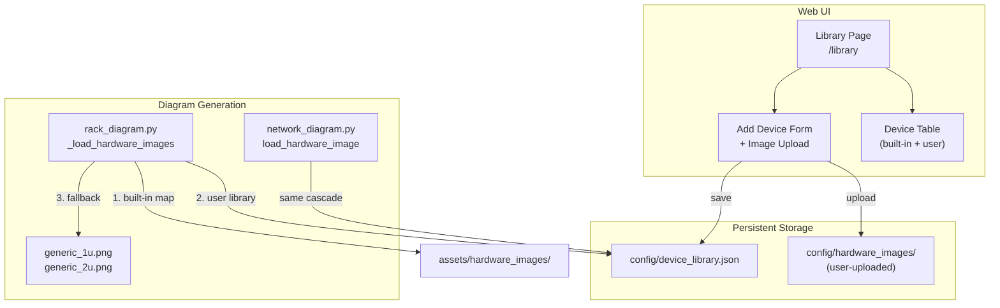

# Hardware Device Library

## Architecture



## Lookup Cascade (Priority Order)

When a device model is encountered during diagram generation:

1. **Built-in map** -- check the existing hardcoded `image_map` in `rack_diagram.py` (unchanged, preserves current behavior)
2. **User library** -- check `device_library.json` for a matching identifier key (exact then partial match)
3. **Generic fallback** -- use `generic_1u.png` or `generic_2u.png` based on U height (default 1U), log the unrecognized model as a warning requesting a library entry

## Data Model

`config/device_library.json` -- persistent JSON file (same pattern as `cluster_profiles.json`):

```json
{
  "dell_poweredge_r760": {
    "type": "cbox",
    "height_u": 2,
    "image_filename": "dell_poweredge_r760_2u.png",
    "description": "Dell PowerEdge R760 2U CBox",
    "added": "2026-03-04T12:00:00"
  }
}
```

- **Key**: identifier key (lowercased, used for matching)
- **type**: `cbox`, `dbox`, or `switch`
- **height_u**: `1` or `2`
- **image_filename**: filename in `config/hardware_images/` (user-uploaded) -- or `null` for generic
- **description**: optional human-readable label
- **added**: ISO timestamp

## Image Requirements (enforced on upload)

Based on existing images in `assets/hardware_images/`:

- **Format**: PNG (RGBA preferred) or JPEG
- **Dimensions**: width 120--1900 px, height proportional to U size
- **Recommended**: ~240 px wide for consistency with existing images (120px is the low end; 242px is common)
- **Max file size**: 1 MB
- **Naming**: auto-generated as `{identifier_key}_{height_u}u.{ext}`

## File Changes

### New files

- **`frontend/templates/library.html`** -- Library page template with:
  - Table of all devices (built-in + user-defined), showing: identifier key, type, U height, image preview, source (built-in/user), actions
  - "Add Device" form with fields: identifier key, type dropdown (CBox/DBox/Switch), U height dropdown (1U/2U), description, image upload
  - Delete button for user-defined entries only (built-in entries shown as read-only)
  - Section showing any "unrecognized devices" encountered during recent report generation
  - Image format/dimension requirements displayed near the upload field

- **`assets/hardware_images/generic_1u.png`** -- Generic 1U placeholder (gray device with "1U" label, ~240x22 px, RGBA)
- **`assets/hardware_images/generic_2u.png`** -- Generic 2U placeholder (gray device with "2U" label, ~240x44 px, RGBA)

### Modified files

- **[`src/app.py`](src/app.py)** -- Add routes:
  - `GET /library` -- render library page with merged built-in + user devices
  - `GET /api/library` -- JSON list of all devices
  - `POST /api/library` -- add/update a device entry (multipart form with optional image upload)
  - `DELETE /api/library/<key>` -- delete a user-defined device
  - `GET /api/library/unrecognized` -- return list of model keys seen but not in library
  - Add `LIBRARY_PATH` and `USER_IMAGES_DIR` to app config
  - Add helpers: `_load_library()`, `_save_library()`, image validation (format, dimensions, size)

- **[`src/rack_diagram.py`](src/rack_diagram.py)** -- Modify `_load_hardware_images()`:
  - After building the built-in `image_map`, load `device_library.json` and merge user entries (user images stored in `config/hardware_images/`)
  - Modify `_get_hardware_image_path()`: if no built-in or user match, return the generic image path based on model's U height
  - Modify `_get_device_height_units()`: after checking built-in patterns, check user library for height_u
  - Track unrecognized models in a module-level set for the `/api/library/unrecognized` endpoint
  - Accept `library_path` and `user_images_dir` parameters (passed from `app.py` via report builder)

- **[`src/network_diagram.py`](src/network_diagram.py)** -- Modify `load_hardware_image()`:
  - Same cascade: built-in map, then user library, then generic fallback
  - Accept `library_path` and `user_images_dir` parameters

- **[`src/report_builder.py`](src/report_builder.py)** -- Pass library path and user images dir through to `RackDiagram` and `NetworkDiagramGenerator` constructors

- **[`frontend/templates/base.html`](frontend/templates/base.html)** -- Add "Library" nav link between "Reports" and "Configuration"

- **[`frontend/static/css/app.css`](frontend/static/css/app.css)** -- Styles for library page (image preview thumbnails, upload form, unrecognized devices alert)

- **[`frontend/static/js/app.js`](frontend/static/js/app.js)** -- Library page JavaScript for add/delete device, image preview, form validation

- **[`packaging/vast-reporter.spec`](packaging/vast-reporter.spec)** -- Add generic images to bundled `assets/diagrams` data

### Storage locations

- **Built-in images**: `assets/hardware_images/` (bundled, read-only in frozen builds, resolved via `get_bundle_dir()`)
- **User library JSON**: `config/device_library.json` (writable, resolved via `get_data_dir()`)
- **User-uploaded images**: `config/hardware_images/` (writable, resolved via `get_data_dir()`)
- **Generic images**: `assets/hardware_images/generic_1u.png` and `generic_2u.png` (bundled)

## Key Design Decisions

- **Built-in entries are immutable** -- the hardcoded map in `rack_diagram.py` is preserved as-is; user entries extend but never override it
- **User entries persist across restarts** via JSON file (same pattern as cluster profiles)
- **Uploaded images persist** in the writable data directory, surviving app restarts and upgrades
- **Unrecognized device tracking** is per-session (module-level set, reset on restart) -- the Library page shows these as suggestions for the user to define
- **Generic images are always available** as bundled assets, ensuring diagrams never fail due to missing images
