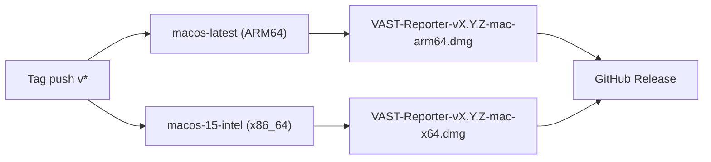

# macOS Intel Architecture Support

## Current State

- [build-release.yml](.github/workflows/build-release.yml) uses `macos-latest` (Apple Silicon / ARM64)
- PyInstaller builds a native binary for the host architecture only
- The [spec file](packaging/vast-reporter.spec) bundles `libcairo.2.dylib` from either `/opt/homebrew/lib` (ARM64) or `/usr/local/lib` (Intel) — already handles both paths
- Output: single `VAST-Reporter-vX.Y.Z-mac.dmg`

## Approach: Separate Architecture Builds (Recommended)

Add a second macOS matrix entry using the `macos-15-intel` runner (Intel x86_64, available until August 2027). This produces two .dmg files per release with zero cross-compilation complexity.



## Changes Required

### 1. Update build matrix in `.github/workflows/build-release.yml`

Split the single macOS entry into two:

```yaml
matrix:
  include:
    - os: macos-latest
      artifact: VAST-Reporter-mac-arm64
      script: bash packaging/build-mac.sh
      pip-cache: ~/Library/Caches/pip
    - os: macos-15-intel
      artifact: VAST-Reporter-mac-x64
      script: bash packaging/build-mac.sh
      pip-cache: ~/Library/Caches/pip
    - os: windows-latest
      artifact: VAST-Reporter-win
      script: powershell -ExecutionPolicy Bypass -File packaging/build-windows.ps1
      pip-cache: ~\AppData\Local\pip\Cache
```

Update the "Install macOS build deps" step condition from `matrix.os == 'macos-latest'` to `startsWith(matrix.os, 'macos')` (so both macOS runners install Cairo and create-dmg).

Similarly update the "Ensure config files exist (macOS)" step condition.

### 2. Update `packaging/build-mac.sh`

Append the architecture suffix to the .dmg filename:

```bash
ARCH=$(uname -m)  # "arm64" or "x86_64"
if [ "$ARCH" = "x86_64" ]; then
    ARCH_SUFFIX="x64"
else
    ARCH_SUFFIX="arm64"
fi
DMG_NAME="VAST-Reporter-v${VERSION}-mac-${ARCH_SUFFIX}.dmg"
```

### 3. Update release job asset preparation in `build-release.yml`

Download both macOS artifacts and copy both .dmg files into the release:

```yaml
- name: Download macOS ARM64 artifact
  uses: actions/download-artifact@v4
  with:
    name: VAST-Reporter-mac-arm64
    path: artifacts/mac-arm64

- name: Download macOS x64 artifact
  uses: actions/download-artifact@v4
  with:
    name: VAST-Reporter-mac-x64
    path: artifacts/mac-x64
```

Update the "Prepare release assets" step to handle both .dmg files and attach both to the GitHub Release.

### 4. Update release asset glob in the `softprops/action-gh-release` step

The existing glob `VAST-Reporter-*.dmg` already matches both `*-mac-arm64.dmg` and `*-mac-x64.dmg` -- no change needed there.

### 5. Update `ci.yml` build-smoke job (if applicable)

If `ci.yml` has a macOS build-smoke test, add the Intel variant there too (or keep it ARM64-only for cost savings since it's just a smoke test).

## Cost Consideration

- `macos-15-intel` costs the same as other macOS runners (10x Linux rate)
- Adding one Intel build job adds ~3-5 minutes of macOS runner time per release
- This only runs on tag pushes (releases), not on every commit

## Timeline Constraint

- `macos-15-intel` is available until **August 2027**
- After that, GitHub will not offer x86_64 macOS runners
- If Intel support is still needed post-2027, the project would need to switch to a **universal2 binary** approach (significantly more complex: requires universal2 Python install, fat Cairo library, PyInstaller `--target-arch universal2`)

## Alternative: Universal2 Binary (Not Recommended Now)

A single .dmg containing a fat binary for both architectures. This requires:

- Installing Python from python.org (universal2 installer) instead of `actions/setup-python`
- Building or obtaining a universal2 `libcairo.2.dylib`
- Adding `--target-arch universal2` to the PyInstaller invocation
- Ensuring all native C extensions (cryptography, cffi, etc.) are compiled as fat binaries

This is significantly more fragile and complex. Recommended only if a single-file deliverable is mandatory or after the Intel runner is retired.
