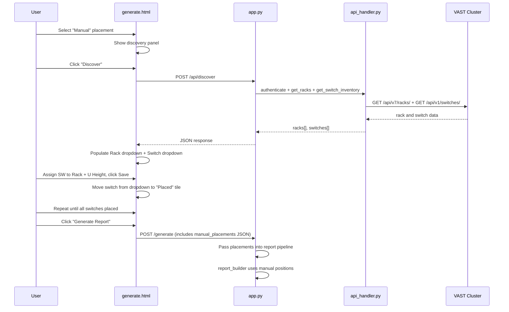

# Manual Switch Placement

## Architecture




## Key Design Decision

`generate_rack_diagram()` in [src/rack_diagram.py](src/rack_diagram.py) already supports explicit `rack_unit` positions on switch dicts (lines 907-921). When a switch dict has `rack_unit` set, it bypasses auto-calculation entirely. This means no changes to `rack_diagram.py` are needed — we just need to set `rack_unit` on the switch data before it reaches the diagram generator.

## Files to Modify

### 1. `src/app.py` — New discovery endpoint + pass manual placements

**New route `POST /api/discover`** (inside `_register_routes`):

- Accepts `cluster_ip`, `auth_method`, `username`/`password`/`token`
- Creates a temporary `api_handler`, authenticates, calls `get_racks()` and `get_switch_inventory()`
- Returns JSON:

```python
{
  "racks": [{"name": "Rack", "id": 1, "height_u": 42}, ...],
  "switches": [{"name": "se-var-1-1", "model": "MSN3700-VS2FC", "serial": "MT2450...", "height_u": 1}, ...]
}
```

- Switch `height_u` is derived from `RackDiagram._get_device_height_units(model)` so the UI can display it.

**Modify `POST /generate`** (line ~108):

- Parse `manual_placements` from form data (JSON string) when `switch_placement == "manual"`
- Expected format: `[{"switch_name": "se-var-1-1", "rack_name": "Rack", "u_position": 40}, ...]`
- Add to `params` dict

**Modify `_run_report_job`** (line ~339):

- When `params["switch_placement"] == "manual"`, inject `manual_switch_placements` into `processed_data` before calling `generate_pdf_report`

### 2. `src/report_builder.py` — Consume manual placements

**Modify the pre-calculation block** (around line 1947):

- Check for `data.get("manual_switch_placements")`
- When present, skip auto-calculation entirely
- Build `self.switch_positions` and `self.switch_rack_name` directly from the manual data
- Group placements by rack so per-rack assignment works correctly

**Modify the per-rack switch assignment** (around line 2097):

- When manual placements exist, assign each switch to its specified rack (not just the first rack)
- Set `rack_unit` on each switch dict so `generate_rack_diagram` uses explicit positioning (line 908-921 of rack_diagram.py)

### 3. `frontend/templates/generate.html` — Manual placement UI

**Enable the Manual option** (line ~73):

- Remove `disabled` attribute from `<option value="manual">`

**Add `toggleSwitchPlacement()` handler**:

- When "Manual" selected: show `manualPlacementPanel`, hide form hint
- When "Auto" selected: hide panel, show hint

**New `manualPlacementPanel` section** (after the switch_placement select):

- **Discovery controls**: "Discover" button that calls `POST /api/discover` using current form credentials
- **Assignment row**: Rack dropdown, Switch dropdown, U Height input, "Add" button
- **Placed switches tile**: Table showing assigned switches with Rack/Switch/U Height columns and a "Remove" button per row
- **Hidden input** `manual_placements` that stores the JSON array, submitted with the form

**JavaScript functions** (inline in generate.html, following existing pattern):

- `discoverSwitches()` — calls `/api/discover`, populates dropdowns
- `addSwitchPlacement()` — validates input, moves switch from dropdown to placed tile, updates hidden JSON
- `removeSwitchPlacement(idx)` — moves switch back to dropdown, updates hidden JSON
- Form submit validation: if Manual mode, require all switches to be placed before allowing generate

### 4. `frontend/static/css/app.css` — Styles for placement UI

Add styles for:

- `.manual-placement-panel` container
- `.placed-switches-table` for the assignment tile
- `.discover-btn` for the discovery button

## Data Flow for Manual Placement

1. User fills in cluster credentials and selects "Manual"
2. User clicks "Discover" -> `POST /api/discover` returns racks + switches
3. User assigns each switch to a rack + U position via the dropdowns
4. On "Generate", form submits `switch_placement=manual` + `manual_placements=[{...}]`
5. `_run_report_job` injects placements into `processed_data["manual_switch_placements"]`
6. `report_builder` skips auto-calc, sets `self.switch_positions` and per-rack assignments from manual data
7. `generate_rack_diagram` sees `rack_unit` on switch dicts and uses explicit positions

## What Does NOT Change

- `src/rack_diagram.py` — already handles explicit `rack_unit` on switches
- `src/api_handler.py` — `get_racks()` and `get_switch_inventory()` already exist
- `src/data_extractor.py` — no changes needed
- Auto placement logic — remains the default; Manual is opt-in

