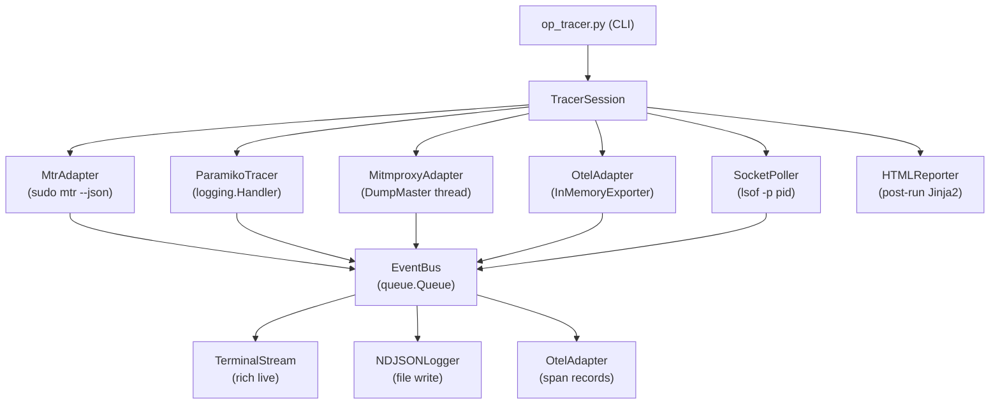

# Op Tracer Framework

A standalone macOS CLI tool that monitors the full operational workflow: route trace → SSH proxy connect → secondary SSH hops → API calls → command execution → SCP transfers → log collection.

## File Structure

```
tools/
  op_tracer.py                   # CLI entry point (argparse)
  tracer/
    __init__.py
    event_bus.py                 # TracerEvent dataclass + thread-safe EventBus
    session.py                   # TracerSession — orchestrates adapters, lifecycle
    adapters/
      __init__.py
      mtr_adapter.py             # Route tracing (sudo mtr --json)
      paramiko_tracer.py         # SSH session/tunnel/command/SCP tracing
      mitmproxy_adapter.py       # HTTP/HTTPS request+response intercept
      otel_adapter.py            # OpenTelemetry span creation
      socket_poller.py           # lsof -p <pid> connection state polling
    output/
      __init__.py
      terminal_stream.py         # Rich live terminal output (color-coded)
      ndjson_logger.py           # Newline-delimited JSON event file
      html_reporter.py           # Post-run HTML timeline report (Jinja2)
  requirements-tracer.txt        # Tracer-only dependencies
```

## CLI Invocation (single parameter set)

```bash
python3 tools/op_tracer.py \
  --entry-host <ip> \
  --ssh-user vastdata --ssh-password vastdata \
  --api-user support --api-password <pass> \
  --interface en0 \
  --output-dir ./tracer-output \
  --format terminal,json,html
```

Optional flags: `--secondary-hosts 172.x.x.x,...`, `--skip-mtr`, `--skip-mitmproxy`, `--skip-otel`, `--timeout 30`

## Central Event Model

All adapters write to a single `EventBus` (thread-safe `queue.Queue`). Every event is a `TracerEvent` dataclass:

```python
@dataclass
class TracerEvent:
    seq: int               # monotonically increasing
    timestamp: float       # time.time()
    event_type: str        # see table below
    source: str            # "mtr" | "paramiko" | "mitmproxy" | "otel" | "lsof"
    host: str
    details: dict
    duration_ms: Optional[float]
    status: str            # "ok" | "fail" | "pending" | "skipped"
    parent_seq: Optional[int]   # for nested operations
```

### Event Types

- `route.hop` — mtr hop (hop_num, hop_ip, latency_ms, packet_loss)
- `ssh.connect` — paramiko channel open (host, port, user, auth_method)
- `ssh.tunnel_open` — direct-tcpip channel (src_addr, dest_addr)
- `ssh.command` — remote command (command, exit_code, stdout_preview)
- `ssh.scp_transfer` — file copy (direction, path, bytes_transferred)
- `http.request` — mitmproxy intercept (method, url, headers_count)
- `http.response` — mitmproxy intercept (status_code, duration_ms, body_bytes)
- `socket.open` / `socket.close` — lsof diff (local_addr, remote_addr)
- `span.start` / `span.end` — OTel span boundaries

## Adapter Design

### `[mtr_adapter.py](tools/tracer/adapters/mtr_adapter.py)`

- Runs `sudo mtr --json --report --report-cycles 5 --no-dns <target>` per destination
- Parses JSON hubs array, emits one `route.hop` event per hop
- Executes concurrently for all known targets at startup before SSH begins

### `[paramiko_tracer.py](tools/tracer/adapters/paramiko_tracer.py)`

- Registers a custom `logging.Handler` on `logging.getLogger("paramiko.transport")` and `logging.getLogger("paramiko.transport.sftp")`
- Parses log message patterns to classify into `ssh.connect`, `ssh.tunnel_open`, `ssh.command`, `ssh.scp_transfer`
- Zero-intrusion: no changes to existing `ssh_adapter.py` or `vms_tunnel.py` required

### `[mitmproxy_adapter.py](tools/tracer/adapters/mitmproxy_adapter.py)`

- Embeds mitmproxy using its Python API (`mitmproxy.options.Options` + `DumpMaster`) in a background thread
- Custom `Addon` class with `request()` and `response()` hooks writing to `EventBus`
- Sets `HTTP_PROXY`/`HTTPS_PROXY` env vars before invoking the target app/workflow so all requests route through the local proxy listener
- Handles TLS via mitmproxy's CA (auto-generated on first run, stored in `~/.mitmproxy/`)

### `[otel_adapter.py](tools/tracer/adapters/otel_adapter.py)`

- Root OTel span: `tracer_session` wraps the entire run
- Child spans created per phase: `route_trace`, `ssh_primary`, `ssh_secondary.<host>`, `api_call`, `scp_transfer`
- Uses `InMemorySpanExporter` → serialized to NDJSON span records alongside other events
- Optional OTLP export to Jaeger if `--otlp-endpoint` is specified

### `[socket_poller.py](tools/tracer/adapters/socket_poller.py)`

- Background thread polling `lsof -n -P -p <pid> -i` every 2 seconds
- Diffs previous vs current connection set, emits `socket.open` / `socket.close` events

## Output Handlers

### Terminal (real-time)

Uses `rich` for structured, color-coded live output:

```
[00:01.2] [ROUTE ] <ip>  hop 1: <ip>     2.3ms   OK
[00:02.1] [SSH   ] CONNECT  → <ip>:22            45ms    OK
[00:02.8] [SSH   ] TUNNEL   → <ip>:443 (tcpip)     12ms    OK
[00:03.1] [HTTP  ] GET /api/clusters/  → 200 OK           38ms
[00:04.0] [SSH   ] CMD      → df -h                       OK
[00:05.5] [SCP   ] DOWNLOAD ← /var/log/vast.log          1.2 MB  OK
```

### NDJSON Log (real-time, one line per event)

`tracer-output/session-<timestamp>.ndjson` — one JSON object per `TracerEvent`

### HTML Report (post-run)

Jinja2 template generating a timeline with:

- Summary header (session params, duration, counts per event type)
- Per-phase sections (Route Trace, SSH Primary, Secondary Connections, API Calls, File Transfers)
- Collapsible detail rows with full request/response bodies
- Color-coded status indicators

## New Dependencies (`[requirements-tracer.txt](tools/requirements-tracer.txt)`)

- `mitmproxy>=11.0` (embeddable Python API)
- `opentelemetry-api>=1.25`
- `opentelemetry-sdk>=1.25`
- `rich>=13.0` (terminal output)
- `jinja2>=3.0` (already present via Flask in main app)

## Architecture Flow


