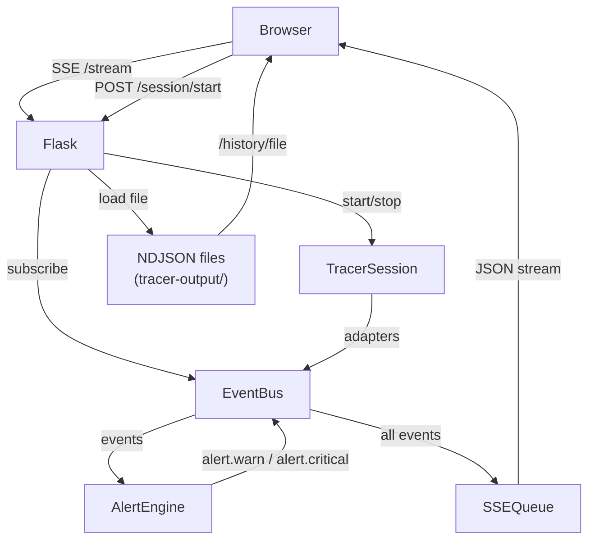

# asbuilt-analyzer Web Frontend

## Architecture



## New Files

### `tools/tracer/alert_engine.py`

Subscribes to `EventBus`, evaluates 6 rule functions, publishes `alert.warn` / `alert.critical` events (new event types added to `EVENT_TYPES`).

Rules:

- `unknown_ip` — connection to non-RFC1918 / non-declared-cluster IP
- `suspicious_port` — TCP not on 22, 80, 443, 8443, 2049, 389, 6001, 5001
- `sensitive_cmd` — command matches `rm -rf`, `passwd`, `chmod [0-9]`, `curl.*\|.*sh`, `wget.*\|.*sh`
- `large_scp` — SCP bytes field > 10,485,760 (10 MB), configurable
- `unexpected_api` — `http.request` host not in declared entry/secondary hosts
- `high_volume` — sliding 60s window: >15 new connections to the same single host

### `tools/analyzer_web.py`

Standalone Flask app branded as **asbuilt-analyzer**. Key routes:

| Route                     | Method | Purpose                                                     |
| ------------------------- | ------ | ----------------------------------------------------------- |
| `/`                       | GET    | Redirect → `/live`                                          |
| `/live`                   | GET    | Dashboard template                                          |
| `/session/start`          | POST   | Instantiate + start `TracerSession` in background thread    |
| `/session/stop`           | POST   | Call `session.stop()`                                       |
| `/session/status`         | GET    | JSON: `{running, duration_s, event_counts, alert_counts}`   |
| `/stream`                 | GET    | SSE — streams `TracerEvent.as_dict()` as `data: <JSON>\n\n` |
| `/history`                | GET    | History list template                                       |
| `/api/history`            | GET    | JSON list of NDJSON files with summary metadata             |
| `/api/history/<filename>` | GET    | JSON array of all events from that file                     |

SSE bridge: a `queue.Queue` (`_SSE_QUEUE`) receives every event via an EventBus subscriber during an active session. The `/stream` generator reads from this queue with a 1s timeout heartbeat.

Session state managed by module-level globals (mirrors the pattern in `src/app.py`):

```python
_SESSION: Optional[TracerSession] = None
_SESSION_THREAD: Optional[threading.Thread] = None
_SESSION_LOCK = threading.Lock()
_SESSION_RUNNING = False
```

### `tools/templates/analyzer/base.html`

Shared layout: dark sidebar navigation with **asbuilt-analyzer** branding, alert badge in header (count pulled from `/session/status`), no external CDN dependencies — all CSS/JS served locally.

### `tools/templates/analyzer/index.html` (Live Dashboard)

Three-column layout:

- **Left column — Session Control** (250px): form fields for `entry_host`, `ssh_user`, `ssh_password`, `ssh_key_path` (optional), `secondary_hosts`, `app_log` (auto-detected), `app_pid`, `skip_mtr` / `skip_mitmproxy` / `skip_otel` toggles. Start/Stop buttons. Live stats: duration, event counts per category.
- **Center column — Event Timeline** (flex): tab strip (All / SSH / API / Transfers / Sockets / Alerts), each event rendered as a row with: timestamp, colored category badge, direction arrows (→ / ←), source host, target host, detail text, status indicator. Rows expand on click to show full JSON payload. Auto-scroll toggle.
- **Right column — Network Map + Alerts** (280px): SVG canvas showing nodes (local machine, entry host, secondary hosts discovered from remote_poller events) with animated edges for active connections, colored by event category. Below the map: Alerts panel with severity badge, rule name, and jump-to-event link.

### `tools/templates/analyzer/history.html`

Table of past sessions: date, entry host, duration, event totals, alerts detected (parsed from `_summary` line + a pre-scan of alert events). Click row → loads session detail inline or navigates to `/history/<file>`.

### `tools/templates/analyzer/session_detail.html`

Same timeline/map layout as index.html but populated from `/api/history/<filename>` via a single fetch call on page load. No SSE — events rendered all at once with the same filter/sort controls.

### `tools/static/analyzer/css/analyzer.css`

Dark-mode-first design consistent with the existing app palette. CSS custom properties for colors. No external fonts or icon libraries.

### `tools/static/analyzer/js/analyzer-live.js`

- `EventSource('/stream')` with `onmessage` handler
- Event router dispatching by `event_type` prefix to category renderers
- Filter state (active tabs, host filter, text search)
- Network map SVG updater — adds/removes nodes and edges based on `socket.`*and `ssh.`* events
- Alert counter updater on `alert.*` events
- Auto-scroll to bottom with override

### `tools/static/analyzer/js/analyzer-replay.js`

- Fetch `/api/history/<filename>` → render all events through same renderers as live
- Play/pause replay with speed multiplier (1x / 5x / max)

## Alert Event Types (additions to `event_bus.py`)

```python
"alert.warn",
"alert.critical",
```

## `requirements-tracer.txt` additions

```
flask>=3.0.0
```

## Run Command

```bash
cd /Users/ray.stamps/vast-asbuilt-reporter/tools
python3 analyzer_web.py           # serves http://localhost:5050
```

Or with explicit port/output-dir:

```bash
python3 analyzer_web.py --port 5050 --output-dir ../tracer-output
```
