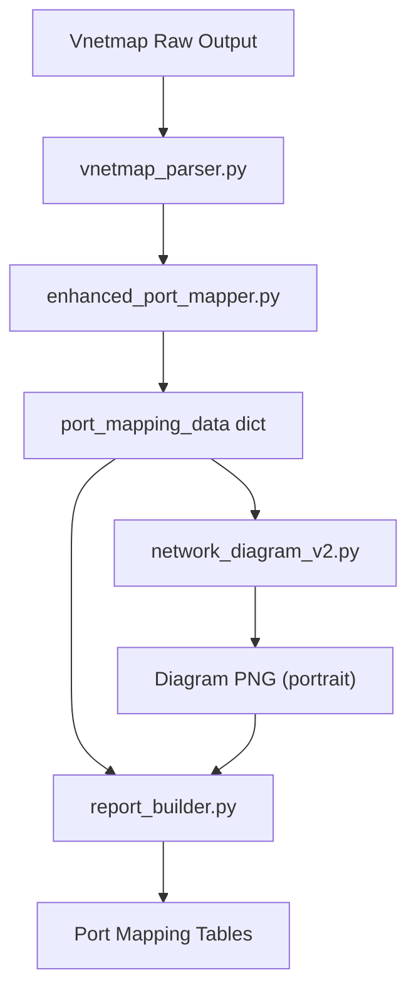

# Portrait Logical Network Diagram Redesign

## Context

The current diagram in [src/network_diagram_v2.py](src/network_diagram_v2.py) uses landscape orientation (11x8.5in), draws schematic spine-to-leaf connections for all upstream switches, and paginates at 6 racks. The vnetmap `port_map` now provides complete topology data (hostname, switch_ip, port, data_ip, interface, MAC, network) that should be the sole driver for diagram connections.

## Key Design Decisions

- **Portrait layout**: 8.5x11in (US Letter portrait), max **2 racks per page**, paginating beyond that
- **Spine vs Leaf classification**: A switch is **leaf** if its `switch_ip` appears in the `port_map` with node connections (CNode/DNode). A switch is **spine** if it is in the hardware inventory but has **no node connections** in the port_map (only switch-to-switch links)
- **Spine-to-leaf connections**: Only drawn when **LLDP/IPL data confirms** them (from `ipl_connections` in `port_mapping_data`), not schematic/inferred
- **Labels**: Use existing designation format from `enhanced_port_mapper.py` -- `SWA`, `SWB` for leaf; `SP1`, `SP2` for spine; `CB1-CN1-R/L`, `DB1-DN1-R/L` for nodes

## Data Flow




## File Changes

### 1. [src/network_diagram_v2.py](src/network_diagram_v2.py) -- Layout and rendering changes

**Constants (lines 87-92)**:

- Change from landscape to portrait dimensions:
  - `PORTRAIT_W = 8.5 * 72` (612 pts)
  - `PORTRAIT_H = 11 * 72` (792 pts)
- Reduce `MAX_RACKS_PER_PAGE` from 6 to **2**
- Adjust `RACK_W`, `DEVICE_W`, `SWITCH_W` proportionally for narrower page (approximately 60% of current widths)
- Recalculate `RACK_PAD_X`, `RACK_GAP` for tighter portrait margins

**Spine classification (around line 338)**:

- Current logic already separates leaf (in port_map) from upstream (not in port_map) -- this is correct
- Add explicit "spine" labeling: spine switches get `SP1`, `SP2`, etc. instead of `UP1`, `UP2`
- Add a visual distinction: spine switches use a different gradient/color than leaf switches

**Spine-to-leaf connections (around lines 781-798)**:

- Remove the current schematic "all leaves uplink to all spines" loop
- Instead, read `ipl_connections` from `port_mapping_data` (currently passed as `_ipl_conns` but **unused**)
- Rename `_ipl_conns` parameter back to `ipl_conns` and wire it into rendering
- Only draw spine-to-leaf links when an `ipl_connection` entry confirms the link (matching `switch1_ip`/`switch2_ip` to a spine and a leaf)
- Use dashed orange/purple line style for confirmed spine-to-leaf uplinks

**IPL rendering (around lines 696-724)**:

- Keep the existing leaf-to-leaf IPL rendering (purple horizontal segment between SWA and SWB)
- Add new handling: if an `ipl_connection` entry references a spine switch IP and a leaf switch IP, draw a vertical dashed connection from the leaf's top to the spine's bottom

`**_render_page` (lines 551-804)**:

- Swap canvas dimensions from landscape to portrait
- Adjust the spine tier placement for narrower width
- Reduce rack column widths to fit 2 racks side-by-side in portrait (approx 250pt each with gap)
- Add page number rendering at bottom of each page

**Device connection routing (lines 941-1013)**:

- No structural change needed -- the `_rounded_polyline` routing already works per-rack
- Adjust channel offsets for the narrower rack widths

### 2. [src/report_builder.py](src/report_builder.py) -- Embedding changes

`**_create_logical_network_diagram` (lines 3616-3866)**:

- Change `use_landscape` default behavior: when portrait mode is active, do NOT switch to `NextPageTemplate("landscape")`
- Remove the landscape page template switch (lines 3836-3844) when diagram is portrait
- Update available area calculation (lines 3794-3800) to use portrait dimensions: ~7.0 x 9.5 inch available area
- Each generated PNG page gets its own `Image()` element in the story flow, naturally paginating in the PDF

**Config defaults (lines 87-92 of ReportConfig)**:

- Change `"orientation": "landscape"` to `"orientation": "portrait"` as the new default

### 3. [src/enhanced_port_mapper.py](src/enhanced_port_mapper.py) -- Spine designation

`**_build_switch_map` (lines 225-265)**:

- After building `leaf_switches`, also build a `spine_switches` list (switches in inventory but NOT in port_map IPs)
- Assign spine designations: `SP1`, `SP2`, etc. (using `"SP"` prefix + sequential number)
- Add spine entries to `switch_map` with a `role: "spine"` field to distinguish from leaf entries

`**generate_switch_designation` (lines 316-333)**:

- When a switch IP maps to a spine entry, generate `SP{N}-P{port}` format

### 4. [config/config.yaml.template](config/config.yaml.template) -- Default config

- Change `network_diagram.orientation` from `"landscape"` to `"portrait"`

### 5. No changes needed to

- `vnetmap_parser.py` -- already provides complete topology data
- `data_extractor.py` -- already builds `ipl_connections` from LLDP data
- `brand_compliance.py` -- table/heading utilities unchanged

## Visual Layout (Portrait, 2 racks)

```
+------------------------------------------+
|        Logical Network Topology           |
|                                           |
|    [SP1: spine-hostname] (if present)     |
|         |            |                    |
|    (LLDP-confirmed uplinks only)          |
|         |            |                    |
|  +-- Rack 1 --+  +-- Rack 2 --+          |
|  | [SWA] [SWB]|  | [SWA] [SWB]|          |
|  |   IPL      |  |   IPL      |          |
|  |  cnode-3-4 |  |  ...       |          |
|  |  cnode-3-5 |  |            |          |
|  |  --------- |  |            |          |
|  | dnode-3-104|  |            |          |
|  | dnode-3-105|  |            |          |
|  +------------+  +------------+          |
|                                           |
|  [Net A] [Net B] [IPL/MLAG] [Uplink]     |
+------------------------------------------+
```

## Testing Considerations

- Existing unit tests in `tests/test_network_diagram_v2.py` will need updated assertions for portrait dimensions and 2-rack pagination
- Add test cases for spine switch classification and LLDP-only spine-to-leaf rendering
- Manual visual verification with the <lab-cluster> cluster data (2 switches, 2 CBoxes, 1 DBox)

