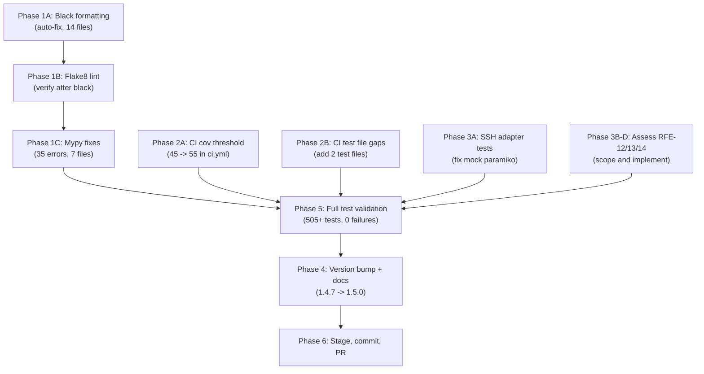

# Pre-Release Readiness Plan (v1.5.0)

Current state: 503 tests, 56% coverage, `cov-fail-under=55` in pyproject.toml. Branch: `feature/health-check-v2`. Version: `1.4.7`.

---

## Phase 1: Quality Gate Fixes (CI Blockers)

The CI `quality-gate` job runs flake8, black, and mypy. All three currently fail. These **must** pass before any PR to `develop`/`main`.

### 1A. Black formatting (14 files)

Run `black --line-length 120 src/ tests/` to auto-format. Files needing reformat:

- `src/app.py`, `src/advanced_ops.py`, `src/script_runner.py`, `src/tool_manager.py`
- `src/utils/ssh_adapter.py`
- `src/workflows/` (vnetmap, vperfsanity, network_config, support_tool, switch_config)
- `tests/` (test_rack_diagram, test_health_checker, test_workflows, test_external_port_mapper)

### 1B. Flake8 lint (63 issues)

After black auto-fixes most whitespace issues, remaining:

- **59 W293** (blank line whitespace) -- resolved by black
- **2 E303** (excess blank lines) -- resolved by black
- **1 W291** (trailing whitespace) -- resolved by black
- **1 E128** (indent) -- may need manual fix

### 1C. Mypy type errors (35 errors in 7 files)

Key files and fix strategy:

- `src/workflows/vnetmap_workflow.py` (16 errors): JSON-parsed `object` types need `Dict`/`List` annotations or casts
- `src/tool_manager.py` (9 errors): Same pattern -- `object` indexing needs type annotations
- `src/workflows/log_bundle_workflow.py` (3 errors): `float`-to-`int` assignment -- use `int()` cast
- `src/result_bundler.py` (1 error): `float`-to-`int` assignment
- `src/session_manager.py` (1 error): `Any` return type
- `src/advanced_ops.py` (1 error): `Any` return type
- `src/workflows/network_config_workflow.py` (2 errors): `Any` return + missing annotation

---

## Phase 2: CI Configuration Alignment

### 2A. Coverage threshold mismatch

- **`pyproject.toml`**: `cov-fail-under=55`
- **`ci.yml` unit-tests job**: `--cov-fail-under=45`

Fix: Update [ci.yml line 126](.github/workflows/ci.yml) to `--cov-fail-under=55` to match pyproject.toml. The CI override defeats the local threshold.

### 2B. CI test coverage gaps

The `advanced-ops-tests` job does NOT include new test files:

- Missing: `tests/test_tool_manager.py`
- Missing: `tests/test_external_port_mapper.py`

Fix: Add these to the `advanced-ops-tests` job `pytest` invocation in [ci.yml line 195](.github/workflows/ci.yml), or create a dedicated CI job for them.

---

## Phase 3: Bug Fixes (Stability)

### 3A. Fix `test_ssh_adapter.py` -- 2 pre-existing failures

The tests `test_client_always_closed` and `test_connection_error` fail because the mock replaces the `paramiko` module entirely, making `paramiko.SSHException` a `MagicMock` instead of a real exception class. When `_paramiko_exec` hits `except paramiko.SSHException`, Python raises `TypeError: catching classes that do not inherit from BaseException`.

Fix in [tests/test_ssh_adapter.py](tests/test_ssh_adapter.py) lines 118-148: The `_make_mock_paramiko()` helper must set `mock_paramiko.SSHException = paramiko.SSHException` (importing the real class) so the `except` clause works. Same for `AuthenticationException`.

### 3B. RFE-12: DC/DBox Rack naming (assess scope)

Evaluate if this is a naming-only fix or requires deeper structural changes. If naming-only, fix in `rack_diagram.py` and `report_builder.py`.

### 3C. RFE-13: Rack API Call fix (assess scope)

Evaluate if the rack API endpoint returns incorrect data or is called incorrectly.

### 3D. RFE-14: Capacity calculations check (assess scope)

Verify capacity math in `health_checker.py` (`_check_capacity()`).

---

## Phase 4: Version Bump and Documentation

### 4A. Version bump to 1.5.0

The version sync script checks these files -- all must match:

- `src/__init__.py` (`__version__` and docstring `Version:`)
- `src/app.py` (`APP_VERSION`)
- `src/main.py` (`--version` argument)
- `packaging/vast-reporter.spec` (`CFBundleShortVersionString`, `CFBundleVersion`)
- `README.md` (version badge)

### 4B. CHANGELOG finalization

Move all `[Unreleased]` content into a `[1.5.0]` section with the release date.

### 4C. TODO-ROADMAP update

- Move completed items (AO-15, TSE-9 Phase A-C) to Done section
- Update "Last updated" and "Next steps"
- Move AO-15 to Done once hardening is validated

### 4D. PRE-RELEASE-QA-GAP-ANALYSIS update

Update the "Current state" line to reflect final test count and coverage after all fixes.

---

## Phase 5: Test Suite Validation

### 5A. Fix all tests to green

After Phase 1-3 changes, run full suite and verify 0 failures:

```
pytest tests/ -v --ignore=tests/test_ui.py --ignore=tests/test_integration.py --cov=src --cov-report=term-missing --cov-fail-under=55
```

### 5B. Run integration tests

```
pytest tests/test_integration.py -v -m integration --no-cov
```

### 5C. Pre-release quality checklist

```
flake8 src/ tests/
black --check --line-length 120 src/ tests/
mypy src/ --ignore-missing-imports --no-strict-optional
bash scripts/check-version-sync.sh
```

---

## Phase 6: Final Staging and PR

### 6A. Stage all changes

Ensure `.DS_Store`, log files, and `vnetmap.py` are excluded per `.gitignore`.

### 6B. Commit and push

Commit to `feature/health-check-v2` with conventional commit message.

### 6C. Create PR to develop

PR from `feature/health-check-v2` to `develop` for CI validation.

---

## Priority and Sequencing



---

## Items Explicitly Deferred (Post-Release)

These are tracked in TODO-ROADMAP as Planned and are NOT required for this release:

- RFE-1/SB-1: Support Bundle integration
- RFE-2: Jeff's Port Mapper
- RFE-3: Conditional Net Diagram rendering
- RFE-6: Container deployment
- RFE-7/8: Updated deployment / Mac.app / Win.msi packaging
- RFE-9/10/11: Next steps, Alert Summary, JSON export DB
- AUTH-1: Automated token generation
- DEV-1: Developer button
- TSE-9 Phase D+: Coverage toward 80%
