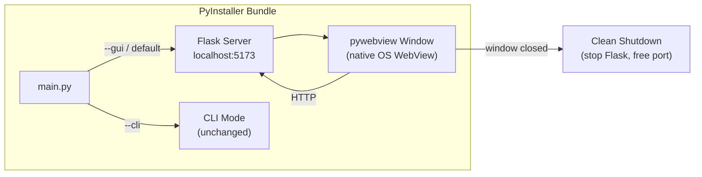

# Native Window with App Icons, Installer, and Clean Shutdown

## Architecture




## Changes

### 1. `requirements.txt` -- Add pywebview dependency

Add `pywebview>=5.0` to runtime dependencies. On macOS this uses the system WebKit (zero extra binaries). On Windows it uses Edge WebView2 (pre-installed on Win 10/11).

### 2. `packaging/icons/` -- App icon files (new)

Generate proper app icons from the existing VAST logo (`frontend/static/img/vast-logo.png`):

- `**packaging/icons/icon.icns**` -- macOS icon set (required sizes: 16, 32, 64, 128, 256, 512, 1024 px). Generated using `iconutil` from an `.iconset` folder. This icon appears in **Launchpad**, Dock, Finder, and the app title bar.
- `**packaging/icons/icon.ico`** -- Windows icon (multi-resolution: 16, 32, 48, 64, 128, 256 px). Generated using Pillow. This icon appears on the **desktop shortcut**, Start Menu, taskbar, and window title.

### 3. `src/main.py` -- Refactor `run_gui()` with clean shutdown

Modify `run_gui()` ([src/main.py](src/main.py) lines 793-818):

- Start Flask via `werkzeug.serving.make_server()` in a **daemon thread** (gives us a `server.shutdown()` handle)
- Poll until the server is ready
- Launch `webview.create_window()` + `webview.start()` on the **main thread** (required by macOS)
- **On window close**: call `server.shutdown()` to stop Flask cleanly, freeing port 5173
- Keep `webbrowser.open()` as a fallback if pywebview is not available
- In fallback mode, `Ctrl+C` triggers the same `server.shutdown()` path

Key structure:

```python
def run_gui(host="127.0.0.1", port=5173):
    flask_app = create_flask_app(config)

    # Use make_server for clean shutdown control
    from werkzeug.serving import make_server
    server = make_server(host, port, flask_app)

    server_thread = threading.Thread(target=server.serve_forever, daemon=True)
    server_thread.start()

    # Wait for server ready
    _wait_for_server(host, port)

    url = f"http://{host}:{port}"

    try:
        import webview
        webview.create_window("VAST As-Built Reporter", url,
                              width=1280, height=800)
        webview.start()  # blocks until window is closed
    except ImportError:
        webbrowser.open(url)
        try:
            server_thread.join()  # Ctrl+C to exit
        except KeyboardInterrupt:
            pass
    finally:
        server.shutdown()  # clean shutdown, frees port
```

### 4. `packaging/vast-reporter.spec` -- Bundle updates

- Add `webview` to `hiddenimports`
- Set `console=False` on macOS (hides terminal window for `.app`)
- Reference the new icon files (`icon.icns`, `icon.ico`)
- Add `NSAllowsLocalNetworking` and `NSAppTransportSecurity` to `info_plist` for WebKit localhost access
- The `.app` bundle with the `.icns` icon automatically appears in **Launchpad** when dragged to `/Applications`

### 5. `packaging/installer.nsi` -- Windows NSIS installer (new)

NSIS (Nullsoft Scriptable Install System) creates a proper `.exe` installer for Windows with:

**Install actions:**

- Copies the PyInstaller `VAST Reporter/` folder to `C:\Program Files\VAST Reporter\`
- Creates a **desktop shortcut** (`VAST Reporter.lnk`) pointing to `vast-reporter.exe` with the `.ico` icon
- Creates a **Start Menu folder** (`VAST Data\VAST Reporter`) with app shortcut and uninstaller shortcut
- Registers the uninstaller in Windows **Add/Remove Programs** (Control Panel)

**Uninstall actions:**

- Removes all installed files from `C:\Program Files\VAST Reporter\`
- Removes the desktop shortcut
- Removes the Start Menu folder and all entries
- Removes the Add/Remove Programs registry entry
- Kills any running `vast-reporter.exe` process before uninstalling

Key NSIS sections:

```nsis
Section "Install"
    SetOutPath "$INSTDIR"
    File /r "dist\VAST Reporter\*.*"
    CreateShortCut "$DESKTOP\VAST Reporter.lnk" "$INSTDIR\vast-reporter.exe" "" "$INSTDIR\icon.ico"
    CreateDirectory "$SMPROGRAMS\VAST Data"
    CreateShortCut "$SMPROGRAMS\VAST Data\VAST Reporter.lnk" "$INSTDIR\vast-reporter.exe"
    CreateShortCut "$SMPROGRAMS\VAST Data\Uninstall.lnk" "$INSTDIR\uninstall.exe"
    WriteUninstaller "$INSTDIR\uninstall.exe"
    ; Register in Add/Remove Programs
    WriteRegStr HKLM "Software\Microsoft\Windows\CurrentVersion\Uninstall\VASTReporter" ...
SectionEnd

Section "Uninstall"
    ; Kill running process
    nsExec::ExecToLog 'taskkill /F /IM vast-reporter.exe'
    Delete "$DESKTOP\VAST Reporter.lnk"
    RMDir /r "$SMPROGRAMS\VAST Data"
    RMDir /r "$INSTDIR"
    DeleteRegKey HKLM "Software\Microsoft\Windows\CurrentVersion\Uninstall\VASTReporter"
SectionEnd
```

### 6. `packaging/build-mac.sh` -- Update for icons

- The `icon.icns` file is already referenced by `vast-reporter.spec`, so the `.app` bundle picks it up automatically
- No changes needed beyond ensuring the icon file exists before build

### 7. `packaging/build-windows.ps1` -- Update for NSIS

After the PyInstaller step, invoke NSIS to create the installer:

```powershell
# Copy icon into dist folder for NSIS
Copy-Item "packaging\icons\icon.ico" "$AppDir\icon.ico"
# Build installer
makensis packaging\installer.nsi
```

Output: `dist/VAST-Reporter-v1.4.0-setup.exe`

## Clean Shutdown Summary


| Trigger                        | What Happens                                                                     |
| ------------------------------ | -------------------------------------------------------------------------------- |
| Close native window (X button) | `webview.start()` returns, `finally` block calls `server.shutdown()`, port freed |
| Ctrl+C in terminal (dev mode)  | KeyboardInterrupt caught, `finally` block calls `server.shutdown()`, port freed  |
| macOS Cmd+Q                    | Same as close window                                                             |
| Windows uninstaller            | `taskkill` kills process, then removes files                                     |


## macOS Launchpad Integration

When a user drags `VAST Reporter.app` into `/Applications/` (the standard DMG install flow), macOS automatically indexes it and the app appears in **Launchpad** with the `.icns` icon. No additional registration is needed.

## What Does NOT Change

- **All Flask routes, templates, CSS, JS** -- completely untouched
- **CLI mode** (`--cli`) -- completely untouched
- **PyInstaller bundling strategy** -- still `--onedir`, same data files
- **SSE log streaming** -- works identically in WebView as in browser
- **All existing tests** -- pywebview is only invoked in `run_gui()`, which tests don't call

## Bundle Size Impact

- macOS: +0 MB (uses system WebKit, no extra binaries; `.icns` is ~200 KB)
- Windows: +2-5 MB (pywebview wrapper; `.ico` is ~100 KB; NSIS installer adds ~1 MB overhead)

## Fallback Behavior

If pywebview fails to import (e.g., missing system dependency, SSH session, CI), the app falls back to opening the default browser -- exactly like today. Clean shutdown still works via `Ctrl+C` in the terminal.
