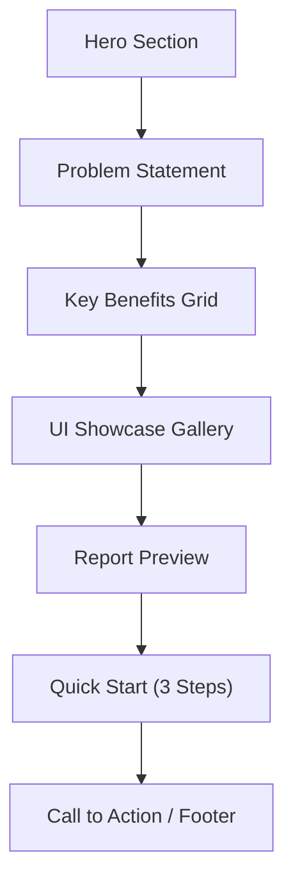

# Internal Marketing Asset: VAST As-Built Reporter

## Format Decision

**Standalone HTML file** (`docs/marketing/se-one-pager.html`) -- self-contained with all CSS inline, no external dependencies. Opens in any browser, attachable to email/Slack, printable to PDF. Mirrors the app's dark-navy + teal-accent design language from `frontend/static/css/app.css` for brand consistency.

## Proposed Layout (Scrolling One-Pager)

The page is a single vertically-scrolling document with seven sections:



### Section 1: Hero Banner

- Full-width dark gradient banner matching app palette (`#0e1117` to `#161b22`)
- App name **"VAST As-Built Reporter"** in large type
- Tagline: *"Generate customer-ready as-built reports in minutes -- not hours."*
- Subtext: *"No Python. No terminal. Just download, connect, and go."*
- Accent-colored CTA button linking to GitHub Releases download

### Section 2: The Problem

- Brief 2-3 sentence block calling out the pain:
  - Manual as-built documentation is time-consuming (hours per cluster)
  - Inconsistent deliverables across engagements
  - Risk of missing critical configuration details
- Pulled from PRD language in [docs/confluence/02-PRD.md](docs/confluence/02-PRD.md): *"save significant engineering time"*, *"consistent, high-quality deliverable"*

### Section 3: Key Benefits (4-card grid)

- **80% Time Savings** -- Automated data collection from VAST REST API; full report in under 5 minutes
- **Customer-Ready Output** -- VAST-branded PDF with executive summary, rack diagrams, network topology, and health results; plus machine-readable JSON
- **Field-Ready Design** -- SSH proxy hop for unreachable switches, Tech Port mode, graceful degradation when data is partial, works offline after collection
- **One-Click Health Checks** -- 32 automated checks (26 API + 6 switch SSH) with remediation guidance; optional inclusion in the PDF report

### Section 4: UI Showcase Gallery

- Horizontal scrollable or grid of 4-5 screenshot slots with captions:
  1. **Dashboard** -- Quick Start tiles, Results Odometer, workflow cards
  2. **Reporter** -- Unified 5-step workflow (Discover, Place Switches, Generate, Health Check, Download)
  3. **Results** -- Validation results hub with per-operation tabs
  4. **Library** -- Hardware device catalog with custom images
  5. **Advanced Ops** -- One-shot validation suites and bundling (Developer Mode)
- Each slot will be a styled placeholder (`<div>` with dashed border, SVG camera icon, and caption text) where real screenshots can be dropped in later by replacing the `src` attribute on `` tags

### Section 5: Report Preview

- Side-by-side mock showing:
  - Left: PDF cover page representation (VAST branding, cluster name, date)
  - Right: Bullet list of report sections (Executive Summary, Hardware Inventory, Physical Rack Layout, Network Configuration, Switch Configuration, Port Mapping, Logical Configuration, Security & Authentication, Health Check Results, Post-Deployment Activities)
- Accent callout: *"PDF + JSON -- regenerate reports from saved JSON without reconnecting to the cluster"*

### Section 6: Quick Start (3 Steps)

- Styled step cards matching the app's `.step-card` pattern:
  1. **Download** -- Go to GitHub Releases, grab the `.dmg` (macOS) or `.zip` (Windows)
  2. **Launch** -- Open the app; browser opens automatically at `localhost:5173`
  3. **Connect & Generate** -- Enter cluster IP + credentials, run discovery, generate your report
- Note about Gatekeeper (macOS) and SmartScreen (Windows) first-launch approval
- Link to full installation guide: `docs/deployment/INSTALLATION-GUIDE.md`

### Section 7: Call to Action / Footer

- Bold CTA: *"Start generating professional as-built reports today."*
- Links: GitHub Releases, Slack channel (placeholder), Confluence page reference
- App version badge and "Built by PS Engineering" credit

## Visual Design Tokens (from [frontend/static/css/app.css](frontend/static/css/app.css))

- **Backgrounds:** `#0e1117` (body), `#161b22` (cards), `#1c2333` (elevated)
- **Borders:** `#2a3548`
- **Text:** `#e6edf3` (primary), `#8b949e` (secondary)
- **Accent:** `#1a6fb5` (blue), `#00b4d8` (cyan highlights), `#22c55e` (success)
- **Typography:** system font stack, monospace for code snippets
- **Shape:** 6px radius, soft box-shadow on cards

## Screenshot Strategy

The HTML will include styled placeholder containers with:

- Dashed border + camera icon + descriptive label (e.g., "Dashboard Screenshot")
- Commented `` tags with suggested filenames (e.g., `screenshot-dashboard.png`)
- Instructions in an HTML comment block at the top of the file explaining how to add real screenshots

This lets you capture screenshots from a running instance and drop them in without changing any layout code.

## File Location

```
docs/
  marketing/
    se-one-pager.html      <-- The marketing asset (self-contained)
    screenshots/            <-- Directory for screenshot images (gitignored or added later)
      README.md             <-- Instructions for capturing screenshots
```
