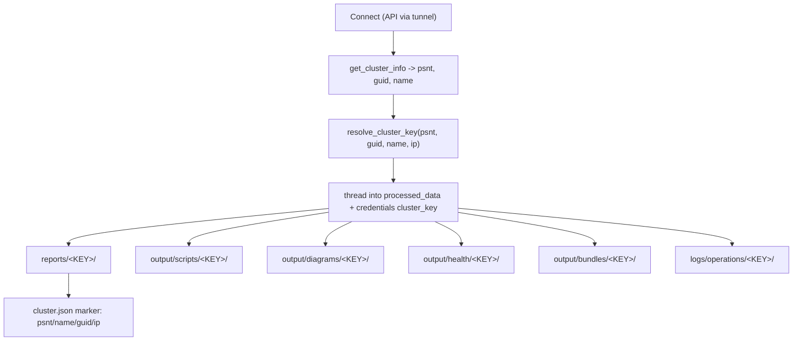

# Segment generated results by cluster PSNT

## Goal

Stop cross-cluster data intermingling caused by the shared tech-port IP `192.168.2.2`. Every artifact (reports, vnetmap, workflow outputs, health, bundles, diagrams, ops logs, and test fixtures going forward) is written under a per-cluster subdirectory keyed by a resolved cluster identifier, with a `cluster.json` marker. Discovery/scanning becomes folder-scoped, with a legacy fallback for existing flat files.

## Cluster key + layout

Resolved once per operation, fallback chain: `PSNT -> GUID -> cluster name -> IP`, sanitized to `[A-Za-z0-9._-]`.

## Phase 1 - Central utility (new module)

Create `src/utils/cluster_paths.py`:

- `resolve_cluster_key(psnt=None, guid=None, name=None, ip=None) -> str` - fallback chain + `_sanitize` (replace anything outside `[A-Za-z0-9._-]` with `_`).
- `cluster_output_dir(root: str, cluster_key: str) -> Path` - returns `get_data_dir()/<root>/<cluster_key>`, `mkdir(parents=True, exist_ok=True)`.
- `write_cluster_marker(dir: Path, psnt, name, guid, ip)` - create/merge `cluster.json` (`first_seen` preserved).
- `find_cluster_dirs(root: str, ip=None, name=None) -> list[Path]` - back-compat association via existing `cluster.json` markers.
- New tests `tests/test_cluster_paths.py` (fallback ordering, sanitization, marker round-trip).

## Phase 2 - Resolve and thread the key (orchestration)

Resolve the key once where identity is known and inject it:

- Web report job [src/app.py](src/app.py) ~2447: after `extract_all_data`, build key from `processed_data["cluster_summary"]` (`psnt`/`guid`/`name`) + `cluster_ip`; set `processed_data["cluster_key"]`.
- OneShot [src/oneshot_runner.py](src/oneshot_runner.py) ~1671.
- CLI [src/main.py](src/main.py) ~561 and replay ~1048.
- Advanced-Ops routes [src/app.py](src/app.py) (`advanced_ops_start`/`run_step`/`run_all`, ~632/661/692) and manager `set_credentials` [src/advanced_ops.py](src/advanced_ops.py) ~342: resolve key (probe `get_cluster_info` over the tunnel when an API handler is available; otherwise fall back to IP) and set `credentials["cluster_key"]` so every workflow inherits it.

## Phase 3 - Reports under the key

Write JSON/PDF/`.meta.json` to `reports/<key>/` and write the `cluster.json` marker there:

- [src/app.py](src/app.py) 2447-2471, [src/oneshot_runner.py](src/oneshot_runner.py) 1671-1710, [src/main.py](src/main.py) 561-577 and 1048-1054. Filenames keep the existing `vast_data_{name}_{ts}` / `vast_asbuilt_report_{name}_{ts}` patterns.

## Phase 4 - Workflow outputs under the key

Route each workflow's writes into `output/scripts/<key>/` (preserving its subdirs), using `credentials["cluster_key"]` (resolve fallback from `cluster_ip` if absent):

- vnetmap [src/workflows/vnetmap_workflow.py](src/workflows/vnetmap_workflow.py) 1330-1372
- vperfsanity [src/workflows/vperfsanity_workflow.py](src/workflows/vperfsanity_workflow.py) 421-452
- support_tool [src/workflows/support_tool_workflow.py](src/workflows/support_tool_workflow.py) 499-500, 665-669
- network_config [src/workflows/network_config_workflow.py](src/workflows/network_config_workflow.py) 435-478
- switch_config [src/workflows/switch_config_workflow.py](src/workflows/switch_config_workflow.py) 617-645
- log_bundle [src/workflows/log_bundle_workflow.py](src/workflows/log_bundle_workflow.py) 185-186, 283-292
- generic download [src/script_runner.py](src/script_runner.py) 870-873

## Phase 5 - Diagrams, health, bundles, ops logs

- Diagrams: pass `output/diagrams/<key>/` as `out_dir` ([src/report_builder.py](src/report_builder.py) 3795-3814; [src/network_diagram_v2.py](src/network_diagram_v2.py) 557 keeps the `network_topology_p{N}.png` name) - fixes silent PNG overwrite across clusters.
- Health: `output/health/<key>/` ([src/health_checker.py](src/health_checker.py) 232-237, 447).
- Bundles: zip into `output/bundles/<key>/` ([src/result_bundler.py](src/result_bundler.py) 676-682); collection sourced from `output/scripts/<key>/`.
- Ops logs: `logs/operations/<key>/` ([src/utils/ops_log_manager.py](src/utils/ops_log_manager.py) 50-53).
- Verbose mapper log: include key / `logs/<key>/` ([src/external_port_mapper.py](src/external_port_mapper.py) 86-88).

## Phase 6 - Folder-aware discovery with legacy fallback

- `_find_latest_vnetmap_output` ([src/app.py](src/app.py) 2598, [src/oneshot_runner.py](src/oneshot_runner.py) 1798): accept `cluster_key`, search `output/scripts/<key>/vnetmap_output_*.txt` first; fall back to legacy flat `vnetmap_output_{ip}_*.txt` only when no per-cluster dir exists (prevents the current "newest across all clusters" bug). Update callers to pass `cluster_key`.
- [src/result_scanner.py](src/result_scanner.py): scan the cluster's `<key>` folders; keep legacy flat scan as fallback, associating via `cluster.json` marker / `filename_ip`.
- [src/result_bundler.py](src/result_bundler.py): collect from the cluster folder; legacy fallback retained.

## Phase 7 - Tests, fixtures, docs

- TDD across the new util and each touched module; add a cross-cluster isolation test proving two PSNT folders both reachable via `192.168.2.2` do not cross.
- Adopt the layout for new fixtures; convert a couple representative fixtures (e.g. under `tests/data` / `reports/latest-reports`) to the `<PSNT>/` layout and add scanner/bundler folder + legacy-fallback tests.
- Docs: README output-structure section, `config/config.yaml.template` comment, `CHANGELOG.md`, and a `docs/TODO-ROADMAP.md` item.
- Run `pytest`, `flake8 src/ tests/`, `black --check --line-length 120 src/ tests/`.

## Verify

Replay-generate the <customer-site> report and confirm artifacts land under `reports/VA2553454/` and `output/scripts/VA2553454/`, the `cluster.json` marker is written, vnetmap discovery only returns that cluster's file, and existing flat files still resolve via the fallback path.
