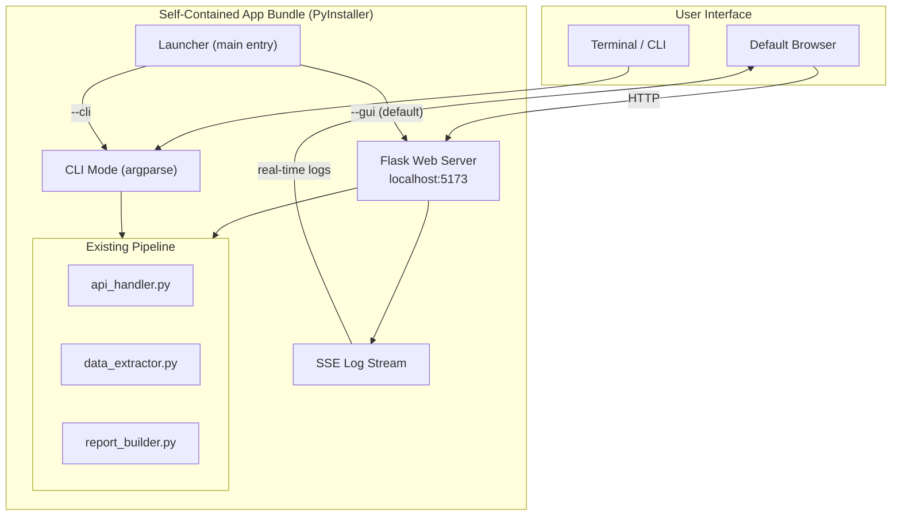

# Self-Contained Application Packaging with Web UI

## Recommendation: PyInstaller + Flask Web UI

After evaluating Docker, Electron, Tauri, BeeWare/Briefcase, and PyInstaller, the clear winner for this use case is **PyInstaller with a built-in Flask web server**. Here is why the alternatives fall short:

- **Docker**: Requires Docker Desktop (2GB+ install, $$$$ enterprise licensing, IT approval). Overkill for a single-purpose tool on engineer laptops.
- **Electron**: Bundles an entire Chromium browser (~200MB), two separate runtimes (Node + Python), complex IPC bridging. Far too heavy.
- **Tauri**: Smaller than Electron but requires Rust toolchain and still needs a Python sidecar process.
- **BeeWare/Briefcase**: Python-native but immature GUI toolkit, limited widget library, poor fit for data-heavy forms and log streaming.

**PyInstaller + Flask** gives: single app bundle, embedded Python runtime (no system conflicts), modern browser-based GUI, preserved CLI, clean install/uninstall, and proven packaging for complex Python projects.

---

## Architecture




The launcher detects the mode: GUI (default on double-click) starts Flask and opens the browser; CLI mode (terminal with `--cli` flag) uses the existing argparse workflow unchanged.

---

## Key Design Decisions

### 1. Drop WeasyPrint from the bundle

WeasyPrint depends on system-level C libraries (Pango, HarfBuzz, GDK-Pixbuf) that are extremely difficult to bundle cross-platform. ReportLab is already the primary PDF engine and handles all production reports. WeasyPrint should remain as an optional dev dependency only, not bundled.

Similarly, `cairocffi`/`pycairo` should be evaluated -- `rl-renderPM` (ReportLab's built-in renderer) can handle PNG conversion without system Cairo in most cases.

### 2. Flask over FastAPI/Streamlit

- Flask has the best PyInstaller compatibility (well-documented, no async complications)
- Jinja2 templates keep everything server-rendered (no separate JS build step)
- Lightweight enough to start in <1 second on localhost
- Alpine.js or htmx for interactivity without a JS build toolchain

### 3. Server-Sent Events (SSE) for live progress

The existing pipeline logs to Python's logging module. A custom log handler will forward log records to an SSE endpoint, giving the browser real-time progress without WebSockets or polling.

### 4. PyInstaller `--onedir` mode

`--onefile` extracts to a temp directory on every launch (slow, antivirus issues on Windows). `--onedir` produces a folder that runs instantly and is more reliable for complex dependency trees.

### 5. Platform-specific SSH handling

`pexpect` is Unix-only. On Windows, the port mapping feature will use `paramiko` (pure Python SSH) as the transport layer, with a thin adapter interface so the rest of the code is platform-agnostic.

---

## Project Structure (new/modified files)

```
vast-asbuilt-reporter/
  src/
    main.py              # MODIFY: add --gui/--cli mode switch
    app.py               # NEW: Flask application, routes, SSE
    api_handler.py       # existing (no changes)
    data_extractor.py    # existing (no changes)
    report_builder.py    # existing (no changes)
    utils/
      logger.py          # MODIFY: add SSE log handler
      ssh_adapter.py     # NEW: cross-platform SSH (pexpect/paramiko)
  frontend/
    templates/
      base.html          # layout, nav, VAST branding
      dashboard.html     # landing page, recent reports
      generate.html      # report generation form + live progress
      config.html        # YAML config editor
      reports.html       # browse/download previous reports
    static/
      css/app.css        # VAST-branded styles
      js/app.js          # SSE listener, form handling (vanilla JS + htmx)
      img/               # VAST logo, icons
  packaging/
    vast-reporter.spec   # PyInstaller spec file
    build-mac.sh         # macOS build script
    build-windows.ps1    # Windows build script
    icons/
      icon.icns          # macOS icon
      icon.ico           # Windows icon
    dmg-settings.json    # macOS DMG layout (create-dmg)
  .github/
    workflows/
      build-release.yml  # GitHub Actions: build + release
  requirements.txt       # MODIFY: add flask, split runtime vs dev deps
  requirements-dev.txt   # NEW: test/lint/weasyprint deps (not bundled)
```

---

## Web UI Pages

### Dashboard (`/`)

- Application version and status
- Quick-generate button (opens generate form)
- Recent reports list with download links

### Generate Report (`/generate`)

- Form fields: Cluster IP, auth method (token/password), credentials
- Optional: port mapping toggle, switch credentials
- Optional: output directory picker
- "Generate" button triggers background job
- Live progress panel (SSE-fed log stream)
- Download link appears when complete

### Configuration (`/config`)

- YAML editor (textarea with syntax help) for `config.yaml`
- Save/reset/load template buttons
- Section toggles for report sections

### Report Browser (`/reports`)

- List all generated reports (PDF + JSON) from output directory
- Sort by date, cluster name
- Download and delete actions
- PDF preview (iframe or object embed)

---

## Build and Distribution

### macOS

1. PyInstaller bundles into `VAST Reporter.app`
2. `create-dmg` wraps into `VAST-Reporter-v1.4.0-mac.dmg`
3. Install: open DMG, drag to Applications
4. Uninstall: drag to Trash

### Windows

1. PyInstaller bundles into `VAST Reporter/` folder
2. Zip the folder into `VAST-Reporter-v1.4.0-win.zip` (or optionally NSIS installer)
3. Install: extract zip, optionally create shortcut
4. Uninstall: delete folder

### GitHub Actions Workflow

- Triggered on version tags (`v*`)
- Matrix build: `macos-latest` + `windows-latest`
- Steps: install deps, run tests, PyInstaller build, create DMG/zip, upload to GitHub Release
- Artifacts are platform-specific download links on the release page

---

## Dependency Splitting

**Runtime deps** (bundled by PyInstaller):
`requests`, `urllib3`, `PyYAML`, `reportlab`, `rl-renderPM`, `Pillow`, `click`, `colorlog`, `python-dateutil`, `jsonschema`, `python-dotenv`, `flask`, `pexpect` (mac), `paramiko` (windows)

**Dev-only deps** (not bundled):
`weasyprint`, `cairocffi`, `pycairo`, `pytest`, `pytest-cov`, `pytest-mock`, `flake8`, `black`

---

## Migration Path

The existing CLI workflow is preserved exactly as-is. The web UI is an additive layer. Engineers who prefer the terminal can use `--cli` mode with all existing flags. The launcher simply adds a new default mode (GUI) that starts Flask and opens the browser.

---

## Estimated Bundle Size

- Embedded Python runtime: ~30MB
- ReportLab + Pillow + deps: ~40MB
- Flask + templates + static: ~5MB
- Application code + assets: ~10MB
- **Total: ~80-120MB** (comparable to typical desktop apps, far smaller than Docker or Electron)

