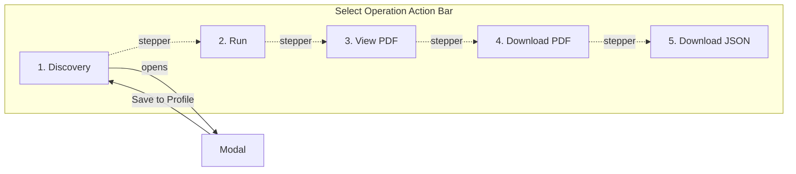

# Switch Placement Modal & Sequential Workflow

## Overview

Restructure the Reporter "Select Operation" tile into a clean, sequential 5-step workflow. The Switch Placement Mode toggle is removed (default Manual, fallback Auto). A modal handles all Discovery and switch placement. The bottom action bar becomes a visual stepper with 5 evenly-spaced buttons.

## Design Reference

Mockups saved in `assets/`:

- `switch-placement-workflow-mockup-v2.png` -- Select Operation tile with stepper bar (before/after states)
- `switch-placement-modal-mockup-v2.png` -- Switch Placement Editor modal

## Sequential Workflow

```
A. Connection Settings:
   Step 1 -> Connect to cluster, verify SSH
   Step 2 -> Add Cluster IP, save profile (defaults pre-populated)

B. Select Operation:
   [1. Discovery] --> [2. Run] --> [3. View PDF] --> [4. Download PDF] --> [5. Download JSON]
       |                                  (3-5 ghosted until report completes)
       v
   Modal: Discover racks/switches, +Switch manual add, assign U heights, Save to Profile
```



---

## Detailed Changes

### 1. Remove Switch Placement Mode Toggle

**File:** [frontend/templates/reporter.html](frontend/templates/reporter.html)

- Remove the entire `rpt-section` containing the Auto/Manual toggle, labels, and hidden input
- Remove `toggleRptSwitchPlacement()` function
- Set default `switch_placement` to `"manual"` in the config template
- In the report generation JS, fallback: if `rptPlacedSwitches.length === 0`, send `switch_placement: "auto"`

**File:** [config/config.yaml.template](config/config.yaml.template)

- Change `default_switch_placement: manual` (currently may be `auto` or `manual`)

### 2. Stepper Action Bar (replaces existing `op-action-bar`)

**File:** [frontend/templates/reporter.html](frontend/templates/reporter.html)

Replace the current Reporter `op-action-bar` (which has bar-left / bar-center / bar-right) with:

```html
<div class="op-stepper-bar">
    <div class="stepper-track">
        <div class="stepper-line"></div>
        <div class="stepper-dot active" id="stepDot1"></div>
        <div class="stepper-dot active" id="stepDot2"></div>
        <div class="stepper-dot disabled" id="stepDot3"></div>
        <div class="stepper-dot disabled" id="stepDot4"></div>
        <div class="stepper-dot disabled" id="stepDot5"></div>
    </div>
    <div class="stepper-buttons">
        <button class="btn btn-primary" id="btnDiscovery" onclick="openPlacementModal()">Discovery</button>
        <button class="btn btn-primary" id="btnReporterRun" onclick="runReporterChecklist()">Run</button>
        <button class="btn btn-primary" id="btnStepView" disabled>View PDF</button>
        <button class="btn btn-primary" id="btnStepDownloadPdf" disabled>Download PDF</button>
        <button class="btn btn-primary" id="btnStepDownloadJson" disabled>Download JSON</button>
    </div>
</div>
```

CSS for stepper:

- `.op-stepper-bar` -- flex column, blue top border, negative margins to span card width
- `.stepper-track` -- flex row, justify-content: space-between, position: relative
- `.stepper-line` -- absolute horizontal line connecting dots
- `.stepper-dot` -- 10px circles; `.active` = blue filled, `.disabled` = gray hollow
- `.stepper-buttons` -- flex row, justify-content: space-between
- Disabled buttons: `background: #30363d; color: #8b949e; cursor: not-allowed;`

### 3. Relocate Update Tools to Card Header

Move the Update Tools button from the action bar into the card header, next to the Reporter/Test Suite toggle:

```html
<div class="card-header">
    <h3>Select Operation</h3>
    <div class="mode-toggle-widget">...</div>
    <button class="btn btn-sm btn-outline-secondary" id="btnUpdateTools" onclick="updateDeploymentTools()">
        <svg>...</svg> Update Tools
        <span class="tools-badge" id="toolsUpdateBadge" style="display:none;"></span>
    </button>
</div>
```

- `.tools-badge` -- tiny orange dot (8px, absolute positioned top-right of button), shown when tools need updating
- On page load, check tool versions and show/hide badge
- Remove Tool Status button from Reporter bar (keep it functional via tools status panel)

### 4. Switch Placement Editor Modal

**HTML structure** (placed after the Select Operation card):

```html
<div id="placementModal" class="placement-modal-overlay hidden">
    <div class="placement-modal">
        <div class="placement-modal-header">
            <h3>Switch Placement Editor</h3>
            <button class="placement-modal-close" onclick="cancelPlacementModal()">&times;</button>
        </div>
        <div class="placement-modal-body">
            <!-- Discovery status -->
            <small id="rptDiscoverStatus" class="discover-status"></small>

            <!-- Left: action buttons / Right: form fields -->
            <div class="placement-layout">
                <div class="placement-actions">
                    <!-- Find Racks & Switches section -->
                    <!-- + Switch section -->
                    <!-- No-switches fallback -->
                </div>
                <div class="placement-fields" style="width:65%;">
                    <!-- Switch IP / Model row -->
                    <!-- Manual Switches table -->
                    <!-- Rack / Switch / Height row -->
                    <!-- Placed Switches table -->
                </div>
            </div>
            <input type="hidden" id="rptManualPlacements" value="[]">
            <input type="hidden" id="rptManualSwitchIps" value="[]">
        </div>
        <div class="placement-modal-footer">
            <button class="btn btn-secondary" onclick="cancelPlacementModal()">Cancel</button>
            <button class="btn btn-primary" onclick="savePlacementModal()">Save to Profile</button>
        </div>
    </div>
</div>
```

**CSS** (in `app.css`, reusing browse-modal pattern):

- `.placement-modal-overlay` -- fixed, inset:0, dark overlay, z-index:1000
- `.placement-modal` -- width: min(750px, 90vw), max-height: 80vh, flex column
- `.placement-modal-header` -- flex, border-bottom, blue 2px top accent
- `.placement-modal-body` -- overflow-y: auto, padding
- `.placement-modal-footer` -- flex, justify-content: flex-end, gap, border-top 2px blue
- `.placement-layout` -- flex row, gap

### 5. JavaScript Changes

**New functions:**

- `openPlacementModal()` -- snapshot state, show overlay, auto-run discovery if no data yet
- `closePlacementModal()` -- hide overlay (internal helper)
- `savePlacementModal()` -- sync hidden inputs, call `saveProfile()` to persist to cluster profile, update stepper dot 1 to "completed" style, close modal
- `cancelPlacementModal()` -- restore snapshot, re-render tables, close modal
- `activateReportSteps(result)` -- called after report generation; enables dots 3-5 and buttons, wires hrefs

**Modified functions:**

- `showReporterResultButtons(result)` -- replaced by `activateReportSteps(result)` which enables stepper buttons 3-5 and sets PDF/JSON hrefs
- `runReporterChecklist()` -- on start, if `rptPlacedSwitches.length === 0` set `switch_placement: "auto"`, else `"manual"`
- `loadProfile()` -- remove switch placement toggle logic, call `renderPlacementSummary()` (not needed if no summary view, but keep stepper dot state)
- `resetReporterUI()` -- reset stepper dots 3-5 to disabled

**Removed functions:**

- `toggleRptSwitchPlacement()` -- no longer needed

### 6. Save to Profile Integration

The modal "Save to Profile" button:

1. Syncs `rptManualPlacements` and `rptManualSwitchIps` hidden inputs
2. Calls the existing `saveProfile()` function which POSTs to `/profiles`
3. This persists the placement data to the selected cluster profile
4. Shows a brief success indicator in the modal before closing

---

## What Does NOT Change

- Backend routes (`app.py`) -- no new endpoints needed
- Profile data format -- same fields, same hidden inputs
- `localStorage` state persistence -- same `saveUIState` / `applySavedUIState` flow
- Test Suite (One-Shot) panel -- keeps its own action bar (separate)
- Other templates (`advanced_ops.html`, `generate.html`) -- unaffected

## Effort Estimate (Revised)

**Medium-High** -- roughly 3-4 hours. The scope expanded from the original plan:

- (+) Stepper bar with dot/line/ghost states is new CSS + JS
- (+) Update Tools relocation with badge indicator
- (+) Switch placement toggle removal + auto fallback logic
- (=) Modal itself is similar effort as before
