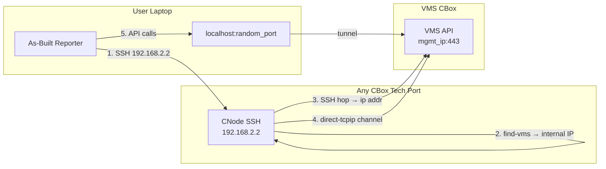

# Tech Port Auto-Discovery and API Proxy Tunnel (TP-1)

## Architecture

The feature adds a **VMS tunnel layer** between the user's connection and the API handler. When Tech Port mode is active, the app SSH's into the CNode, discovers the VMS management IP via a two-hop chain, and opens a local TCP forwarder through the paramiko transport. The API handler then connects to `localhost:<tunnel_port>` instead of the cluster IP directly. This reuses the same `direct-tcpip` channel pattern already in `[src/utils/ssh_adapter.py](src/utils/ssh_adapter.py)` (lines 383-438).



## Validated Assumptions (<lab-cluster>, 2026-03-28)

- `find-vms` returns VMS internal IP (<ip>) from any CNode
- SSH hop from non-VMS CNode to VMS internal IP works (port 22)
- `ip addr` on VMS CNode returns management IP (<ip>)
- API calls to management IP from any CNode return HTTP 403 (reachable, needs auth)
- VMS internal IP does NOT serve HTTPS (port 443 returns 000) — must tunnel to management IP

## File Map

- **Create:** `[src/utils/vms_tunnel.py](src/utils/vms_tunnel.py)` — VMS discovery + TCP tunnel class
- **Create:** `[tests/test_vms_tunnel.py](tests/test_vms_tunnel.py)` — Unit tests with mocked paramiko
- **Create:** `[tests/diag_vms_tunnel_integration.py](tests/diag_vms_tunnel_integration.py)` — Live integration test against real CNode
- **Modify:** `[src/api_handler.py](src/api_handler.py)` — Accept optional tunnel; use tunnel base URL when active
- **Modify:** `[src/app.py](src/app.py)` — Tech Port mode in generate/discover/health routes
- **Modify:** `[src/main.py](src/main.py)` — `--tech-port` CLI flag
- **Modify:** `[frontend/templates/reporter.html](frontend/templates/reporter.html)` — Tech Port toggle in connection settings
- **Modify:** `[frontend/templates/generate.html](frontend/templates/generate.html)` — Tech Port toggle
- **Modify:** `[config/config.yaml.template](config/config.yaml.template)` — `ssh.tech_port_mode` key

---

## Task 1: VMS Discovery Functions

**Goal:** Parse `find-vms` output and `ip addr` output to extract VMS IPs.

**Files:**

- Create: `src/utils/vms_tunnel.py`
- Test: `tests/test_vms_tunnel.py`

### Step 1.1: Write parsing functions with tests

Two pure functions with no SSH dependency — parse command output strings:

```python
# src/utils/vms_tunnel.py

def parse_find_vms_output(output: str) -> Optional[str]:
    """Extract VMS internal IP from find-vms command output.

    find-vms returns a single line like '<ip>' or may include
    additional text. Returns the first IP-like string found.
    """

def parse_management_ip(ip_addr_output: str) -> Optional[str]:
    """Extract the primary management IP from 'ip addr show' output.

    Looks for the first 'inet 10.x.x.x' address that is a 'scope global'
    non-secondary address on a non-loopback interface. Falls back to first
    'inet 10.x.x.x' if no primary is found.
    """
```

Test cases:

- `find-vms` returning just IP: `"<ip>\n"`
- `find-vms` with extra text/whitespace
- `find-vms` returning empty or error
- `ip addr` with primary + secondary management IPs (real output from <lab-cluster>)
- `ip addr` with no 10.x addresses
- `ip addr` with multiple interfaces

### Step 1.2: Write SSH discovery chain

```python
# src/utils/vms_tunnel.py

def discover_vms_management_ip(
    tech_port_ip: str,
    ssh_user: str,
    ssh_password: str,
    timeout: int = 30,
) -> Tuple[str, str]:
    """Discover VMS management IP via two-hop SSH chain.

    1. SSH to tech_port_ip
    2. Run find-vms → get VMS internal IP
    3. SSH hop to VMS internal IP → run ip addr → get management IP

    Returns: (vms_internal_ip, vms_management_ip)
    Raises: VMSDiscoveryError on any failure.
    """
```

Test with mocked `run_ssh_command`:

- Success path: both hops return valid IPs
- `find-vms` failure (command not found, empty output)
- SSH hop failure (unreachable VMS internal IP)
- `ip addr` parse failure (no management IP found)

---

## Task 2: TCP Tunnel via Paramiko

**Goal:** Create a local TCP listener that forwards connections through a paramiko `direct-tcpip` channel to the VMS management IP.

**Files:**

- Modify: `src/utils/vms_tunnel.py`
- Test: `tests/test_vms_tunnel.py`

### Step 2.1: VMSTunnel class

```python
# src/utils/vms_tunnel.py

class VMSTunnel:
    """SSH tunnel forwarding local TCP port to VMS management IP:443.

    Usage:
        tunnel = VMSTunnel(tech_port_ip, ssh_user, ssh_password)
        tunnel.connect()  # discovers VMS, opens tunnel
        # API handler uses tunnel.local_bind_address
        tunnel.close()
    """

    def __init__(self, tech_port_ip, ssh_user, ssh_password,
                 remote_port=443, timeout=30):
        self.tech_port_ip = tech_port_ip
        self.ssh_user = ssh_user
        self.ssh_password = ssh_password
        self.remote_port = remote_port
        self.timeout = timeout

        self._ssh_client: Optional[paramiko.SSHClient] = None
        self._server_socket: Optional[socket.socket] = None
        self._accept_thread: Optional[threading.Thread] = None
        self._running = False

        self.vms_internal_ip: Optional[str] = None
        self.vms_management_ip: Optional[str] = None
        self.local_port: Optional[int] = None

    @property
    def local_bind_address(self) -> str:
        """Returns 'localhost:<port>' for use as API handler target."""
        return f"127.0.0.1:{self.local_port}"

    def connect(self) -> None:
        """Discover VMS and open tunnel."""
        # 1. SSH to tech port
        # 2. discover_vms_management_ip()
        # 3. Open local socket on random port
        # 4. Start accept thread that opens direct-tcpip channels

    def close(self) -> None:
        """Shut down tunnel and SSH connection."""

    def __enter__(self): ...
    def __exit__(self, *args): ...
```

Key implementation detail for the forwarder thread:

```python
def _forward_connection(self, local_sock):
    """Forward a single TCP connection through the SSH tunnel."""
    transport = self._ssh_client.get_transport()
    channel = transport.open_channel(
        "direct-tcpip",
        (self.vms_management_ip, self.remote_port),
        local_sock.getpeername(),
    )
    # Bidirectional copy between local_sock and channel
    # using select() or threading
```

Tests:

- Tunnel opens and binds to a local port
- Tunnel closes cleanly (no resource leaks)
- Context manager protocol works
- Connection forwarding with mocked transport/channel
- Error handling: SSH connection failure, transport unavailable, channel open failure

---

## Task 3: API Handler Integration

**Goal:** Allow VastApiHandler to use a tunnel for its base URL when in Tech Port mode.

**Files:**

- Modify: `src/api_handler.py` (lines 188-239, 325-334, 2642-2662)
- Test: `tests/test_vms_tunnel.py` (additional API integration tests)

### Step 3.1: Constructor change

Add an optional `tunnel_address` parameter to `VastApiHandler.__init__()` and the factory function. When provided, use it instead of `cluster_ip` for building URLs:

```python
# api_handler.py __init__ (line ~195)
def __init__(self, cluster_ip, username=None, password=None,
             token=None, config=None, tunnel_address=None):
    ...
    self.cluster_ip = cluster_ip
    self._api_host = tunnel_address or cluster_ip  # Used for URL construction
```

### Step 3.2: URL construction change

In `_set_api_version()` (line ~332) and version detection (line ~301), use `self._api_host` instead of `self.cluster_ip`:

```python
# _set_api_version (line ~332)
self.base_url = f"https://{self._api_host}/api/{version}/"

# _detect_api_version (line ~301)
test_url = f"https://{self._api_host}/api/{version}/vms/"
```

### Step 3.3: Factory function update

```python
# create_vast_api_handler (line ~2642)
def create_vast_api_handler(cluster_ip, username=None, password=None,
                            token=None, config=None, tunnel_address=None):
    return VastApiHandler(cluster_ip, username, password, token, config, tunnel_address)
```

**Key design decision:** `cluster_ip` is preserved as-is for metadata/logging/reporting (the actual cluster IP). `_api_host` is the connection target (either `cluster_ip` or `127.0.0.1:<port>`). This means reports still show the real cluster IP, not `localhost`.

Tests:

- API handler with no tunnel uses `cluster_ip` for URLs (existing behavior unchanged)
- API handler with `tunnel_address` uses it for URL construction
- `cluster_ip` still available for metadata even when tunneled

---

## Task 4: CLI Integration

**Goal:** Add `--tech-port` flag to CLI mode.

**Files:**

- Modify: `src/main.py` (lines 145-186 `_connect_to_cluster`, lines 622-691 arg parser)

### Step 4.1: Add CLI argument

```python
# main.py argument parser (after --no-proxy-jump, line ~691)
parser.add_argument(
    "--tech-port",
    action="store_true",
    default=False,
    help="Connect via CBox Tech Port: auto-discover VMS and tunnel API calls",
)
```

### Step 4.2: Modify `_connect_to_cluster`

```python
# main.py _connect_to_cluster (line ~145)
def _connect_to_cluster(self, args):
    username, password, token = self._get_credentials(args)

    tunnel = None
    tunnel_address = None
    if args.tech_port:
        from utils.vms_tunnel import VMSTunnel
        node_user = args.node_user or "vastdata"
        node_password = args.node_password or "vastdata"
        tunnel = VMSTunnel(args.cluster_ip, node_user, node_password)
        tunnel.connect()
        tunnel_address = tunnel.local_bind_address
        self._tunnel = tunnel  # Store for cleanup

    self.api_handler = create_vast_api_handler(
        cluster_ip=args.cluster_ip,
        username=username, password=password, token=token,
        config=self.config,
        tunnel_address=tunnel_address,
    )
    ...
```

### Step 4.3: Cleanup in `_cleanup`

```python
# main.py _cleanup (line ~581)
def _cleanup(self):
    if hasattr(self, '_tunnel') and self._tunnel:
        self._tunnel.close()
    ...
```

---

## Task 5: Web UI Integration

**Goal:** Add Tech Port mode toggle to Reporter and Generate pages.

**Files:**

- Modify: `src/app.py` (routes: `/generate`, `_run_report_job`, `/api/discover`)
- Modify: `frontend/templates/reporter.html`
- Modify: `frontend/templates/generate.html`
- Modify: `config/config.yaml.template`

### Step 5.1: Config key

```yaml
# config/config.yaml.template under ssh:
ssh:
  tech_port_mode: false  # Auto-discover VMS via Tech Port SSH tunnel
```

### Step 5.2: Generate route

In `generate_start()` (line ~306), read the toggle and pass to params:

```python
"tech_port": form.get("tech_port") == "on",
```

In `_run_report_job()` (line ~1524), create tunnel before API handler:

```python
tunnel = None
tunnel_address = None
if params.get("tech_port"):
    from utils.vms_tunnel import VMSTunnel
    tunnel = VMSTunnel(
        params["cluster_ip"],
        params.get("node_user", "vastdata"),
        params.get("node_password", "vastdata"),
    )
    tunnel.connect()
    tunnel_address = tunnel.local_bind_address
    # Log discovery results for UI
    logger.info("VMS discovered at %s (internal: %s)",
                tunnel.vms_management_ip, tunnel.vms_internal_ip)

try:
    handler = create_vast_api_handler(
        cluster_ip=params["cluster_ip"],
        ..., tunnel_address=tunnel_address,
    )
    ...
finally:
    if tunnel:
        tunnel.close()
```

### Step 5.3: Frontend toggle

Add a checkbox in the connection settings tile (same pattern as "Proxy through CNode"):

```html
<div class="form-check form-switch">
    <input type="checkbox" id="techPort" name="tech_port" class="form-check-input">
    <label class="form-check-label" for="techPort">Tech Port Mode</label>
    <i class="bi bi-info-circle info-icon" title="Connect via any CBox Tech Port.
       App auto-discovers VMS and tunnels API calls. Requires Node SSH credentials."></i>
</div>
```

---

## Task 6: Integration Test Script (Current Environment)

**Goal:** Validate the full tunnel chain against live CNodes using management IPs (simulating Tech Port access).

**Files:**

- Create: `tests/diag_vms_tunnel_integration.py`

This script tests the entire chain using the user's current SSH access to CNodes (management IPs). The same code path executes whether the entry point is a management IP or a Tech Port IP — only the initial SSH target differs.

### Test Scenarios

**Scenario A: VMS Discovery Chain**

- SSH to `<ip>` (non-VMS CNode, simulates Tech Port entry)
- Run `find-vms` → expect `<ip>`
- SSH hop to `<ip>` → run `ip addr` → expect `<ip>`

**Scenario B: Tunnel Establishment**

- Open VMSTunnel to `<ip>` (simulates `192.168.2.2`)
- Verify local port is bound
- Verify tunnel is forwarding (connect to localhost:port, expect TLS handshake from VMS)

**Scenario C: API Call Through Tunnel**

- Create VMSTunnel, get `local_bind_address`
- Create `VastApiHandler(cluster_ip="<ip>", tunnel_address=tunnel.local_bind_address)`
- Authenticate with `support` credentials
- Call `get_cluster_info()` → expect valid cluster data for <lab-cluster>
- Verify `handler.cluster_ip` is still `<ip>` (metadata preserved)

**Scenario D: Full Report Generation (smoke test)**

- Same tunnel setup
- Run `handler.get_all_data()` through tunnel
- Verify data collection completes without errors

**Scenario E: Error Recovery**

- Tunnel to unreachable IP → expect clear error message
- Tunnel SSH auth failure → expect clear error message
- Tunnel drops mid-session → expect graceful degradation

### Preparing for Tech Port Testing

When Tech Port access is available, re-run the same scenarios with:

- Entry IP changed from `<ip>` to `192.168.2.2`
- All other parameters identical
- Expected results identical

---

## Implementation Order

1. **Task 1** (parsing + discovery) — pure functions, easy to test, no dependencies
2. **Task 2** (TCP tunnel) — core infrastructure, depends on Task 1
3. **Task 3** (API handler) — thin integration layer, depends on Task 2
4. **Task 4** (CLI) — wires it up for command-line use
5. **Task 6** (integration test) — validate against live cluster before UI work
6. **Task 5** (Web UI) — frontend integration after backend is proven

## Risk Considerations

- **TLS certificate mismatch:** VMS cert is for its management IP, not `localhost`. Since `verify_ssl: false` is the default for self-signed cluster certs, this is a non-issue. If a user has `verify_ssl: true`, the tunnel would need to pass the original hostname for SNI — document this limitation.
- **Tunnel stability:** Long-running report generation needs the SSH connection to stay alive. Use paramiko keepalive (`transport.set_keepalive(15)`) — same pattern as existing `ssh_adapter.py` (line 441).
- **Credential flow:** Tech Port mode requires Node SSH credentials (to SSH into the CNode) AND VMS API credentials (to authenticate API calls through the tunnel). Both are already collected in the existing UI.
- **192.168.2.2 collision:** Every CBox has the same Tech Port IP. The tunnel binds to the first CBox the user connects to — this is correct behavior (any CBox works).
