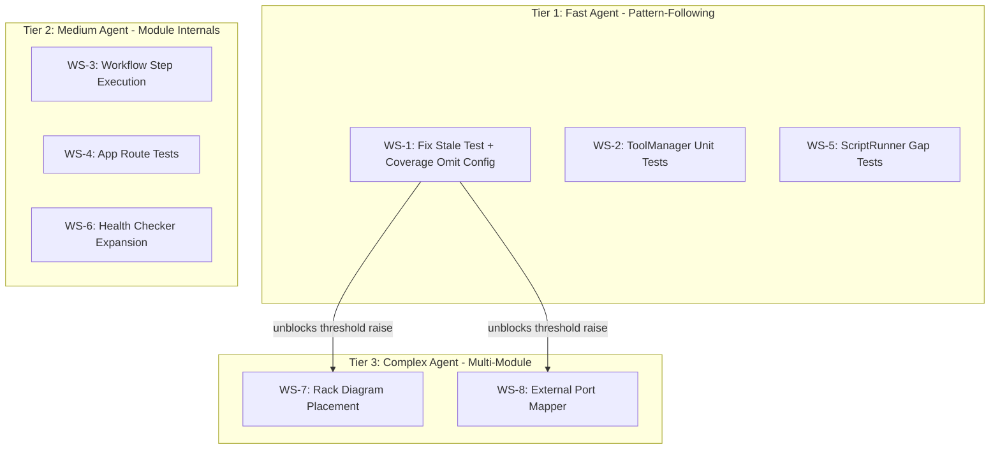

# Test Coverage Implementation Plan: Phases A-C

## Architecture and Work Stream Map



All work streams within the same tier are fully independent and can run in parallel. Tier 3 work benefits from the coverage omit config in WS-1 but does not strictly depend on it.

---

## Conventions (all work streams must follow)

- Path setup: `sys.path.insert(0, str(Path(__file__).parent.parent / "src"))` at top of every test file
- Mocking: `unittest.mock.patch` with module-path targets (e.g., `"tool_manager.run_ssh_command"`)
- Framework: pytest (not unittest) for all new tests; match existing `test_workflows.py` style
- SSH mock pattern: `mock.return_value = (0, "stdout", "stderr")` for `run_ssh_command`
- Naming: `test_<method>_<scenario>` for test functions, `Test<Class>` for classes
- Fixtures: module-local; shared fixtures only in `tests/conftest.py`

---

## Tier 1: Fast Agent Work Streams

### WS-1: Fix Stale Test + Coverage Omit Config (~15 min)

**File:** [tests/test_workflows.py](tests/test_workflows.py)

- Fix `test_get_steps_returns_6_steps` to assert 7 steps (line references `TestVperfsanityWorkflow`)

**File:** [pyproject.toml](pyproject.toml)

- Add `[tool.coverage.run]` section with `omit` patterns to exclude dead-code modules from coverage measurement:

```toml
[tool.coverage.run]
omit = [
    "src/comprehensive_report_template.py",
    "src/enhanced_report_builder.py",
    "src/session_manager.py",
]
```

- `comprehensive_report_template.py` and `enhanced_report_builder.py` are **not used** in the main pipeline (confirmed: not imported by `main.py` or `report_builder.py`)
- `session_manager.py` is tmux-based session management that was superseded by direct SSH execution

This immediately raises effective coverage without writing tests, because ~700+ lines of dead code stop diluting the metric. Then raise `cov-fail-under` from 45 to 55.

**Tests added:** 0 new (1 fix)
**Coverage impact:** +5-8% from omit alone

---

### WS-2: ToolManager Unit Tests (~30 min)

**New file:** `tests/test_tool_manager.py`

Target: [src/tool_manager.py](src/tool_manager.py) (301 lines, 0% coverage)

```python
# Key imports
from tool_manager import ToolManager

# Fixtures
@pytest.fixture
def tool_manager():
    return ToolManager(output_callback=MagicMock())

@pytest.fixture
def mock_ssh():
    with patch("tool_manager.run_ssh_command") as m:
        m.return_value = (0, "ok", "")
        yield m
```

Tests to write (12 tests):

- **TestToolManagerInit**
  - `test_initialization` -- instance created, `TOOLS` dict populated
  - `test_get_tool_info_known` -- returns dict with url/description for "vnetmap.py"
  - `test_get_tool_info_unknown` -- returns None for "nonexistent"
  - `test_get_all_tools_info` -- returns list with len >= 3

- **TestToolManagerLocalOps**
  - `test_get_local_tool_path` -- returns Path under output/tools
  - `test_update_local_tool_success` -- mock `requests.get` 200, assert file written (use `tmp_path`)
  - `test_update_local_tool_network_error` -- mock `requests.get` raises, returns `(False, ...)`
  - `test_update_all_tools` -- mock `requests.get`, assert dict has entries for each tool

- **TestToolManagerDeploy**
  - `test_deploy_to_cnode_internet_success` -- mock SSH wget returns 0, assert `(True, ...)`
  - `test_deploy_to_cnode_internet_fail_local_fallback` -- mock SSH wget returns non-0, mock SCP succeeds
  - `test_deploy_to_cnode_both_fail` -- both paths fail, returns `(False, ...)`
  - `test_deploy_ensures_remote_dir` -- verify `mkdir -p` SSH command issued (unless `skip_mkdir=True`)

**Tests added:** 12
**Coverage impact:** +3-4%

---

### WS-5: ScriptRunner Gap Tests (~25 min)

**File:** [tests/test_script_runner.py](tests/test_script_runner.py) (15 existing tests)

Target gaps: `_classify_output_line`, `copy_to_remote`, `download_from_remote`

Tests to add (10 tests):

- **TestOutputClassification** (new class)
  - `test_classify_ssh_retry_suppressed` -- line containing "Permission denied" returns `None` (suppress)
  - `test_classify_warning_line` -- line containing "Warning:" returns `"warn"`
  - `test_classify_normal_line` -- normal output returns `"info"`
  - `test_classify_traceback_suppressed` -- Python traceback line returns `None`
  - `test_classify_empty_line` -- empty string returns `None`

- **TestCopyToRemote** (new class)
  - `test_copy_to_remote_success` -- mock SSH mkdir + paramiko SCP, assert `FileTransferResult.success`
  - `test_copy_to_remote_mkdir_fails` -- mkdir SSH returns non-0, assert failure
  - `test_copy_to_remote_set_executable` -- verify `chmod +x` command issued when `set_executable=True`

- **TestDownloadFromRemote** (new class)
  - `test_download_from_remote_success` -- mock paramiko SCP get, assert local file path returned
  - `test_download_from_remote_ssh_error` -- mock SCP raises exception, assert failure result

**Tests added:** 10
**Coverage impact:** +2-3%

---

## Tier 2: Medium Agent Work Streams

### WS-3: Workflow Step Execution Tests (~45 min)

**File:** [tests/test_workflows.py](tests/test_workflows.py) (20 existing tests)

Uses existing `mock_ssh` fixture that patches `run_ssh_command` in all 6 workflow modules.

Tests to add (18 tests):

- **TestVperfsanityCrossTenantCleanup** (new class, highest priority)
  - `test_cleanup_finds_and_deletes_stale_views` -- mock SSH curl returns JSON with vperfsanity view, verify DELETE issued
  - `test_cleanup_no_stale_views` -- mock SSH curl returns JSON with no matching views, verify no DELETE
  - `test_cleanup_api_unreachable` -- mock SSH curl returns non-0 rc, verify graceful skip with warning
  - `test_cleanup_malformed_json` -- mock SSH curl returns invalid JSON, verify graceful skip

- **TestVperfsanityStepExecution** (new class)
  - `test_step3_prepare_success` -- mock SSH returns 0, assert `{"success": True}`
  - `test_step3_prepare_bucket_conflict` -- mock SSH returns 1 with "bucket name already in use", assert hint in output
  - `test_step4_run_tests_success` -- mock SSH returns 0
  - `test_step7_cleanup_passes_admin_creds` -- verify ADMIN_USER/ADMIN_PASSWORD in command string
  - `test_step7_cleanup_passes_vast_vms` -- verify VAST_VMS in command string

- **TestSwitchConfigStepExecution** (new class)
  - `test_detect_switch_type_cumulus_nvue` -- mock SSH `nv show version` returns 0
  - `test_detect_switch_type_cumulus_nclu` -- mock SSH `nv` fails, `net show version` returns 0
  - `test_detect_switch_type_mellanox` -- both cumulus commands fail, falls back to mellanox

- **TestNetworkConfigStepExecution** (new class)
  - `test_step2_clush_via_gateway` -- verify clush command constructed with gateway proxy
  - `test_step2_grep_uses_text_flag` -- verify `-a` flag in grep command

- **TestSupportToolStepExecution** (new class)
  - `test_step3_uses_container_path` -- verify `/vast/data/` in vms.sh command
  - `test_step3_requires_force_tty` -- verify force_tty=True passed to run_ssh_command

- **TestLogBundleStepExecution** (new class)
  - `test_step1_discover_sizes` -- mock SSH returns file size output, assert parsed correctly

**Tests added:** 18
**Coverage impact:** +4-5%

---

### WS-4: App Route Tests (~40 min)

**File:** [tests/test_app.py](tests/test_app.py) (64 existing tests)

Uses existing `create_flask_app()` + `test_client()` pattern.

Tests to add (15 tests):

- **TestProfileMergeSave** (new class)
  - `test_save_preserves_existing_fields` -- POST with only `cluster_ip`, verify `switch_user` preserved from existing profile
  - `test_save_normalizes_api_token_to_token` -- POST with `api_token` field, verify stored as `token`
  - `test_save_applies_defaults_for_new_profile` -- POST new profile with minimal fields, verify ALL_FIELDS defaults applied
  - `test_save_without_name_returns_400` -- POST without `name`, assert 400

- **TestAdvancedOpsRoutes** (new class, requires `--dev-mode` mock)
  - `test_advanced_ops_page_requires_dev_mode` -- without dev-mode, assert 404 or redirect
  - `test_workflows_list_returns_json` -- GET `/advanced-ops/workflows`, assert JSON with workflows array
  - `test_start_workflow_missing_id_returns_400` -- POST `/advanced-ops/start` without workflow_id
  - `test_run_step_missing_step_id_returns_400` -- POST `/advanced-ops/run-step` without step_id
  - `test_cancel_when_not_running` -- POST `/advanced-ops/cancel` when idle
  - `test_reset_clears_state` -- POST `/advanced-ops/reset`, verify status is empty
  - `test_status_returns_json` -- GET `/advanced-ops/status`

- **TestAdvancedOpsToolRoutes** (new class)
  - `test_list_tools_returns_json` -- GET `/advanced-ops/tools`
  - `test_update_tools_triggers_download` -- POST `/advanced-ops/tools/update` with mock ToolManager
  - `test_bundle_list_empty` -- GET `/advanced-ops/bundles` when no bundles exist
  - `test_bundle_download_not_found` -- GET `/advanced-ops/bundle/download/nonexistent.zip` returns 404

**Tests added:** 15
**Coverage impact:** +3-4%

---

### WS-6: Health Checker Expansion (~40 min)

**File:** [tests/test_health_checker.py](tests/test_health_checker.py) (29 existing tests)

Uses existing `mock_api_handler` and `checker` fixtures.

Tests to add (15 tests):

- **TestRemediationReport** (new class)
  - `test_generate_remediation_report_with_failures` -- pass report with FAIL results, assert .txt file created with numbered findings
  - `test_generate_remediation_report_all_pass` -- all PASS results, assert report still created with "no issues" message
  - `test_remediation_report_includes_severity` -- assert CRITICAL/WARNING labels appear in output
  - `test_remediation_report_includes_timestamps` -- assert timestamp format in output

- **TestCorrelationEngine** (new class)
  - `test_correlate_cnode_dnode_down` -- both CNode and DNode fail, assert chassis correlation detected
  - `test_correlate_no_findings` -- all pass, assert empty correlations
  - `test_correlate_leader_inactive` -- leader state fail, assert inconsistency warning

- **TestSSHTier2Checks** (new class)
  - `test_management_ping_success` -- mock SSH returns 0, assert PASS result
  - `test_management_ping_timeout` -- mock SSH raises timeout, assert FAIL with timeout message
  - `test_management_ping_respects_cancel` -- set cancel_event, assert CancelledError raised
  - `test_node_memory_check_pass` -- mock SSH returns normal memory output

- **TestSSHTier3Checks** (new class)
  - `test_mlag_status_pass` -- mock SSH returns MLAG healthy output
  - `test_mlag_status_fail` -- mock SSH returns MLAG peer-down
  - `test_switch_ntp_pass` -- mock SSH returns NTP synced output
  - `test_run_switch_checks_no_config` -- no ssh_config, assert empty results

**Tests added:** 15
**Coverage impact:** +3-4%

---

## Tier 3: Complex Agent Work Streams

### WS-7: Rack Diagram Placement Tests (~45 min)

**File:** [tests/test_rack_diagram.py](tests/test_rack_diagram.py) (4 existing tests)

Target: [src/rack_diagram.py](src/rack_diagram.py) (~25% coverage)

```python
from rack_diagram import RackDiagram

@pytest.fixture
def diagram():
    return RackDiagram()
```

Tests to add (14 tests):

- **TestDeviceBoundaries** (new class)
  - `test_gather_boundaries_standard_cluster` -- CBoxes at U10-12, DBoxes at U30-34, assert correct min/max
  - `test_gather_boundaries_with_eboxes` -- EBoxes at U5-8, assert ebox boundaries included
  - `test_gather_boundaries_empty` -- no devices, returns None
  - `test_gather_boundaries_single_cbox` -- only 1 CBox, assert top == bottom

- **TestSwitchPlacement** (new class)
  - `test_center_placement_success` -- CBoxes top at U15, DBoxes bottom at U25, assert switches in gap
  - `test_center_placement_no_gap` -- CBoxes and DBoxes adjacent, assert empty list (no room)
  - `test_above_placement_success` -- switches placed above highest CBox
  - `test_above_placement_at_rack_top` -- CBoxes at U1, assert placement fails (no room above)
  - `test_below_placement_success` -- switches placed below lowest DBox
  - `test_below_placement_at_rack_bottom` -- DBoxes at U42, assert placement fails
  - `test_calculate_switch_positions_cascading` -- center fails, above succeeds (verify cascade)

- **TestRackDiagramGeneration** (new class)
  - `test_generate_returns_drawing` -- basic cluster data, assert Drawing object returned
  - `test_generate_with_eboxes` -- ebox data included, assert no exception
  - `test_get_unrecognized_models` -- pass unknown model, assert it appears in unrecognized set

**Tests added:** 14
**Coverage impact:** +4-5%

---

### WS-8: External Port Mapper Core Paths (~45 min)

**File:** [tests/test_port_mapper.py](tests/test_port_mapper.py) (32 existing tests) or new `tests/test_external_port_mapper.py`

Target: [src/external_port_mapper.py](src/external_port_mapper.py) (~16% coverage)

```python
from external_port_mapper import ExternalPortMapper

@pytest.fixture
def mapper():
    return ExternalPortMapper(
        cluster_ip="<ip>", api_user="admin", api_password="<redacted>",
        cnode_ip="<ip>", node_user="vastdata", node_password="<redacted>",
        switch_ips=["<ip>", "<ip>"],
        switch_user="cumulus", switch_password="<redacted>",
    )
```

Tests to add (12 tests):

- **TestExternalPortMapperInit** (new class)
  - `test_init_stores_config` -- assert attributes set correctly
  - `test_init_multiple_switches` -- 2 switch IPs stored

- **TestSwitchDetection** (new class)
  - `test_detect_cumulus_switch` -- mock SSH `net show version`, assert returns cumulus type
  - `test_detect_onyx_switch` -- mock SSH cumulus fails, onyx succeeds
  - `test_detect_unknown_switch` -- both fail, assert unknown type

- **TestMacCollection** (new class)
  - `test_collect_node_macs_via_clush` -- mock SSH returns MAC table, assert parsed correctly
  - `test_parse_clush_output` -- raw clush output, assert hostname-to-MAC mapping
  - `test_parse_cumulus_mac_table` -- raw cumulus output, assert MAC-to-port mapping
  - `test_parse_onyx_mac_table` -- raw Onyx output, assert MAC-to-port mapping

- **TestCorrelation** (new class)
  - `test_correlate_node_to_switch` -- given node MACs and switch MACs, assert correct mapping
  - `test_detect_cross_connections` -- given two switches with shared node, assert cross-connection detected
  - `test_collect_port_mapping_integration` -- mock all SSH calls, assert full result dict structure

**Tests added:** 12
**Coverage impact:** +3-4%

---

## Summary

| Work Stream | Tier | File | New Tests | Est. Time | Coverage Lift |
|-------------|------|------|-----------|-----------|---------------|
| WS-1 | 1 (Fast) | test_workflows.py, pyproject.toml | 0 (1 fix + config) | 15 min | +5-8% (omit) |
| WS-2 | 1 (Fast) | test_tool_manager.py (new) | 12 | 30 min | +3-4% |
| WS-5 | 1 (Fast) | test_script_runner.py | 10 | 25 min | +2-3% |
| WS-3 | 2 (Medium) | test_workflows.py | 18 | 45 min | +4-5% |
| WS-4 | 2 (Medium) | test_app.py | 15 | 40 min | +3-4% |
| WS-6 | 2 (Medium) | test_health_checker.py | 15 | 40 min | +3-4% |
| WS-7 | 3 (Complex) | test_rack_diagram.py | 14 | 45 min | +4-5% |
| WS-8 | 3 (Complex) | test_external_port_mapper.py (new) | 12 | 45 min | +3-4% |
| **Total** | | **8 files** | **~96 tests** | **~5 hrs** | **53% to ~77%** |

## Parallelization Strategy

```mermaid
gantt
    title Multi-Agent Execution Timeline
    dateFormat X
    axisFormat %M min
    section FastAgent1
        WS-1_FixAndConfig : 0, 15
        WS-2_ToolManager  : 15, 45
    section FastAgent2
        WS-5_ScriptRunner : 0, 25
    section MediumAgent1
        WS-3_Workflows    : 0, 45
    section MediumAgent2
        WS-4_AppRoutes    : 0, 40
    section MediumAgent3
        WS-6_HealthChecker: 0, 40
    section ComplexAgent1
        WS-7_RackDiagram  : 0, 45
    section ComplexAgent2
        WS-8_PortMapper   : 0, 45
```



Maximum parallelism: 7 agents. All work streams are independent (no file conflicts except WS-1 and WS-3 both touch `test_workflows.py` -- assign to same agent or serialize). After all complete, run full test suite to validate and measure final coverage.

## Post-Completion Validation

After all work streams complete:

1. `python3 -m pytest tests/ -v` -- all tests pass
2. `python3 -m pytest tests/ --cov=src --cov-report=term-missing` -- measure coverage
3. Raise `cov-fail-under` in `pyproject.toml` to match new baseline (target: 65-70 after Phase A-B, 75+ after Phase C)
4. `flake8 src/ tests/` and `black --check --line-length 120 src/ tests/` -- quality gates
