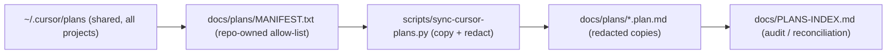

# Thread handoff prep (2026-09-25)

## Where things stand

- `origin/main` = `origin/develop` = `2567eb6`, and CI is green. [v1.6.1](https://github.com/rstamps01/ps-deploy-report/releases/tag/v1.6.1) is published as latest with the arm64 and x64 DMGs and the Windows zip.
- The Field Procedure work (DOC-16) was squash-merged in [PR #33](https://github.com/rstamps01/ps-deploy-report/pull/33). The local `docs/field-procedure` branch has no content difference from `develop`.
- No uncommitted work anywhere. The only open PRs are Dependabot: #28 types-pyyaml, #29 types-paramiko (major), #30 pillow, #31 reportlab 5.0.1 (on hold), #32 pymupdf.
- The tracking docs are behind in four places:
  - The roadmap "Next steps" and "Execution status" (around L242–244) still say "Ship v1.6.1 (pending approval)".
  - DOC-16 still says "in review".
  - `PROJECT-STATUS.md` stops at "prepare-release".
  - The `AGENTS.md` rollout line still says "v1.6.1 prepared (awaiting tag)".
- You approved the field-feedback triage in [field_feedback_triage_1d3ae704.plan.md](/Users/ray.stamps/.cursor/plans/field_feedback_triage_1d3ae704.plan.md), but it is not in the roadmap yet.

## 1. Docs PR on `docs/field-feedback-2026-09` off `origin/develop`

[docs/TODO-ROADMAP.md](docs/TODO-ROADMAP.md):
- Add a section "Planned — Field feedback (2026-09-23)" with 12 rows: HCF-1 through HCF-6, SW-1 (Deferred until logs arrive), INV-1, INV-2, DRV-1, DRV-2 and DIAG-1. Each row carries type, priority, size, target (v1.6.2 or v1.7.0) and notes, taken from the triage plan.
- Mark DOC-16 Done, linking PR #33.
- Change "Last updated" to 2026-09-25.
- Rewrite the "Execution status" and "Next steps" sections:
  1. v1.6.2 batch: DIAG-1, HCF-1, HCF-2, HCF-5, HCF-6, INV-1.
  2. v1.7.0 batch: HCF-3, HCF-4, INV-2, DRV-1.
  3. Ship-release leftovers: the live update-pill check from a 1.6.0 build (QA §6b), and the Slack and Confluence announcement.
  4. Dependabot triage.

[docs/DECISIONS.md](docs/DECISIONS.md) gets new entries:
- "v1.6.1 shipped": tag on `7095ccb`, build-release run `35937686117`, three artifacts.
- "Field-feedback triage accepted".
- "HC-1 reversal accepted": critical alarms fail, major stays warning, controlled by `health_check.alarms.fail_on`, implemented in v1.7.0.
- A memlog line.

[docs/PROJECT-STATUS.md](docs/PROJECT-STATUS.md) gets a new section, "2026-09-25 — v1.6.1 shipped; field-feedback batch planned".

[AGENTS.md](AGENTS.md): the rollout line becomes "v1.6.1 shipped; next: v1.6.2 field-feedback patch".

## 2. Project plan archive at `docs/plans/` (same PR)

Goal: a versioned, auditable copy in the repo of every Cursor plan that belongs to this project. The originals stay in `~/.cursor/plans/`, which is shared with other projects. The repo is **public**, so every copy is redacted.

- **Manifest (`docs/plans/MANIFEST.txt`):** one filename per line; this list decides which plans belong to the project.
  - Seed it from the existing `PLANS-INDEX.md` buckets A–D, using the full bucket-A list from the 2026-07-31 reconciliation memlog in `DECISIONS.md`: 103 repo plans, minus the 12 already deleted.
  - Add the three repo plans created since then: `agentic_cicd_pipeline`, `field_feedback_triage` and `thread_handoff_prep`.
  - Expected total is about 94. Plans from other projects (Planalyzer, Orion, budget report, recipes, and so on) are excluded.
- **Sync script (`scripts/sync-cursor-plans.py`, standard library only):**
  - Copies each manifest entry into `docs/plans/` under its original filename, and prints a per-file redaction count.
  - Redacts: IPv4 addresses except `127.0.0.1` and `0.0.0.0` (replaced with `<ip>`); `password|passwd|token|secret|api[_-]?key` followed by `:`/`=` and a value (replaced with `<redacted>`); email addresses; and cluster or host names from an editable `REDACT_PATTERNS` list at the top of the script, seeded with lab and customer names found during the review pass.
  - `--check` mode lists (a) plans in `~/.cursor/plans/` that are newer than the manifest and not in it, as untriaged; and (b) archive copies that have drifted from their source. It exits non-zero on either, so a future `update-tracker` run can call it.
- **Test:** `tests/test_sync_cursor_plans.py` covers the redaction function: IPs, credential key/value pairs, loopback left untouched, and idempotence.
- **Review gate before commit:**
  - Read the redaction report and spot-check the files that had the most hits.
  - Run `gitleaks detect --no-git --source docs/plans`; the pre-commit hook also runs gitleaks.
  - Any file that still carries customer-identifying content after redaction gets dropped from the manifest and listed in the README as "withheld (local only)".
- **`docs/plans/README.md`:** covers purpose (the audit trail for past activity), provenance, the redaction policy, how to sync or check, and the fact that `PLANS-INDEX.md` holds the bucket status for each plan.
- **Wiring:**
  - Add `plans/` to the `docs/` sub-homes list in [.cursor/rules/repo-structure-17.mdc](.cursor/rules/repo-structure-17.mdc) and [docs/development/REPO-STRUCTURE.md](docs/development/REPO-STRUCTURE.md).
  - Add a "Plan archive" row to the canonical locations table in [AGENTS.md](AGENTS.md).
  - Update the source line in [docs/PLANS-INDEX.md](docs/PLANS-INDEX.md) to `docs/plans/`, and add "re-reconciliation pending (PLN-1)".
- **Roadmap item PLN-1 (Planned, next thread):**
  - Re-audit every archived plan against `CHANGELOG.md` and tags.
  - Re-bucket them as A–D, flip the stale frontmatter in the copies, and promote any genuine open tail into the roadmap.
  - Wire `sync-cursor-plans.py --check` into the `update-tracker` skill.

Then:
- Run the roadmap-structure check from the `ci.yml` "Todo list validation" job locally, plus `black --check` and `flake8` on the new test.
- Commit in two steps: `docs(docs): record v1.6.1 ship and field-feedback plan`, then `docs(docs): add redacted project plan archive and sync script`.
- Push, open one PR to `develop`, and merge once green. `main` is not touched.

## 3. Local cleanup (approved)

- `git worktree remove /Users/ray.stamps/psdr-161`.
- Delete the local branches `validate/v1.6.1`, `feat/hpe-turin-cbox-builtin` and `docs/field-procedure`. All three are squash-merged.
- Leave `feature/pywebview` and both stashes untouched, and list them in the handoff as dormant.
- Leave the main worktree on `develop`, pulled to the merged PR.

## 4. Deliverables in the final reply

- **Handoff prompt** (copy/paste, about 25 lines). It points the new agent at the repo files rather than repeating history:
  - Read `AGENTS.md`, then the Next steps in `docs/TODO-ROADMAP.md`, then the latest entries in `docs/DECISIONS.md`, then the triage plan file.
  - The current SHAs and the release state.
  - The immediate first task: start the v1.6.2 branch, beginning with DIAG-1 and HCF-1 (failing-first test).
  - Guardrails: never commit to `main`; pause before merge, tag or delete; secrets stay out of git; use a worktree for any release checkout.
  - The open items: SW-1 needs the reporter's logs, #31 stays on hold, #29 is a major bump. PLN-1, the plan audit using `docs/plans/`, is a candidate side task.
- **Simpler transition advice**, aligned with `~/vast-repos/cursor-budget-report/artifacts/thread-splitting-protocol.md` (split at about $40 or about 40 turns, or at a phase change; carry forward only the goal, constraints, paths and decisions). The repo docs act as persistent memory, so a new thread needs only a one-line "resume per AGENTS.md" prompt. Make that a standing `resume` skill or rule so it isn't hand-written each time. Keep one chat per golden-path phase, and use `@`-references to the plan file instead of pasting content.
