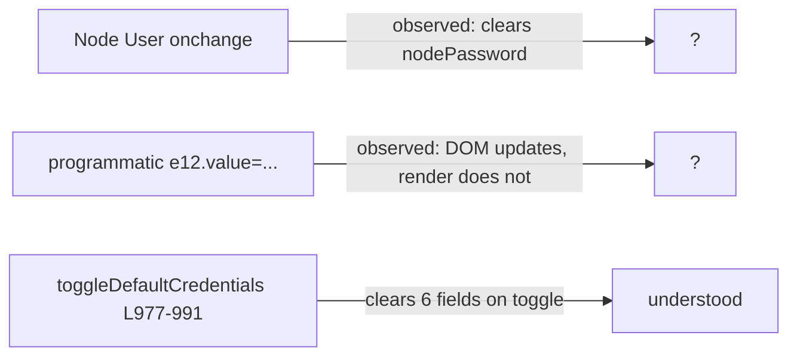

## Issues discovered during the assessment

| ID | Surface | Severity | Status | File(s) |
|---|---|---|---|---|
| **TP-1** | Tech Port VMS discovery fails on any cluster whose management plane is not in `10.0.0.0/8`. Fully blocks `/api/discover`, `/generate` (Tech Port on), and `OneShotRunner` Tech Port branch. | High | reproduced, documented in [docs/issues/TP-1/06-summary.md](docs/issues/TP-1/06-summary.md) | [src/utils/vms_tunnel.py](src/utils/vms_tunnel.py) |
| **RPT-VALIDATION-1** | Programmatic input `value` set is invisible until the field receives focus/input event. Field `e12` (Node User) was the only one observed; possibly CSS-level. | Medium (UI quality, no data loss) | side-finding documented in [docs/issues/TP-1/07-ui-behavior-note.md](docs/issues/TP-1/07-ui-behavior-note.md); root cause not yet localized | [frontend/templates/reporter.html](frontend/templates/reporter.html) + CSS |
| **RPT-VALIDATION-2** | Re-filling Node User in the form clears Node Password without warning. `toggleDefaultCredentials()` (lines 977-991) explains the toggle-time clear, but NOT the mid-session clear; an additional listener exists somewhere. | Medium (data loss; silent) | side-finding documented in [docs/issues/TP-1/07-ui-behavior-note.md](docs/issues/TP-1/07-ui-behavior-note.md); root listener not yet found | [frontend/templates/reporter.html](frontend/templates/reporter.html) |

Decisions locked from clarifying answers:

- TP-1 ships on `feature/tp-1-techport-discovery` only; **no version bump, no CHANGELOG release header, no tag, no merge** — user wants a separate go-ahead before any of that.
- UI bugs: investigate first; do not write code until the cause is confirmed and you decide scope.

### Network context: Infiniband (IPoIB) fabric — added per session note 2026-04-29

`<customer-cluster>`'s management plane runs on **Infiniband**, not Ethernet. This contextualizes WHY the bug manifests on this cluster (172.16/12 management is more common on IB-based VAST deployments than 10/8) but does NOT change the root cause — the parser is hard-coded to `10/8` regardless of underlying media.

Evidence from the captured `ip addr show` (Layer 4a probe, [docs/issues/TP-1/06-summary.md](docs/issues/TP-1/06-summary.md)):

| Interface | Type | Tells |
|---|---|---|
| `em2`, `em3` | Ethernet | `mtu 1500`, `qdisc mq`, `qlen 1000` |
| `ib0`, `ib1`, `ib2` | **Infiniband** (IPoIB) | `mtu 2044`, `qdisc fq`, `qlen 256` |
| `bond0:m` | Bond/team alias **on top of the IB stack** | management VIP `<ip>/18` |
| `ib2:a`, `ib3:b` | IB sub-aliases | data-plane on IPoIB |
| `100.64.x.x` (CGNAT) on `em3`/`ib0`/`ib1` | RFC 6598, not RFC1918 | must be excluded from selection |
| `<ip>/16` on `docker0` | Docker bridge (IP in 172.16/12 range) | must be excluded from selection by interface name |

**Implications for the fix:**

1. **Parser is media-agnostic.** `parse_management_ip` reads `inet <ip>/<prefix> ... <iface>` lines from `ip addr show` output; iproute2 emits the same line format for Ethernet, IB, and bonds. No code branch on media type is needed.
2. **Selection priority must work on IB-style interface names.** The `<iface>:m` / `<iface>:mgmt` alias rule must match `bond0:m`, `bond1:m`, `ib0:m`, `team0:mgmt`, etc., regardless of whether the parent device is `em*` / `eth*` / `ens*` / `enp*` (Ethernet) or `ib*` (IB).
3. **CGNAT (100.64.0.0/10) must be rejected.** It's NOT RFC1918 and the regex already excludes it; we just need an explicit test fixture so the IB-deploy-with-CGNAT pattern stays excluded.
4. **`docker0` (172.17/16) must be rejected** even though 172.17/16 is inside 172.16/12 — by interface-name filter (`lo`, `docker*`, `cni*`, `flannel*`, etc.).
5. **Test fixture must be IB-realistic.** Use <customer-cluster>'s actual captured payload (with `ib0`/`ib1`/`ib2` interfaces, IPoIB MTU, the `bond0:m` alias, plus the 100.64 CGNAT addresses) so the test would have caught this bug on a real IB cluster.

---

## Phase 1 — TP-1 fix on feature branch (TDD, no version bump)

### Branch hygiene (operationally important)

The working tree is currently on `feature/health-check-v2` with uncommitted advanced-ops changes per the session-start `git status`. Those must not contaminate the TP-1 fix.

```bash
git status                              # confirm what's dirty
git stash push -u -m "wip: pre-TP1"     # if dirty
git checkout develop && git pull --ff-only
git checkout -b feature/tp-1-techport-discovery
```

### Capture the IB-realistic test fixture (read-only, before any source edits)

Before touching code, save the full untruncated `ip addr show` payload from `<customer-cluster>`'s VMS CNode (<ip> via the tech port at 192.168.2.2) so the test fixture is reproducible from real-world data and the mypy/black/flake8 fixture lives next to its provenance:

```bash
PYTHONPATH=src python3 - <<'PY' > docs/issues/TP-1/mammoth_ip_addr_full.txt
import os
from utils.ssh_adapter import run_ssh_command
rc, out, _ = run_ssh_command(
    "<ip>", os.environ["VAST_NODE_USER"], os.environ["VAST_NODE_PASSWORD"],
    "ip addr show", timeout=20,
    jump_host="192.168.2.2",
    jump_user=os.environ["VAST_NODE_USER"],
    jump_password=os.environ["VAST_NODE_PASSWORD"],
)
print(out)
PY
```

The in-test `MAMMOTH_IP_ADDR_OUTPUT` literal in `tests/test_vms_tunnel.py` will mirror this file. Both are committed in the same commit so future readers can re-derive the test from the source.

### Files to change

- [src/utils/vms_tunnel.py](src/utils/vms_tunnel.py)
- [tests/test_vms_tunnel.py](tests/test_vms_tunnel.py) — **invert two existing tests, add new fixtures**

### Tests first (TDD)

Add a captured `ip addr show` payload from cluster `<customer-cluster>` (already captured during the assessment; see Layer 4a in [docs/issues/TP-1/06-summary.md](docs/issues/TP-1/06-summary.md)):

```python
MAMMOTH_IP_ADDR_OUTPUT = """\
1: lo: <LOOPBACK,UP,LOWER_UP> ...
    inet 127.0.0.1/8 scope host lo
3: em2: ...
    inet <ip>/24 brd <ip> scope global em2
4: em3: ...
    inet <ip>/20 scope global em3
    inet <ip>/20 scope global secondary em3:e
7: ib0: ...
    inet <ip>/24 scope global ib0
    inet <ip>/20 scope global ib0
9: ib2: ...
    inet <ip>/18 brd <ip> scope global ib2:a
    inet <ip>/18 brd <ip> scope global ib3:b
    inet <ip>/18 brd <ip> scope global bond0:m
    inet <ip>/16 brd <ip> scope global docker0
"""
```

**Invert** these two existing tests (they currently codify the bug):

```95:96:tests/test_vms_tunnel.py
    def test_no_ten_network(self):
        assert parse_management_ip(NO_TEN_NETWORK) is None
```

becomes: should return `"<ip>"` (or `"<ip>"` per priority — see selection rules).

```166:172:tests/test_vms_tunnel.py
    @patch("utils.vms_tunnel.run_ssh_command")
    def test_no_management_ip_found(self, mock_ssh):
        mock_ssh.side_effect = [
            (0, "│ VMS:    <ip>                │\n", ""),
            (0, "    inet <ip>/24 scope global eth0\n", ""),
        ]
        with pytest.raises(VMSDiscoveryError, match="Could not parse management IP"):
            discover_vms_management_ip("192.168.2.2", "vastdata", "pw")
```

becomes: should return `("<ip>", "<ip>")` and not raise.

**Add** new tests (IB-realistic):

- `test_mammoth_ib_picks_bond0_m`: `parse_management_ip(MAMMOTH_IP_ADDR_OUTPUT) == "<ip>"` (bond/team `:m` alias wins, even when surrounding interface block is `ib2`).
- `test_picks_iface_m_alias_on_ib`: synthetic payload with `ib0:m` (no bond) → IB-direct management alias still wins.
- `test_picks_iface_m_alias_on_ethernet`: same payload but on `em2:m` — confirms media-agnostic selection.
- `test_172_16_only`, `test_192_168_only`: each non-10/8 RFC1918 range resolves correctly without a `:m` alias.
- `test_ignores_cgnat_100_64`: `100.64.x.x` (RFC 6598 CGNAT) is excluded, even when present alongside RFC1918 on the same IB interface (matches <customer-cluster>'s `ib0` carrying both `<ip>/24` and `<ip>/20`).
- `test_ignores_docker0_172_17`: `172.17/16` on `docker0` is rejected by interface-name filter even though it's inside `172.16/12`.
- `test_ignores_lo_127`: `127.0.0.1/8` on `lo` is excluded.
- `test_secondary_ignored_when_primary_present`: `secondary` flag de-prioritizes (matches <customer-cluster>'s `<ip>/20 secondary em3:e`).
- `test_ipoib_high_mtu_no_effect`: payload with `mtu 2044` IB device produces same answer as `mtu 1500` Ethernet device — confirms parser doesn't care about MTU/qdisc/qlen.
- `test_step2_short_circuit_when_443_open`: mock paramiko transport so the internal IP responds on TCP/443 → mgmt IP equals internal IP, no `ip addr` SSH hop performed.
- `test_step2_falls_back_when_443_closed`: 443 probe fails → falls through to existing `ip addr` parse path.
- `test_error_message_lists_candidates`: when nothing matches, the raised `VMSDiscoveryError` contains the candidate addresses for diagnosability.

The full untruncated `ip addr show` payload from `<customer-cluster>` will also be saved as [docs/issues/TP-1/mammoth_ip_addr_full.txt](docs/issues/TP-1/mammoth_ip_addr_full.txt) (read-only artifact, not a test fixture but the source of truth that the in-test `MAMMOTH_IP_ADDR_OUTPUT` literal mirrors).

### Source change ([src/utils/vms_tunnel.py](src/utils/vms_tunnel.py))

1. **Remove the `10/8` pre-filter** at line 172. Pass full `ip addr show` to the parser:

   ```python
   ip_cmd = "ip addr show 2>/dev/null"
   ```

2. **Widen `parse_management_ip`** (line 72-100) to all RFC1918 with deterministic, **media-agnostic** selection priority. The function reads `ip addr show` line by line and extracts both the address and the trailing interface label; iproute2 emits the same line shape for Ethernet, IB, and bonds, so no media branching is needed.

   ```python
   _RFC1918_RE = re.compile(
       r"inet\s+("
       r"10\.\d{1,3}\.\d{1,3}\.\d{1,3}"                    # 10.0.0.0/8
       r"|172\.(?:1[6-9]|2\d|3[01])\.\d{1,3}\.\d{1,3}"     # 172.16.0.0/12
       r"|192\.168\.\d{1,3}\.\d{1,3}"                      # 192.168.0.0/16
       r")/\d+\b.*?(\S+)\s*$"
   )
   _EXCLUDE_IFACE_PREFIXES = ("lo", "docker", "cni", "flannel", "veth", "br-")
   ```

   Selection priority (deterministic, in order, applied to the candidate set):
   1. **Management alias** — interface label matches `<base>:m` or `<base>:mgmt` (regex `:m(gmt)?$`). Works equally for `bond0:m`, `team0:mgmt`, `ib0:m`, `em2:m`, `enp194s0f0:m`. **This is the rule that makes <customer-cluster> work** (its VIP `<ip>` lives on `bond0:m` over IPoIB).
   2. `scope global` non-`secondary` on a non-excluded interface.
   3. First non-excluded RFC1918 address seen.

   Excluded interfaces (by prefix): `lo`, `docker*`, `cni*`, `flannel*`, `veth*`, `br-*`. Excluded address ranges already (by regex omission): CGNAT `100.64/10`, link-local `169.254/16`, loopback `127/8`, public addresses.

3. **Add Step-2 short-circuit** in `discover_vms_management_ip` after Step 1 finds the internal IP, but before the SSH-jump:

   ```python
   if _probe_internal_443(self._ssh_client, vms_internal_ip):
       logger.info("VMS management IP: %s (via 443 short-circuit on internal IP)", vms_internal_ip)
       return vms_internal_ip, vms_internal_ip
   ```

   Implementation: open a `direct-tcpip` channel through the existing SSH transport to `(vms_internal_ip, 443)` with a 2-second timeout; success means VMS HTTPS is reachable from the internal IP itself. (<customer-cluster> resolves here.)

4. **Improve error message** when the parse fails:

   ```python
   raise VMSDiscoveryError(
       f"Could not parse management IP from {len(candidates)} candidates "
       f"on VMS CNode {vms_internal_ip}: {sorted(candidates)}"
   )
   ```

### Local quality gate (run before commit)

```bash
black --check --line-length 120 src/utils/vms_tunnel.py tests/test_vms_tunnel.py
flake8 src/utils/vms_tunnel.py tests/test_vms_tunnel.py
mypy src/utils/vms_tunnel.py --ignore-missing-imports
pytest tests/test_vms_tunnel.py -v
```

### Live re-verification against `<customer-cluster>` (read-only)

Re-run the harness used during the assessment with creds in env:

```bash
PYTHONPATH=src python3 -c "
from utils.vms_tunnel import discover_vms_management_ip
import os
print(discover_vms_management_ip('192.168.2.2',
    os.environ['VAST_NODE_USER'],
    os.environ['VAST_NODE_PASSWORD'],
    timeout=20))
"
# Expected: ('<ip>', '<ip>')
```

Optionally re-drive `/api/discover` through the live UI via the cursor-ide-browser MCP — same flow as the assessment, but expect HTTP 200 + rack/switch JSON instead of 500.

### Commit on `feature/tp-1-techport-discovery` only

One commit, conventional message:

```
fix(api): widen VMS discovery to RFC1918 + IB-aware bond:m selection (TP-1)

Tech Port discovery previously hard-coded 10.0.0.0/8 in both the SSH
ip_cmd grep and the parse_management_ip regex, blocking any cluster
with a 172.16/12 or 192.168/16 management plane. Field-confirmed on
cluster <customer-cluster> (5.4.3): VMS management VIP lives on bond0:m over an
IPoIB fabric at <ip>, with no 10.x.x.x address anywhere on
the VMS CNode.

Changes:
  - Drop the remote 'inet 10\.' grep; pass full `ip addr show` to
    the parser.
  - Widen parse_management_ip to recognize all RFC1918 ranges.
  - Add deterministic, media-agnostic selection priority: <iface>:m
    or <iface>:mgmt alias first (works for bond0:m, ib0:m, em2:m,
    etc.); then scope global non-secondary on a non-excluded
    interface (lo/docker/cni/flannel/veth/br-); then first match.
  - Reject CGNAT (100.64/10), link-local, loopback, and Docker
    bridge addresses by regex/iface filter.
  - Short-circuit step 2 when the internal IP already answers on
    TCP/443 (resolves <customer-cluster> in one less SSH hop).
  - Improve VMSDiscoveryError message to list seen candidates.

Tests inverted: test_no_ten_network, test_no_management_ip_found.
Tests added: bond0:m on IPoIB, ib0:m direct, em2:m direct, 172.16/12
and 192.168/16 fixtures without :m alias, CGNAT and docker0 and lo
exclusion, IPoIB high-MTU passthrough, 443 short-circuit and its
fallback, diagnostic error message.

Test data captured live from cluster <customer-cluster> and stored in
docs/issues/TP-1/mammoth_ip_addr_full.txt for provenance.

Refs: docs/issues/TP-1/06-summary.md
```

**STOP after commit.** No push, no version bump (`src/app.py` `APP_VERSION` stays at `1.5.6`), no `CHANGELOG.md` `[1.5.7]` header, no tag, no merge to `develop`. Awaiting separate go-ahead per "branch_only" decision.

---

## Phase 2 — UI investigation (no code changes)

### Goal

Localize the actual root causes of RPT-VALIDATION-1 and RPT-VALIDATION-2 in [frontend/templates/reporter.html](frontend/templates/reporter.html), capture findings, and present three concrete options per defect for your decision.

### What's already known (negative evidence)

`toggleDefaultCredentials()` lines 977-991 explains the toggle-time clear we saw when un-checking Autofill, but it does **not** explain RPT-VALIDATION-2 (Node Password clearing when Node User is re-typed mid-session, with Autofill already off). A different listener is responsible.



### Investigation steps (read-only)

1. **Wider grep on the form** — find every `addEventListener`, `onchange=`, `oninput=`, `onfocus=`, `onblur=` and every direct write to `nodePassword.value` / `password.value` / `switchPassword.value` in [frontend/templates/reporter.html](frontend/templates/reporter.html). Catalog by line number.
2. **Trace profile-loading code** — `applyProfile()`, `restoreUIState()`, `getCredentials()` are mentioned at lines 1296, 1326, 1356, 1412. Inspect whether any of them fire on `node_user` change.
3. **CSS audit for RPT-VALIDATION-1** — find any rule on `#nodePassword`, `#nodeUser`, `input[type="password"]`, `input:not(:focus)` that could make text invisible (e.g. `color: transparent`, `text-fill-color: transparent`, autofill-detection masks). Inspect the `--accent` / form-control classes referenced in the form.
4. **Live confirmation via MCP** — drive the form again, set Node User programmatically, capture computed-style of the field via `getComputedStyle()` through `browser_evaluate` (read-only). Confirm whether `color`, `-webkit-text-fill-color`, or `opacity` is the culprit.
5. **Live confirmation of RPT-VALIDATION-2** — use the MCP to fire `dispatchEvent(new Event('change'))` on `#nodeUser` programmatically and observe whether `#nodePassword.value` empties without any other interaction. That isolates the listener.
6. **Document findings** in new artifact `docs/issues/TP-1/08-ui-investigation.md`:
   - Section per defect.
   - Listener / CSS rule line numbers cited.
   - Three remediation options each, ranked by surgical precision (e.g. for RPT-VALIDATION-2: remove the listener / scope the listener to the toggle-driven path only / debounce + guard).

### Decision checkpoint

After Phase 2 lands `08-ui-investigation.md`, await your decision on:

- Whether to fix RPT-VALIDATION-1 / RPT-VALIDATION-2 in this branch, in a sibling branch, or defer.
- Whether to add a Playwright UI test in [tests/test_ui.py](tests/test_ui.py) that programmatically fills and asserts each rendered value (catches both regressions).

No code changes will be written for the UI bugs in this plan run.

---

## Out of scope (deferred until separate go-ahead)

- Version bump of `src/app.py` `APP_VERSION` and the other 5 sync locations from [release-packaging-12.mdc](.cursor/rules/release-packaging-12.mdc).
- `CHANGELOG.md` `[1.5.7]` entry, `RELEASE_NOTES_v1.5.7.md`, `docs/TODO-ROADMAP.md` TP-1 entry status moves.
- Merging to `develop` or `main`.
- Tagging `v1.5.7` or pushing the tag (CI build-release workflow not triggered).
- The optional config override (`network.management_subnets:` in `config.yaml.template`) and INFO-level diagnostic logging — both deferred unless explicitly requested.
- Atlassian Jira ticket creation for TP-1 / RPT-VALIDATION-1 / RPT-VALIDATION-2.

These items will be revisited in a follow-up plan once you've reviewed the Phase 1 commit and the Phase 2 investigation report.

---

## Risk register

| Risk | Mitigation |
|---|---|
| TP-1 fix breaks an existing 10/8 cluster | New tests keep the existing 10/8 fixtures green; selection rules return same answer for single-10/8 payloads. |
| 443 short-circuit causes a false positive (something other than VMS answering on 443) | Probe is bounded to 2s, runs only after Step 1 already proved the internal IP came from `motd VMS:` line — high-confidence target. Falls through to existing `ip addr` parse on any failure. |
| `feature/health-check-v2` working tree contamination | Phase 1 step 0 verifies clean tree, stashes if needed, branches off `develop`. |
| MCP browser drift between probes | All MCP interactions in Phase 2 are read-only (snapshot, getComputedStyle); no fills, no clicks beyond opening Advanced. |
| Mypy / flake8 surprises in widened regex | Local quality gate runs before commit; pre-commit hook also catches. |
| **IB fabric oddity not in <customer-cluster> fixture** (e.g. cluster with `ib0:m` direct alias and no `bond0`, or `bond0` over Ethernet only) | Tests `test_picks_iface_m_alias_on_ib` and `test_picks_iface_m_alias_on_ethernet` cover both shapes; selection rule operates on label-suffix `:m` regardless of parent device prefix. If a customer surfaces a different IPoIB topology, regression test from their captured `ip addr show` is added before code change. |
| **CGNAT (100.64/10) used as management on a misconfigured cluster** | Out of spec for VAST mgmt VIPs; explicitly excluded by regex. If a customer truly needs it, the optional `network.management_subnets:` config override (deferred item) is the documented escape hatch. |
