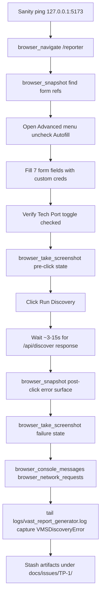

## TP-1 — Live UI reproduction of Tech Port VMS discovery failure

### Scope (locked from clarifying answers)

- Entry point: **Reporter page only** (`http://localhost:5173/reporter`) -> Run Discovery button (lightest path; hits `/api/discover` -> `VMSTunnel.connect()`).
- Goal: **reproduce TP-1 in the live UI**, capture artifacts for the ticket. **No fix attempt.**

### Credentials to apply (read from user input, not echoed)

| Field id (DOM) | Form name | Value |
|---|---|---|
| `#clusterIp` | `cluster_ip` | `192.168.2.2` |
| `#username` | `username` | `support` |
| `#password` | `password` | `X+@}'mPJX4jay-b` |
| `#nodeUser` | `node_user` | `vastdata` |
| `#nodePassword` | `node_password` | `whenever crispy pod tofu` |
| `#switchUser` | `switch_user` | `admin` |
| `#switchPassword` | `switch_password` | `admin` |
| `#techPortToggle` | `tech_port` | checked (default already; verify) |
| `#useDefaultCreds` | autofill | unchecked (so custom values are not overwritten) |

Field locations confirmed in [frontend/templates/reporter.html](frontend/templates/reporter.html) lines 40, 66, 70, 74, 95, and the Run Discovery button at line 347 (calls `rptDiscoverSwitches()` -> POST `/api/discover`).

### Expected failure surface

Backend code path: [src/app.py](src/app.py) L1364-L1417 -> [src/utils/vms_tunnel.py](src/utils/vms_tunnel.py) `VMSTunnel.connect()` -> `discover_vms_management_ip()` -> Step 2 parser receives `''` -> `VMSDiscoveryError("Could not parse management IP from ip addr output: ''")`.

- HTTP 500/502 (or structured error JSON) returned to the page; UI renders a red toast / error banner.
- Server log line in `logs/vast_report_generator.log` containing the exception traceback and the `VMSDiscoveryError` message.

### Execution outline (Plan only - awaiting confirm)

### Tools / MCPs used

- **cursor-ide-browser MCP** for: `browser_tabs list`, `browser_navigate`, `browser_lock`, `browser_snapshot`, `browser_fill`, `browser_click`, `browser_take_screenshot`, `browser_console_messages`, `browser_network_requests`, `browser_lock unlock`.
- **Shell** (read-only) for one `curl http://127.0.0.1:5173/healthz`-style sanity check and a `tail -n 100 logs/vast_report_generator.log` capture after the click.
- **No edits**, no `gh` mutations, no commits, no `pip install`, no server restarts.

### Artifacts to capture for the ticket (saved locally only; no commits)

Target folder: `docs/issues/TP-1/` (will be created at execution time, not now).

1. `01-pre-click.png` - Reporter form filled with all custom values, Tech Port on, Autofill off.
2. `02-post-click-error.png` - failure toast / banner after Run Discovery.
3. `03-network-request.json` - the `/api/discover` request + response (status, body) from `browser_network_requests`.
4. `04-console.txt` - `browser_console_messages` filtered to errors + warnings.
5. `05-server-log.txt` - last ~100 lines of `logs/vast_report_generator.log` containing the `VMSDiscoveryError` traceback.
6. `06-summary.md` - one-page assessment record citing TP-1, root-cause lines from `vms_tunnel.py:90` and `:172`, observed-vs-expected, links to artifacts 1-5.

### Safety / non-goals

- Custom credentials never echoed in shell output; values only flow through MCP form-fill calls.
- No profile is persisted to `cluster_profiles.json`; this run is one-off.
- The Reporter "Run Discovery" call is read-only against the cluster (auth + GET `/api/v1/racks` + GET `/api/v1/switches` once tunnel is up). Since the tunnel never opens, no API calls reach the cluster at all - confirms blast radius is zero on the cluster side.
- Test Suite tile and `/generate` long-run path explicitly excluded from this plan (deferred per "reporter_discover" choice).

### Decision points already resolved

- Reproduce only (no fix) - per "repro_only" answer.
- Reporter Discover only (skip /generate and /advanced-ops) - per "reporter_discover" answer.

### Open follow-ups (will surface after artifacts captured, not part of this plan)

- Whether to file TP-1 as a Jira ticket via the Atlassian MCP using `06-summary.md` as the body.
- Whether to schedule the fix (items 1-4 in the prior outline) for `v1.5.7`.
- Whether to ship diagnostic logging (item 6 in the prior outline) independently and immediately.
