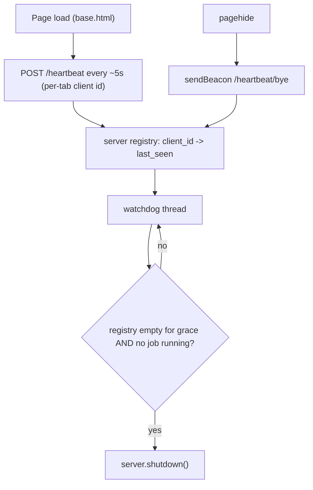

# UI & software management enhancements (QP-3)

Defaults applied (questions skipped): telemetry opt-in/default-off + anonymous + client-now/receiver-design-later; auto-update phased (notify + manual download now, auto-apply/relaunch follow-up), stable channel with pre-release opt-in; auto-close via heartbeat + idle watchdog.

## 1. Header tools buttons + staleness dot (Immediate)

- Add staleness to the tool layer: a `get_tools_status_summary()` on [src/tool_manager.py](src/tool_manager.py) returning `{all_downloaded, any_stale, oldest_age_days, needs_attention}` where `needs_attention = any(not cached) or any(age_days >= 10)`. Reuse the existing `TOOL_FRESHNESS_WARN_DAYS = 10` ([src/oneshot_runner.py](src/oneshot_runner.py) `41`/`990`) by moving it to `tool_manager` and importing it back.
- Expose it: extend `GET /advanced-ops/tools` ([src/app.py](src/app.py) `753`) with a `summary` block and include `tools_needs_attention` in `GET /api/dashboard/status` ([src/app.py](src/app.py) `335`).
- Nav UI: in [frontend/templates/base.html](frontend/templates/base.html) `14-86`, add two always-visible buttons before `#btnExit` - "Deployment Tools" (opens status panel) and "Update Tools" - with an orange notification dot element shown when `needs_attention`.
- Shared modal: extract the existing tools-status panel pattern (`reporter.html` ~2981-3010, `advanced_ops.html` ~1492-1512) into one modal in `base.html`.
- Global JS in [frontend/static/js/app.js](frontend/static/js/app.js): on every page load fetch tools status, toggle the dot, wire "Update Tools" to `POST /advanced-ops/tools/update` then refresh. Remove the dead `#btnUpdateToolsHeader` reference (`reporter.html` `3012`).
- CSS in [frontend/static/css/app.css](frontend/static/css/app.css): `.nav-tools-btn`, `.nav-notification-dot` (orange, modeled on `.nav-prerelease-badge`).
- Tests: `tool_manager` summary thresholds (missing -> attention; 9d vs 11d); route returns the flag.

## 2. In-app auto-update, phased (UPD-1)

Repo `rstamps01/ps-deploy-report`; CI publishes `VAST-Reporter-v...-mac-arm64.dmg` / `...-win.zip`. Writable data dir is outside the bundle ([src/utils/__init__.py](src/utils/__init__.py) `14-37`), so user data survives updates.

Phase 2a (this plan):

- New `src/updater.py`: `get_latest_release(channel)` hits the GitHub Releases API (`/releases/latest` for stable; `/releases` filtered for pre-release), semver-compares vs `APP_VERSION` (handle `-beta`), returns `{current, latest, update_available, asset_url, notes_url}`. Platform/arch resolver maps `darwin`+`arm64`/`x86_64` and `win32` to the correct asset name.
- Config: new `updates:` section in [config/config.yaml.template](config/config.yaml.template) (`github_repo`, `auto_check_on_launch: true`, `channel: stable`, `include_prerelease: false`).
- Routes: `GET /api/updates/check`, `POST /api/updates/download` (download to a staging dir, verify checksum if published).
- UI: an "update available" indicator near the nav version badge + a small modal (current -> latest, release-notes link, "Download update"); background check on launch when enabled.

Phase 2b (follow-up todo, design captured): auto-apply + relaunch - macOS swap the `.app`, Windows helper script that waits for exe exit then replaces `VAST Reporter/` and relaunches; signature/notarization verification.

- Tests: version compare incl. beta; per-platform asset resolver; `/api/updates/check` with mocked GitHub API.

## 3. Auto-close when all browser windows close

- Client: in [frontend/templates/base.html](frontend/templates/base.html), start a persistent heartbeat (`setInterval(fetch('/heartbeat'), 5s)`) with a per-tab id in `sessionStorage`; `navigator.sendBeacon('/heartbeat/bye', id)` on `pagehide`.
- Server: lock-guarded registry in `app.config`; `POST /heartbeat` upserts last-seen, `POST /heartbeat/bye` removes; a daemon watchdog prunes clients not seen within a grace window and, once the registry is empty for a continued idle period AND `JOB_RUNNING`/`HEALTH_JOB_RUNNING` are false, calls the stored `server.shutdown()` ([src/app.py](src/app.py) `476`).
- Guards/config: never shut down mid-job; new config (e.g. `server.auto_shutdown_on_idle: true`, `idle_grace_seconds`); enable only in GUI/frozen mode. Wire watchdog start in `run_gui()` ([src/main.py](src/main.py) `863-949`).
- Tests: pure prune/decision logic (empty + idle + no job -> shutdown) with mocked clock/server.

## 4. Opt-in anonymous usage telemetry + local ROI

- New `src/utils/usage_metrics.py`: persistent store at `get_data_dir()/usage_metrics.json` with a one-time random `install_id` (uuid4) and monotonic counters (`reports_generated`, `json_generated`, `health_checks`, `bundles`, `advanced_ops_runs`, `first_seen`, `last_event`); atomic `record_event(kind)`. No cluster identifiers ever stored.
- Hook the existing success points: report PDF/JSON saved ([src/main.py](src/main.py) `573-583`, [src/app.py](src/app.py) `2456-2475`, [src/oneshot_runner.py](src/oneshot_runner.py) `1690`), health saved, bundle created.
- Config: new `telemetry:` section in [config/config.yaml.template](config/config.yaml.template) (`enabled: false` opt-in, `endpoint: ""`, `anonymous: true`, `submit_interval_days`).
- Local ROI surface: `GET /api/usage/summary` + a dashboard tile showing counters and a configurable "time saved per report" ROI estimate; exportable JSON/CSV.
- Outbound (only when `telemetry.enabled`): batched submitter POSTing `{install_id, app_version, counts, timestamp}` with offline queue + retry; schema enforced to exclude any PII/cluster data.
- Receiver design spec (follow-up, not stood up here): minimal aggregator that sums counts per `install_id`; document schema + privacy note.
- Tests: counter increment/persist atomicity; payload excludes PII; submit gated by `enabled`; ROI math.

## Cross-cutting

- Docs: README (new `updates`/`telemetry`/auto-shutdown config), `CHANGELOG.md`, a short privacy note, and link UPD-1 + new IDs in [docs/TODO-ROADMAP.md](docs/TODO-ROADMAP.md) (QP-3 slot).
- Quality gates per repo rules: `pytest`, `flake8 src/ tests/`, `black --check --line-length 120`. Version bump on release.

## Suggested sequencing

Item 1 (immediate) -> Item 3 (self-contained lifecycle) -> Item 4 (local counters + ROI, outbound gated off) -> Item 2 (phased; 2a notify/download, 2b apply/relaunch).
