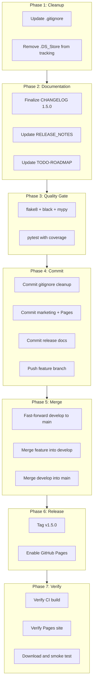

# v1.5.0 Release Plan

## Current State Summary

- **Active branch**: `feature/health-check-v2` (24 commits ahead of `main`)
- `**main`**: at v1.4.7 (commit `0aaf3bd`) -- is a direct ancestor of the feature branch (clean fast-forward merge possible)
- `**develop`**: 42 commits *behind* `main` (stuck at v1.4.2 era) -- needs to be caught up
- **Version strings**: Already set to `1.5.0` in `src/app.py`, `src/main.py`, `src/__init__.py`, `packaging/vast-reporter.spec`
- **Existing tag**: `v1.5.0-rc1` exists on the feature branch HEAD (commit `319d6ee`)
- **Uncommitted changes**: `README.md` (banner), `.github/workflows/pages.yml` (new), `docs/marketing/` (new: 3 HTML pages + 17 screenshots)
- **Untracked clutter**: Several files/dirs that should NOT be committed and are NOT gitignored

---

## Phase 1: Pre-Commit Cleanup

### 1a. Update .gitignore

Several untracked files/directories are not gitignored and must NOT be committed. Add to [.gitignore](.gitignore):

```
# Local development artifacts
docs/superpowers/
frontend/static/odometer_preview.html

# Diagnostic and ad-hoc test scripts (not part of test suite)
tests/diag_*.py
reports/diag_*

# Output bundle artifacts
output/bundles/
```

The `tools/` directory already has selective ignores but the whole directory should be ignored since it contains local-only analyzer and tracer tools. Append:

```
# Local tools (analyzer, tracer — not published)
tools/
```

### 1b. Remove .DS_Store from tracking

`.DS_Store` files in `.cursor/`, `src/`, `tests/` show as modified. These should be untracked. Add to `.gitignore` (if not already covered):

- Confirm `.DS_Store` is already in `.gitignore` (it is, line 167)
- Run `git rm --cached` for the three tracked `.DS_Store` files
- Do NOT commit `logs/vast_report_generator.log.1` (already covered by `logs/*.log.*` pattern in `.gitignore`)

---

## Phase 2: Documentation Updates

### 2a. CHANGELOG.md — finalize the release header

Change `## [Unreleased]` (line 8) to `## [1.5.0] - 2026-04-XX` (use the actual release date).

Add a new entry under the v1.5.0 section for the GitHub Pages and marketing work:

```markdown
### Added (GitHub Pages and Marketing)
- **Product Overview page:** Interactive HTML one-pager at rstamps01.github.io/ps-deploy-report/ showcasing UI screenshots, report previews, key benefits, and quick start steps
- **Visual Quick Start Guide:** Step-by-step macOS and Windows installation walkthroughs with screenshots, path selector for New Install vs. Upgrade, and Gatekeeper/SmartScreen guidance
- **GitHub Pages workflow:** `.github/workflows/pages.yml` auto-deploys `docs/marketing/` on pushes to `main`
- **README visual banner:** Dashboard preview image and links to Product Overview and Quick Start Guide at the top of README.md
```

### 2b. RELEASE_NOTES_v1.5.0.md — add GitHub Pages section

Append a section to [RELEASE_NOTES_v1.5.0.md](RELEASE_NOTES_v1.5.0.md) covering the new marketing pages and GitHub Pages deployment.

### 2c. TODO-ROADMAP.md — update status and date

- Update "Last updated" line to the release date
- If any roadmap items were addressed, update their status

---

## Phase 3: Quality Gate (mandatory before commit)

Run all quality checks in sequence. All must pass.

```bash
# 1. Lint
flake8 src/ tests/

# 2. Format check
black --check --line-length 120 src/ tests/

# 3. Type check
mypy src/ --ignore-missing-imports --no-strict-optional

# 4. Unit tests with coverage
python -m pytest tests/ -v --ignore=tests/test_ui.py --ignore=tests/test_integration.py \
  --cov=src --cov-report=term-missing --cov-fail-under=60

# 5. Secrets scan (the new marketing HTML files should not contain credentials)
# Pre-commit hooks will run gitleaks automatically on commit
```

If any check fails, fix the issue before proceeding. The new files (HTML pages, YAML workflow, screenshots) do not affect Python quality gates, but the pre-commit hooks `check-added-large-files` (max 1024KB) will validate screenshot sizes -- all are under 520KB.

---

## Phase 4: Commit on Feature Branch

Stage and commit all changes on `feature/health-check-v2` using conventional commit format:

**Commit 1** (gitignore cleanup):

```
chore: update .gitignore for local tools, diagnostics, and DS_Store cleanup
```

**Commit 2** (marketing + GitHub Pages):

```
feat(docs): add GitHub Pages marketing site, product overview, and quick start guide
```

Files to stage:

- `.github/workflows/pages.yml`
- `docs/marketing/index.html`
- `docs/marketing/se-one-pager.html`
- `docs/marketing/quick-start-guide.html`
- `docs/marketing/screenshots/` (17 image files + README.md)
- `README.md`

**Commit 3** (release finalization):

```
chore(release): finalize v1.5.0 changelog, release notes, and roadmap
```

Files: `CHANGELOG.md`, `RELEASE_NOTES_v1.5.0.md`, `docs/TODO-ROADMAP.md`

Push the feature branch: `git push origin feature/health-check-v2`

---

## Phase 5: Merge Flow

### 5a. Fast-forward `develop` to `main`

`develop` is 42 commits behind `main`. Catch it up first:

```bash
git checkout develop
git merge main          # fast-forward to v1.4.7
git push origin develop
```

### 5b. Merge feature branch into `develop`

```bash
git checkout develop
git merge feature/health-check-v2   # should be clean (main is ancestor of feature)
git push origin develop
```

### 5c. Merge `develop` into `main`

```bash
git checkout main
git merge develop
git push origin main
```

---

## Phase 6: Tag and Release

### 6a. Create annotated tag

```bash
git tag -a v1.5.0 -m "Release v1.5.0 — Reporter page, SSH proxy hop, vnetmap integration, GitHub Pages marketing site"
git push origin v1.5.0
```

This triggers `.github/workflows/build-release.yml` which:

- Runs quality gate (lint, format, type check) -- `continue-on-error: true`
- Runs test suite with coverage -- `continue-on-error: true`
- Builds macOS .app + .dmg via `packaging/build-mac.sh`
- Builds Windows .exe + .zip via `packaging/build-windows.ps1`
- Creates GitHub Release with both artifacts attached

### 6b. Enable GitHub Pages (manual, one-time)

After the merge lands on `main`:

1. Go to **github.com/rstamps01/ps-deploy-report/settings/pages**
2. Under **Source**, select **GitHub Actions**
3. Save

The `pages.yml` workflow will trigger on the next push to `main` touching `docs/marketing/`** (which the merge itself satisfies).

---

## Phase 7: Post-Release Verification

1. **GitHub Actions**: Confirm `Build & Release` workflow completes successfully
2. **Release artifacts**: Verify `VAST-Reporter-v1.5.0-mac.dmg` and `VAST-Reporter-v1.5.0-win.zip` are attached to the GitHub Release
3. **GitHub Pages**: Verify `https://rstamps01.github.io/ps-deploy-report/` loads the landing page with links to the one-pager and quick start guide
4. **README rendering**: Verify the Dashboard preview image and links render correctly on the repo main page
5. **Download and smoke test**: Download the .dmg, install, launch, confirm version shows 1.5.0

---

## Risk Items and Notes

- `**develop` catch-up**: Since `develop` diverged at v1.4.2 and `main` has progressed to v1.4.7, the `git merge main` into `develop` should be a clean fast-forward. If not, conflicts must be resolved manually.
- **Pre-commit hooks**: The `check-added-large-files` hook (max 1024KB) will run on all new screenshots. All are under 520KB, so no issue expected.
- `**v1.5.0-rc1` tag**: The existing RC tag remains in history. The final `v1.5.0` tag will be on a newer commit (with the marketing additions).
- **GitHub Pages cold start**: The first Pages deployment may take 1-2 minutes after the workflow completes. Subsequent deployments are faster.


