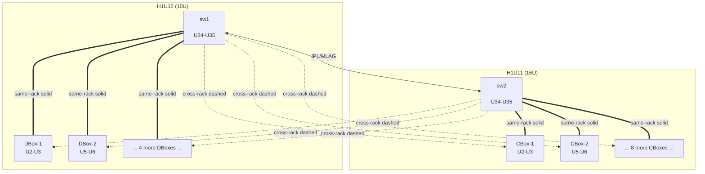

# v1.5.8 Release Batch

A multi-item release where all confirmed and to-be-described fixes/UI enhancements stack on a single feature branch. Each item ships as its own commit pair (TDD red -> impl), all merged together at the end of the cycle.

## Repo state at branch start (verified just now)

- `origin/main` -> `6f09dea` (Merge develop into main: v1.5.7)
- `origin/develop` -> `1f5758b` (docs(release): v1.5.7 release notes) — **0 commits ahead of v1.5.7**
- Tag `v1.5.7` published with `.dmg` (54.9 MB) + `.zip` (51.5 MB) GitHub Release assets
- Last develop CI run: `25963083536` SUCCESS (10/10 jobs)
- No open PRs, no open issues
- Working tree clean (only `logs/vast_report_generator.log.1` modified, ignored)
- Weekly Security Audit failing on `could not add label: 'security' not found` — pipeline plumbing only, optional housekeeping

## Branch + workflow

```
git checkout develop && git pull --ff-only origin develop
git checkout -b feature/v1.5.8-batch
git push -u origin feature/v1.5.8-batch
```

CI on a feature branch runs quality-gate + integration + advanced-ops + health-check + unit-tests (3.12 only); UI tests + macOS/Windows build-smoke gate to develop/main per `ci-pipeline-13.mdc`.

## Items targeted for v1.5.8

| ID | Status | Type | Description |
|---|---|---|---|
| RPT-6 | confirmed | fix | Rack-height diagram off-by-one for 2U+ switches under manual placement (Discovery U-position is top-U; rack diagram treats it as bottom-U). Fix once at the bridge in `report_builder.py`. |
| NET-2A | confirmed | fix | Logical network diagram ignores manual switch->rack assignments (vote-based heuristic puts both leaves in H1U12 on `<customer-cluster>`). Pass `manual_placements` from `report_builder._create_logical_network_diagram` into `network_diagram_v2.generate()`; rewire `_assign_switches_to_racks` to prefer manual; relax `_apply_manual_placements all_default` precondition; filter empty `Rack` placeholder. |
| NET-2B | confirmed | feat | Logical network diagram does not render cross-rack switch-to-node edges. Build per-page `switch_home_rack` registry; render cross-rack edges with `stroke-dasharray=6,4` + opacity 0.55 through inter-rack gutter waypoint. **Routing rule (operator-defined):** same-rack edges exit the OUTER side of devices (away from gutter), cross-rack edges exit the INNER side of devices (toward gutter). No A/B-fixed-side convention. |
| NET-3 | confirmed | feat | **Subnet-based edge coloring** (deprecate A/B network designation as classifier in the diagram). Each switch is colored by the /24-equivalent subnet it services (first 3 octets of `node_ip`, matching vnetmap's `{'172.16.0'}` / `{'172.16.64'}` set notation). 2-switch palette: subnet served by lowest-IP switch -> green family; subnet served by next switch -> blue family. Solid lines = same-rack, dashed lines = cross-rack — color stays the same per subnet across both. Legend swatches change from "Network A / Network B" to per-subnet entries (e.g. "172.16.0.0/24 (sw1)" + "172.16.64.0/24 (sw2)"). |
| NET-4 | confirmed | feat | **Mis-cabling detection + node highlighting + warning banner.** vnetmap's own rule: each switch must service exactly one /24-equivalent subnet group. Diagram-side: build `switch_subnets: Dict[switch_ip, Set[subnet_prefix]]` from `port_map[*].node_ip` first 3 octets. If `len(switch_subnets[sw_ip]) > 1`, the switch is mis-cabled. Identify offending nodes (those whose subnet differs from the dominant subnet for that switch), draw a red dashed outline + warning glyph on the node box, and surface a "Cabling validation: X mis-cabled connection(s) detected" banner under the diagram title. When all switches pass, show "Cabling validation: PASS" in green. |
| _(future items)_ | pending | TBD | Operator will describe additional fixes / UI enhancements over the next few days. Each gets a unique ID using existing prefixes (RPT-N / NET-N / UI-N / RM-N / HC-N / SR-N / etc.), a `docs/issues/<ID>/01-summary.md`, and its own commit pair on the same branch. |

## Phases (each item TDD red -> impl -> commit)

1. **Phase 0** — `git checkout -b feature/v1.5.8-batch` off `develop`, push, confirm CI green. Also generate `docs/issues/NET-2/mockup-before.svg` (illustrating v1.5.7 broken state — vote-based assignment puts both switches in H1U12, 20 H1U11-side edges silently dropped) for reuse in the issue summary and release notes.
2. **Phase 1 (RPT-6)** — Convert `manual_switch_placements` once at the bridge in [`src/report_builder.py`](src/report_builder.py) (lines ~2336-2350 and ~2604-2611): compute `bottom_u = top_u - height_u + 1` (clamp at 1), set `switch_positions[idx] = bottom_u`, build inventory `rack_unit` label as full span (`U34-U35`). Tests: `tests/test_report_builder.py::TestRPT6ManualSwitchUPosition` (4 cases) + `tests/test_rack_diagram.py::TestRPT6ManualSwitchSpan`.
3. **Phase 2 (NET-2A)** — Wire `manual_placements` blob through [`src/report_builder.py::_create_logical_network_diagram`](src/report_builder.py); rewire [`src/network_diagram_v2.py::_assign_switches_to_racks`](src/network_diagram_v2.py) to prefer manual; relax `_apply_manual_placements all_default` gate; filter empty `Rack` placeholder. Tests: `TestNET2ManualSwitchPlacement` (3 cases).
4. **Phase 3 (NET-2B)** — `switch_home_rack` registry; resolve `device_rack_name` via `hardware_inventory.cboxes/dboxes` lookup (or `node_hostname` rack-prefix fallback for clusters where boxes lack `rack_name`); always render edge if `sw_ip in switch_centers` for any rack column. Cross-rack styling: `stroke_dasharray="6,4"`, `opacity=0.55`. **Routing rule (operator-defined):** the existing fixed mapping `network=A -> exit_x=dev_x` / `network=B -> exit_x=dev_x+dev_w` is replaced by a position-based rule:
   - **Same-rack edges** exit on the OUTER side of the device (away from the gutter).
     - Devices in left rack column -> exit LEFT, channel = `chan_a`.
     - Devices in right rack column -> exit RIGHT, channel = `chan_b`.
   - **Cross-rack edges** exit on the INNER side of the device (toward the gutter).
     - Devices in left rack column -> exit RIGHT, channel = `chan_b`, route through gutter to right rack switch.
     - Devices in right rack column -> exit LEFT, channel = `chan_a`, route through gutter to left rack switch.
   Tests: `TestNET2CrossRackEdges` (4 cases) via SVG content scan — assert solid-vs-dashed edge counts, exit-side direction matches rack position, waypoint count for cross-rack uses gutter midpoint, legend entry.
5. **Phase 4 (NET-3)** — Subnet-based edge coloring. Build `switch_subnet: Dict[switch_ip, str]` from `port_map[*].node_ip` (first 3 octets joined, matching vnetmap's `{'172.16.0'}` set notation). Sort switches by IP; assign palette positions. 2-switch palette (this cluster): green (`#0F9D58`) for lowest-IP switch's subnet, blue (`#4285F4`) for next switch's subnet — colors carried over from the existing `COLOR_NETWORK_A/B` palette so the visual change is just the *meaning* of the colors. >2-switch palette extension: orange (`#F4B400`), purple (`#7B1FA2`), then colorbrewer-Dark2 for any additional. Replace edge color lookup `COLOR_NETWORK_A if network=="A" else COLOR_NETWORK_B` -> `palette[switch_subnet[sw_ip]]` in `_draw_device_connections`. Update `_draw_legend` to emit per-subnet swatches: `"172.16.0.0/24 (sw1)"` (green solid + dashed pair), `"172.16.64.0/24 (sw2)"` (blue solid + dashed pair), `"IPL/MLAG"` (purple), `"Spine"` (gray). The `network` field stays in the port_map for backward compat (PDF port table still shows it) but is no longer used as a coloring classifier in the diagram. Tests: `TestNET3SubnetColoring` (3 cases) covering 2-switch standard cluster + 4-switch palette extension + edge color matches `switch_subnet` lookup.
6. **Phase 5 (NET-4)** — Mis-cabling detection. After building `switch_subnet` map, also build `switch_subnets_observed: Dict[switch_ip, Counter[subnet_prefix]]`. For each switch, if `len(observed) > 1`, flag the switch as mis-cabled; the dominant subnet (most common) is "expected" and the rest are mis-cabled connections. Mark each mis-cabled `port_map` entry with an `is_miscabled: True` annotation; mark the corresponding device box with a 2px red dashed outline + small warning glyph in the upper-right corner. Add a banner under the diagram title: `"Cabling validation: PASS"` (green text) when no issues, or `"Cabling validation: N mis-cabled connection(s) detected"` (red text) listing affected nodes inline. Tests: `TestNET4MisCablingDetection` (4 cases) — pass case (this cluster), single-node mis-cable, multi-node mis-cable, all-mixed-on-one-switch (catastrophic). The detection logic is reusable as a standalone validator (`src/cabling_validator.py`?) so the same warning surfaces in the JSON `port_mapping.completeness` check and the PDF report (separate item, NET-4 covers diagram surfacing only).
7. **Phase 6** — Implement additional v1.5.8 items as operator describes them (TDD red -> impl -> commit per item; update plan file inline; new `docs/issues/<ID>/01-summary.md` per item).
8. **Phase 7** — Manual offline verification via `python3 -m src.main --from-json import/Assets-2026-05-19/vast_data_<cluster>_20260519_181453.json --output /tmp/v158-replay`. Visually confirm: rack diagram U34-U35; logical diagram sw1@H1U12 + sw2@H1U11; dashed cross-rack edges with outer/inner exit-side rule; subnet-based coloring (green for sw1, blue for sw2); cabling validation banner shows `PASS`. Replay any other operator-supplied fixture (especially any with mis-cabled connections to validate NET-4).
9. **Phase 8 — Final docs + version bump** (after all items complete, before merge):
   - `docs/issues/<ID>/01-summary.md` per item (RPT-6, NET-2, NET-3, NET-4, plus any future items)
   - Single `[1.5.8] - <YYYY-MM-DD>` block in `CHANGELOG.md` (Added / Changed / Fixed / Deferred)
   - `docs/TODO-ROADMAP.md` "Done — v1.5.8 batch" section + Last updated bump
   - `RELEASE_NOTES_v1.5.8.md` (mirror v1.5.7 template) — call out the A/B-deprecation-in-diagram visual change as a user-visible change
   - Version bump 1.5.7 -> 1.5.8 in 6 locations validated by `scripts/check-version-sync.sh` (src/__init__.py docstring + __version__, src/app.py APP_VERSION, src/main.py argparse, packaging/vast-reporter.spec CFBundle*, README.md badge + test count)
   - Quality gate: `flake8 src/ tests/`, `black --check --line-length 120 src/ tests/`, `bash scripts/check-version-sync.sh`, `pytest` with coverage >= 65%
10. **Phase 9 — Branch + release** (per `release-packaging-12.mdc`): `feature/v1.5.8-batch` -> develop CI green -> merge develop -> main -> tag `v1.5.8` -> `build-release.yml` produces mandatory `.dmg` + `.zip`.

## Tooling already in scope

- **Rules** (workspace): design-guidelines-01, ai-develop-guidelines-02, architecture-03, change-control-07, documentation-08, todo-tracking-09, config-security-11, release-packaging-12, ci-pipeline-13
- **Skills** (relevant): `test-driven-development`, `systematic-debugging`, `verification-before-completion`, `executing-plans`, `subagent-driven-development`, `finishing-a-development-branch`, `requesting-code-review`
- **MCPs** (potentially useful): `cursor-ide-browser` for visual UI verification of any UI-N items; `user-@21st-dev/magic` for UI component generation if needed; `plugin-atlassian-atlassian` for Confluence sync at end of cycle. Slack / GitLens / NanoBanana unlikely to be relevant.

## Out of scope (deferred / carry-forward)

- **SR-2** (cosmetic Onyx pre-probe rejection warning) — still deferred from v1.5.7
- **RPT-VALIDATION-1 / RPT-VALIDATION-2** (Node User render-after-restore, Node Password reset on retype)
- **DEV-1 (full)** — `--from-json` UI tile (CLI flag is shipped, UI tile pending)
- **Compact-mode logical diagram** (`network_diagram.py`) — legacy fallback, not touched
- **Stale local feature branches** (`feature/health-check-v2`, `feature/pywebview`, `feature/tp-1-techport-discovery`) — housekeeping, optional

Operator may pull any of these into the v1.5.8 batch later if convenient.

## Process for adding a new item mid-cycle

1. Operator describes the issue (paste error / log / fixture / screenshot).
2. Triage: assign ID using existing prefix (`RPT-N` / `NET-N` / `UI-N` / `RM-N` / `HC-N` / `SR-N` / etc.), draft `docs/issues/<ID>/01-summary.md` mirroring SR-1/3/4/5 template (symptom, repro evidence, root cause, fix design, acceptance criteria, verification).
3. Append to "Items targeted for v1.5.8" table in this plan file.
4. Add phase rows to `todos:` frontmatter.
5. Implement TDD red -> impl -> commit on `feature/v1.5.8-batch`.
6. Replay against any provided fixture via `--from-json`.

The plan file is updated **incrementally** per item — not a fresh plan per item.

## NET-2 mockup: before / after on `<customer-cluster>`

Reference cluster geometry from the saved JSON: two real racks `H1U11` (16U, 10 HPE Genoa CBoxes -> 10 CNodes) and `H1U12` (10U, 6 BlueField DBoxes -> 12 DNodes); both leaves at `U34-U35` per `manual_switch_placements`; port_map proves each leaf cables to **both** racks (10+12=22 connections per switch -> 44 edges total). Empty placeholder rack `Rack` (id=1, `number_of_units: null`) filtered out of both views.

### Existing rendering palette and routing (preserved by NET-2)

- Network A = `#0F9D58` (teal-green), exits **left** of device, channels at `chan_a = rx + 6`
- Network B = `#4285F4` (deep blue), exits **right** of device, channels at `chan_b = rx + rack_w - 6`
- Same-rack edges: `stroke_width=2.0`, `opacity=0.85`, no dasharray
- IPL/MLAG (`#7B1FA2`, purple, dashed) and Spine (`#757575`, dashed) styling unchanged
- Switch fill `#e8f5e9`, CBox fill `#c8e6f8`, DBox fill `#ffe0b2`, rack background `#f5f5f5`
- `RACK_GAP = 30px` between rack columns; `RACK_PAD_TOP = 40px` for header

### BEFORE — current v1.5.7 rendering (the bug we're fixing)

Vote-based assignment: both switches end up under H1U12 (it has 12 nodes vs 10). H1U11 column has zero switches, so `_draw_device_connections` silently `continue`s for all 20 H1U11-side connections (lines 1185-1186). H1U12 column draws only 24 of 44 edges. Operator sees: "where are sw2's cables?" and "is sw2 even in this cluster?".

```
+------- H1U11 (16U) -------+   +-------- H1U12 (10U) -------+
| (empty switch row)        |   | [ sw1   U34-U35 ]          |
|                           |   | [ sw2   U34-U35 ]          |
|                           |   |   |       |                |
|                           |   |   bus -------               |
|  A|       |B  A|     |B   |   |  A|     |B  A|     |B      |
|  | CBox-1 |   | CBox-2|   |   |  |DBox-1|   |DBox-2|       |
|  |  U2-U3 |   |  U5-U6|   |   |  | U2-U3|   | U5-U6|       |
|  +-------+    +------+    |   |  +------+   +------+       |
|  (no edges drawn — bug)   |   |  (only same-rack edges)    |
+---------------------------+   +----------------------------+

Edges drawn: 24 (sw1+sw2 -> H1U12 only)
Edges silently dropped: 20 (sw1+sw2 -> H1U11)
```

### AFTER — proposed v1.5.8 target rendering

NET-2A puts sw2 back in H1U11 (manual placement wins over vote). NET-2B routes the 22 cross-rack edges through the inter-rack gutter with dashed styling at 0.55 opacity, preserving the existing A/B color and routing semantics. Legend extends with a single new entry.

```
+------ H1U11 (16U) -------+   +------- H1U12 (10U) -------+
| [ sw2   U34-U35 ]        |   | [ sw1   U34-U35 ]         |
|       |                  |   |       |                   |
|    bus ---  -  -  -  -  -| - | -  - bus ----             |
|       |                  |   |       |                   |
|  A|     |B  A|     |B    |   |  A|     |B  A|     |B     |
|  | CBox-1|   | CBox-2|   |   |  |DBox-1|   |DBox-2|      |
|  | U2-U3 |   | U5-U6 |   |   |  | U2-U3|   | U5-U6|      |
|  +------+    +------+    |   |  +------+   +------+      |
|  ===== solid (same-rack) |   |  ===== solid (same-rack)  |
|  ----- dashed (x-rack)   |   |  ----- dashed (x-rack)    |
+--------------------------+   +---------------------------+
                         ^                ^
                         |  inter-rack    |
                         +-- gutter ------+
                            RACK_GAP=30px
                  cross-rack waypoint runs through here
                  (mid bus extended ACROSS the gap)

sw2 (home H1U11):  10 same-rack solid + 12 cross-rack dashed (right to H1U12)
sw1 (home H1U12):  12 same-rack solid + 10 cross-rack dashed (left to H1U11)
Total edges drawn: 44 (parity with port_map)
```

### Cross-rack edge waypoint routing (NET-2B)

For a cross-rack edge `device@rackX -> switch@rackY` (where `rackX != switch_home_rack[sw_ip]`):

```
device.exit_x  -->  device's chan_x   -->  device's mid_bus_y
                                              |
                                              v
                                  ACROSS inter-rack gutter
                                  (extends mid bus through RACK_GAP)
                                              |
                                              v
                            other rack's chan_x  -->  switch column sw_cx
                                                          |
                                                          v
                                                      switch bottom (sw_bot)
```

Waypoint list (replaces the existing 5-point list at lines 1211-1217 only when `is_cross_rack`):

```python
waypoints = [
    (exit_x, exit_y),
    (chan_x, exit_y),
    (chan_x, mid),
    # NEW cross-rack hop: route through inter-rack gutter midpoint
    (gutter_x, mid),                # gutter_x = midpoint between rack columns
    (other_chan_x, mid),
    (sw_cx, mid),
    (sw_cx, sw_bot),
]
```

Visual differentiation from same-rack:
- `stroke_dasharray="6,4"` (matches existing Spine-fabric dash cadence; distinguishable from `6,3` Spine)
- `opacity=0.55` (vs `0.85` same-rack) — keeps same A/B color for fast scanning, lets same-rack edges read as primary
- `stroke_width=2.0` unchanged (don't shrink — operators need to see the cable, just want it visually subordinated)

### Mermaid topology view (simplified, illustrative)

Shows the post-fix logical topology without the geometric routing detail above:



### Legend extension (NET-2B)

Existing legend in [`_draw_legend`](src/network_diagram_v2.py) (line 1266 onwards) has 4 items: `Network A`, `Network B`, `IPL/MLAG`, `Spine`. Proposed new 5th item appended at the same height:

```
[--A--]  Network A      [--B--]  Network B      [--I--]  IPL/MLAG      [--S--]  Spine      [- - -]  Cross-rack link
```

The cross-rack swatch in the legend is rendered as a 24px-wide line with `stroke_dasharray="6,4"` in a neutral color (`COLOR_LABEL = #424242`) so it conveys "this style means cross-rack" independent of A/B color.

### What this mockup is NOT showing (intentionally)

- Per-port labels on edges (already conditional in the existing renderer, unchanged by NET-2).
- Spine pages — this cluster has no spine layer; the routing logic is unchanged for clusters that do.
- Compact mode (`network_diagram.py` legacy fallback) — out of scope.

### Operator feedback on mockup (2026-05-19): expanded NET-2 + NET-3 + NET-4

After reviewing the initial target mockup, operator provided three substantive design corrections:

1. **Routing rule based on rack position, not A/B convention.** The existing v1.5.7 routing has Network A always exiting LEFT and Network B always exiting RIGHT of the device. Replace with a position-based rule:
   - Same-rack edges exit the OUTER side (away from gutter).
   - Cross-rack edges exit the INNER side (toward gutter).
   - All cross-rack edges naturally route through the gutter without crossing intra-rack routing — visually clean. No more dual-variant decision.

2. **Color scheme based on IP subnet, not A/B designation.** A/B is being deprecated as a classifier. The vnetmap output groups connections per switch by first 3 octets of `node_ip`:

   ```
   Switch <ip> has {'172.16.0'}, network {'B', 'A'}, should be only one be in either range 172.16.{0..63} or in range 172.16.{64..127}
   ...
   Switch <ip> has {'172.16.64'}, network {'B', 'A'}, should be only one be in either range 172.16.{0..63} or in range 172.16.{64..127}
   ```

   The `network {'B', 'A'}` set per switch (both letters present) confirms A/B carries no useful classification on this cluster — every switch has both. The IP subnet is the actual port-role classifier. Diagram coloring rule:
   - `switch_subnet: Dict[switch_ip, str]` built from first 3 octets of `node_ip` for each port_map entry.
   - 2-switch palette: green (`#0F9D58`) for the lowest-IP switch's subnet, blue (`#4285F4`) for the next switch's subnet. Solid for same-rack, dashed for cross-rack — color stays the same per subnet across both.
   - >2-switch extension: orange (`#F4B400`), purple (`#7B1FA2`), then colorbrewer-Dark2 for additional.
   - PDF port table preserves the `network` field for backward compat; only the diagram coloring stops using it.

3. **Mis-cabling detection.** vnetmap defines the rule: each switch must service exactly one /24-equivalent subnet group. If a switch has `len({first-3-octets}) > 1` across observed connections, that's mis-cabled. Diagram surfacing:
   - Per-node detection: identify nodes whose subnet differs from the dominant subnet for the connected switch.
   - Visual: 2px red dashed outline on the offending node box + small warning glyph in upper-right corner of the box.
   - Banner: `"Cabling validation: PASS"` (green) when all switches pass, or `"Cabling validation: N mis-cabled connection(s) detected"` (red, with affected node names listed inline) when issues exist.
   - On `<customer-cluster>` this cluster: PASS (sw1=`{'172.16.0'}`, sw2=`{'172.16.64'}`, both single-element sets).

These three changes split into separate items (NET-2B, NET-3, NET-4) because each is independently testable and committed independently. The original "operator-decided cross-rack exit-side" open question is resolved — replaced by the explicit outer/inner rule above.

### Subnet -> color palette specification

```python
# src/network_diagram_v2.py (additions)
SUBNET_PALETTE = [
    ("#0F9D58", "green"),    # lowest-IP switch
    ("#4285F4", "blue"),     # next switch
    ("#F4B400", "orange"),   # 3rd switch
    ("#7B1FA2", "purple"),   # 4th switch
    # additional via colorbrewer-Dark2 if N > 4
]

def assign_switch_colors(switches: List[Dict]) -> Dict[str, str]:
    """Sort switches by IP, build switch_subnet, assign palette in order."""
    sorted_switches = sorted(switches, key=lambda sw: ipaddress.ip_address(sw["mgmt_ip"]))
    return {
        sw["mgmt_ip"]: SUBNET_PALETTE[i % len(SUBNET_PALETTE)][0]
        for i, sw in enumerate(sorted_switches)
    }
```

### Mis-cabling detection algorithm

```python
def detect_miscabled_connections(port_map: List[Dict]) -> Dict[str, Any]:
    """vnetmap-equivalent rule: each switch must service one subnet group."""
    from collections import Counter, defaultdict
    switch_subnets: Dict[str, Counter] = defaultdict(Counter)
    for entry in port_map:
        node_ip = entry.get("node_ip", "")
        sw_ip = entry.get("switch_ip", "")
        if node_ip and sw_ip:
            subnet = ".".join(node_ip.split(".")[:3])  # first 3 octets
            switch_subnets[sw_ip][subnet] += 1

    miscabled_entries = []
    miscabled_switches = []
    for sw_ip, counter in switch_subnets.items():
        if len(counter) > 1:
            dominant = counter.most_common(1)[0][0]
            miscabled_switches.append(sw_ip)
            for entry in port_map:
                if entry.get("switch_ip") == sw_ip:
                    subnet = ".".join(entry.get("node_ip", "").split(".")[:3])
                    if subnet and subnet != dominant:
                        miscabled_entries.append(entry)
    return {
        "passed": len(miscabled_switches) == 0,
        "miscabled_entries": miscabled_entries,
        "miscabled_switches": miscabled_switches,
        "switch_subnets": {sw: list(c.keys()) for sw, c in switch_subnets.items()},
    }
```

### Resolved/superseded: original open question on cross-rack exit-side convention

Existing v1.5.7 routing convention in [`_draw_device_connections`](src/network_diagram_v2.py) (lines 1200-1207):

```python
if network == "A":
    exit_x = dev_x          # left
    chan_x = chan_a
else:
    exit_x = dev_x + dev_w  # right
    chan_x = chan_b
```

This is a fixed mapping: **Network A always exits left, Network B always exits right** — matching the physical port location on the device. Same-rack edges are unaffected by NET-2; the question is only about cross-rack.

Two viable variants:

| Variant | Exit side for cross-rack | Trade-off |
|---|---|---|
| `canonical` | Always B exits right (preserve convention) | Faithful to physical port. Cross-rack B-edges from H1U12 to sw2@H1U11 take a long horizontal U-turn through chan_b col2 (right side, away from gutter), then left across both rack columns to sw2. Visually busy on the right side of the source rack. |
| `facing` | Cross-rack edges exit on the side facing the destination rack (override the convention) | Cleaner geometry, edges go directly through the gutter. Breaks the "B = right port" mnemonic for the cross-rack subset only — operator must read color, not exit side, to identify network for cross-rack edges. Same-rack edges keep the existing convention. |

**Operator chose: render BOTH variants during Phase 3 implementation against the `<customer-cluster>` fixture.** The implementation will:

1. Add an internal env-var toggle `NETWORK_DIAGRAM_CROSS_RACK_EXIT={canonical,facing}` (defaults to `canonical`) to gate the routing logic in `_draw_device_connections`.
2. Run `python3 -m src.main --from-json import/Assets-2026-05-19/...json --output /tmp/v158-canonical` with the env-var unset, save the rendered logical diagram SVG to `docs/issues/NET-2/routing-variant-canonical.svg`.
3. Run with `NETWORK_DIAGRAM_CROSS_RACK_EXIT=facing`, save to `docs/issues/NET-2/routing-variant-facing.svg`.
4. Operator reviews both real outputs (orthogonal waypoints, not bezier) and picks one.
5. The chosen variant becomes the unconditional default; the env-var toggle and the unused branch are removed before the NET-2B commit.
6. The decision and rationale are recorded in the commit message and in `docs/issues/NET-2/01-summary.md`.

This delays the design choice until after we can see real output, eliminating the bezier-vs-orthogonal mockup uncertainty.
