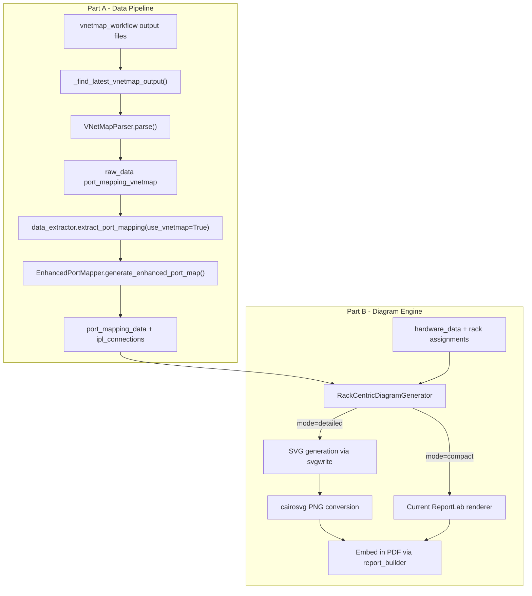

# Vnetmap Port Mapping + Network Diagram Redesign

## Scope

This plan combines two interconnected efforts into a single deliverable:

- **Part A** (Data): Wire vnetmap topology output into the report generation pipeline, replacing SSH-based collection as the primary data source
- **Part B** (Diagram): Redesign the Logical Network Diagram using Design 3 (Rack-Centric with Local Leaves) rendered via SVG

Both share the same data contract (`port_map`, `ipl_connections`, `hardware_data`) and ship together.

## Confirmed Design Decisions

| Decision           | Selection                                                                                |
| ------------------ | ---------------------------------------------------------------------------------------- |
| Diagram layout     | Design 3: Rack-Centric with Local Leaves                                                 |
| Rendering engine   | svgwrite + cairosvg (SVG generation, convert to PNG for PDF embed)                       |
| Small clusters     | Two modes: "compact" (current ReportLab) and "detailed" (new SVG), selectable via config |
| Port labels        | Configurable: off by default, enable via config/profile                                  |
| Page orientation   | Landscape for diagram page; multi-page fallback for 8+ racks                             |
| Device icons       | Configurable: flat SVG icons default, hardware images optional                           |
| Rack source        | API `rack_name` first, profile `manual_placements` fallback                              |
| A/B color contrast | Revisit green/blue during implementation for better differentiation                      |
| SSH code           | Preserved (parked), not deleted                                                          |

## Architecture



---

## Part A: Vnetmap Data Integration

Carries forward the existing vnetmap plan with no changes to scope. See [vnetmap_port_mapping_9b18693e.plan.md] for detailed file-level changes.

### A1. Vnetmap file discovery - `src/app.py`

Add `_find_latest_vnetmap_output(cluster_ip)` to scan `output/scripts/` for matching vnetmap files. Wire into `_run_report_job()` before the SSH collection block. If found, parse and set `use_vnetmap=True`. If not found, fall back to SSH path.

### A2. Extraction path - `src/data_extractor.py`

Add `use_vnetmap` parameter to `extract_port_mapping()`. New branch processes `raw_data["port_mapping_vnetmap"]` through `EnhancedPortMapper`. Fix the `external_data` NameError bug on line 1735. Build `ipl_formatted` from vnetmap LLDP data.

### A3. Parser enhancements - `src/vnetmap_parser.py`

Add `_parse_lldp_neighbors()` for switch-to-switch IPL extraction. Add `node_hostname` alias. Preserve `Eth1/X/Y` breakout port format.

### A4. Breakout port handling - `src/enhanced_port_mapper.py`

Fix `_extract_port_number()` and `generate_switch_designation()` to produce `SWA-P15/1` for `Eth1/15/1` breakout ports instead of `SWA-P1`.

### A5. Port mapping table - `src/report_builder.py`

Update `switch_port_speed_lookup` for `Eth1/X/Y` breakout format. Support IPL data from vnetmap LLDP source. Display breakout port names cleanly.

---

## Part B: Network Diagram Redesign

### B1. New dependencies

Add to `requirements.txt`:

```
svgwrite>=1.4.0
cairosvg>=2.7.0
```

Verify both work within PyInstaller packaging (`packaging/vast-reporter.spec` may need hidden imports for `cairosvg`).

### B2. Config additions - `config/config.yaml.template`

Add under `data_collection`:

```yaml
network_diagram:
  mode: "detailed"           # "compact" (current) or "detailed" (rack-centric SVG)
  show_port_labels: false    # Show port designations on connections
  device_icons: "flat"       # "flat" (SVG icons) or "hardware" (product images)
  orientation: "landscape"   # "landscape" or "portrait" for diagram page
```

### B3. New module - `src/network_diagram_v2.py`

New file implementing the Design 3 rack-centric renderer. Keeps `src/network_diagram.py` intact as the compact mode renderer.

**Class: `RackCentricDiagramGenerator`**

Key responsibilities:

- Accept `port_mapping_data`, `hardware_data`, `config` dict
- Build rack groups from API `rack_name` data (fallback to profile `manual_placements`)
- Assign leaf switch pairs to rack groups (from vnetmap topology or switch mgmt_ip matching)
- Detect spine switches (if present) for the top tier
- Compute layout geometry: rack columns, device stacking, switch positioning
- Generate SVG using svgwrite with orthogonal routing
- Convert to PNG via cairosvg
- Handle landscape orientation and multi-page splitting

**Layout algorithm:**

1. **Rack grouping**: Group CBoxes and DBoxes by `rack_name`. Assign switch pairs to racks by matching which devices connect to which switches (from `port_map`).
2. **Tier assignment**:

- Spine tier (top): switches that connect only to other switches, or explicitly identified as spine
- Leaf tier (per-rack header): switch pairs that connect to devices in that rack
- CNode tier (per-rack): CBoxes stacked vertically
- DNode tier (per-rack): DBoxes stacked vertically

1. **Orthogonal routing**: All connections use vertical-horizontal-vertical paths with rounded corners at bends (SVG `path` with `arc` commands at turns). Network A connections attach to left edge of devices, Network B to right edge. Within each rack, connections are short and clean (only vertical + one horizontal bend).
2. **Spine uplinks**: From each rack's leaf pair, orthogonal paths route upward to the spine tier using horizontal bus-style routing across the top.
3. **IPL rendering**: Purple orthogonal lines between paired switches within each rack.

**SVG rendering details:**

- Device nodes: `<rect>` with `rx/ry` for rounded corners, gradient `<linearGradient>` fills
- Flat icons: Inline SVG path data for server/switch/storage simplified icons
- Hardware images: `<image>` tag referencing PNG from `assets/hardware_images/`
- Connections: `<path>` elements with `M`, `L`, `A` (arc) commands for orthogonal + rounded bends
- Port labels (when enabled): `<text>` elements along connection paths in small font
- Legend: `<rect>` + `<circle>` + `<text>` composites at bottom
- Title: `<text>` with modern sans-serif font

**Multi-page logic:**

- Calculate total width needed: `num_racks * rack_column_width + margins`
- If total width fits landscape letter/A4 page (11" / 297mm usable): single page
- If not: split racks across pages (e.g., 4 racks per page), with spine tier repeated on each page
- Each page is a separate SVG, converted to separate PNG, embedded on separate PDF pages

### B4. Wiring into report_builder - `src/report_builder.py`

Modify `_create_logical_network_diagram()`:

```python
diagram_config = self.config.get("network_diagram", {})
mode = diagram_config.get("mode", "detailed")

if mode == "detailed":
    from network_diagram_v2 import RackCentricDiagramGenerator
    generator = RackCentricDiagramGenerator(...)
    # Returns list of PNG paths (1 for single-page, N for multi-page)
    png_paths = generator.generate(...)
    for png_path in png_paths:
        # Embed each page in landscape orientation
        ...
else:
    # Existing compact mode (current network_diagram.py)
    from network_diagram import NetworkDiagramGenerator
    ...
```

For landscape orientation: use ReportLab's `PageBreak` followed by a landscape-sized `Frame` or set page template to landscape for the diagram section, then revert to portrait.

### B5. Flat SVG icon set

Create `assets/icons/` directory with minimal flat-design SVG icons:

- `server_1u.svg` — simplified 1U server front (for CBoxes)
- `server_2u.svg` — simplified 2U server front
- `storage_1u.svg` — simplified storage unit (for DBoxes)
- `storage_2u.svg` — simplified 2U storage
- `switch_1u.svg` — simplified switch front (for leaf switches)
- `switch_2u.svg` — simplified 2U switch
- `spine_switch.svg` — spine switch variant

These are embedded inline in the SVG output (no external file references needed in the final PNG).

### B6. Interface filter fix - `src/network_diagram.py` and `src/network_diagram_v2.py`

Relax the `f0`/`f1` primary interface filter to also accept DNode interfaces: `ens3`, `ens14`, `enp65s0f0`, `enp94s0f0`. Use device type (DN designation) to determine which interfaces are valid for DNodes rather than a blanket filter.

### B7. Color scheme

Initial implementation uses distinguishable A/B colors with good contrast:

- Network A: teal/green (#0F9D58 or similar)
- Network B: deep blue (#4285F4 or similar)
- IPL/MLAG: purple (#7B1FA2)
- Spine fabric: gray (#757575)

Define colors as constants in `network_diagram_v2.py` for easy adjustment. Consider colorblind-friendly palette (teal vs orange instead of green vs blue) as a config option.

---

## Part C: Testing

### C1. Vnetmap data tests (from original plan)

- `_find_latest_vnetmap_output()` discovery logic
- Breakout port designation (`SWA-P15/1`)
- LLDP/IPL parsing in `VNetMapParser`
- Vnetmap extraction path in `data_extractor`
- Existing SSH path tests still pass

### C2. Diagram renderer tests

- `RackCentricDiagramGenerator` rack grouping from API data
- Rack grouping fallback to profile data
- Leaf-to-rack assignment from port_map topology
- SVG output validation (well-formed XML, expected elements)
- Multi-page splitting threshold
- Config toggle between compact/detailed modes
- PNG conversion via cairosvg

### C3. Integration smoke test

- End-to-end: vnetmap file -> parse -> extract -> diagram generate -> PNG exists
- Compact mode still produces output (regression)

---

## Risks and Mitigations

- **cairosvg system dependency**: cairosvg requires `cairo` C library. On macOS it's available via Homebrew (`brew install cairo`). For PyInstaller packaging, verify the bundled binary includes cairo. Mitigation: if cairosvg fails at runtime, fall back to compact mode with a warning.
- **Large SVG performance**: 100+ node diagrams may produce large SVGs. Mitigation: set reasonable DPI (150) for PNG conversion; test with 50-node mock data during development.
- **Rack assignment gaps**: API `rack_name` may be empty for some clusters. Mitigation: the profile fallback path covers this, and a "default rack" grouping (all devices in one rack) prevents crashes.
- **Landscape page in PDF**: ReportLab page template switching mid-document requires careful frame management. Mitigation: use `NextPageTemplate` + `PageBreak` pattern already proven in other ReportLab projects.

---

## Files Modified (summary)

| File                               | Part  | Change                                                               |
| ---------------------------------- | ----- | -------------------------------------------------------------------- |
| `src/app.py`                       | A     | Add vnetmap discovery + `use_vnetmap` flag                           |
| `src/data_extractor.py`            | A     | Add vnetmap extraction path, fix NameError                           |
| `src/vnetmap_parser.py`            | A     | Add LLDP parsing, `node_hostname` alias                              |
| `src/enhanced_port_mapper.py`      | A     | Fix breakout port designation                                        |
| `src/report_builder.py`            | A+B   | Port mapping table updates + diagram mode switching + landscape page |
| `src/network_diagram.py`           | B     | Fix DNode interface filter (compact mode)                            |
| `**src/network_diagram_v2.py`**    | **B** | **New file: rack-centric SVG diagram generator**                     |
| `config/config.yaml.template`      | B     | Add `network_diagram` section                                        |
| `requirements.txt`                 | B     | Add `svgwrite`, `cairosvg`                                           |
| `**assets/icons/*.svg`**           | **B** | **New: flat device icon set**                                        |
| `tests/test_network_diagram_v2.py` | C     | New: diagram renderer tests                                          |
| `tests/test_vnetmap_*.py`          | C     | Vnetmap data pipeline tests                                          |
