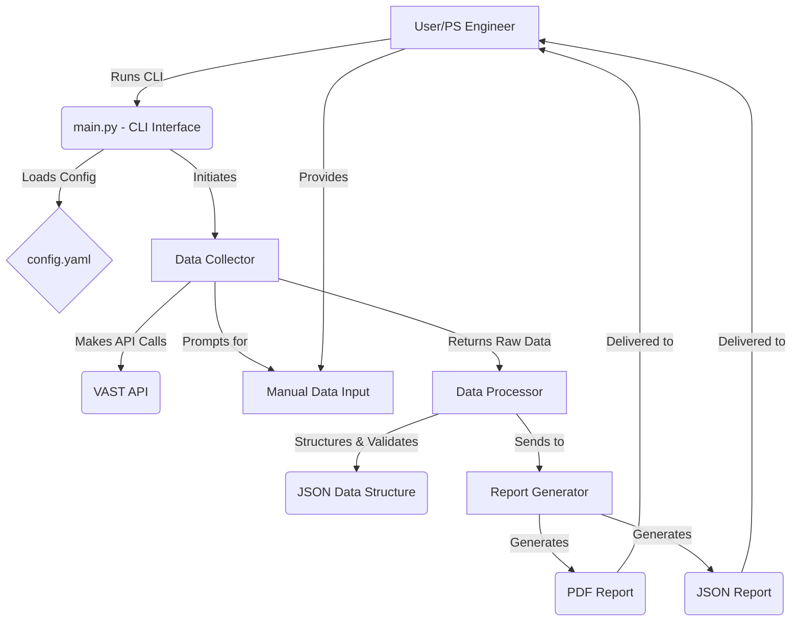

# VAST As-Built Report Generator: Design Guide

**Version:** 1.0
**Author:** Manus AI
**Date:** September 11, 2025

---

## 1. Introduction

### 1.1. Purpose

This document provides a comprehensive design and implementation guide for the **VAST As-Built Report Generator**. It serves as the primary technical reference for the development team, outlining the project's architecture, data collection methodologies, report structure, and implementation details. This guide is intended to ensure that the final product aligns with the project's requirements and is developed in a consistent, maintainable, and scalable manner.

### 1.2. Scope

The scope of this guide covers the end-to-end design of the report generator, including:

- **System Architecture:** The overall structure of the application and its components.
- **Data Collection:** The specific data points to be collected, the API endpoints to be used, and the handling of data that requires manual input.
- **Data Processing:** The transformation and structuring of raw data into a format suitable for reporting.
- **Report Generation:** The layout, formatting, and content of the final PDF and JSON reports.
- **Implementation Details:** The key modules, classes, and functions to be implemented.

### 1.3. Target Audience

This guide is intended for the AI development team responsible for building the VAST As-Built Report Generator. It assumes a technical understanding of Python, REST APIs, and software development principles.

---

## 2. System Architecture

The VAST As-Built Report Generator will be designed as a modular, command-line application with a clear separation of concerns. The architecture is based on a three-tier model, consisting of a data collection layer, a data processing layer, and a presentation layer.

### 2.1. Architectural Diagram



### 2.2. Component Descriptions

- **CLI Interface (`main.py`):** The entry point of the application. It handles command-line argument parsing, configuration file loading, and orchestration of the data collection, processing, and report generation workflow.
- **Configuration (`config.yaml`):** A YAML file that stores all configurable parameters, including API endpoints, credentials (to be handled securely), report formatting options, and logging settings.
- **Data Collector (`data_collector.py`):** Responsible for all data gathering activities. It will contain two main components:
    - **API Handler:** Interacts with the VAST REST API to collect automated data.
    - **Manual Input Handler:** Prompts the user for data that cannot be collected via the API.
- **Data Processor (`data_processor.py`):** Takes the raw data from the Data Collector, validates it, structures it according to a predefined schema, and prepares it for report generation.
- **Report Generator (`report_generator.py`):** Consumes the structured data from the Data Processor and generates the final output reports in both PDF and JSON formats.

---


## 3. Data Points and Collection Methods

This section details every data point to be included in the as-built report, along with its collection method (API or manual). This serves as the definitive list of all information to be gathered.

### 3.1. Cluster Hardware Details

| Data Point                 | Collection Method | API Endpoint / Schema Path                  | Notes                                                                 |
| -------------------------- | ----------------- | ------------------------------------------- | --------------------------------------------------------------------- |
| **BOM**                    |                   |                                             |                                                                       |
| Part Numbers               | Manual            | -                                           | User will be prompted to enter this information.                      |
| Quantities                 | API               | `/api/cnodes/`, `/api/dnodes/`, `/api/switches/` | Count of objects returned from each endpoint.                         |
| Serial Numbers             | API               | `[cbox, dbox, switch].serial`               |                                                                       |
| **CBoxes**                 |                   |                                             |                                                                       |
| Quantity                   | API               | `/api/cboxes/` (count)                      |                                                                       |
| Hardware type & manufacturer | API               | `cbox.model`                                |                                                                       |
| # of Nodes                 | API               | `cbox.nodes` (count)                        |                                                                       |
| # of NICs                  | API               | `cnode.network_interfaces` (count)          |                                                                       |
| B2B enabled?               | API               | `cluster.b2b_enabled`                       |                                                                       |
| Encryption enabled?        | API               | `cluster.encryption_enabled`                |                                                                       |
| Similarity enabled?        | API               | `cluster.similarity_enabled`                |                                                                       |
| VAST Code Version(s)       | API               | `cluster.vast_version`                      |                                                                       |
| Rack Height (U#)           | API               | `cbox.index_in_rack`                        |                                                                       |
| **DBoxes**                 |                   |                                             |                                                                       |
| Quantity                   | API               | `/api/dboxes/` (count)                      |                                                                       |
| Hardware type & manufacturer | API               | `dbox.model`                                |                                                                       |
| # of Nodes                 | API               | `dbox.nodes` (count)                        |                                                                       |
| B2B enabled?               | API               | `cluster.b2b_enabled`                       |                                                                       |
| VAST Code Version(s)       | API               | `cluster.vast_version`                      |                                                                       |
| Rack Height (U#)           | API               | `dbox.index_in_rack`                        |                                                                       |
| **Switches**               |                   |                                             |                                                                       |
| Quantity                   | API               | `/api/switches/` (count)                    |                                                                       |
| Hardware type & manufacturer | API               | `switch.type`                               | e.g., mellanox, arista                                                |
| Protocol                   | API               | `switch.type`                               | Implies Ethernet or IB                                                |
| Port Count                 | API               | `/api/ports/` (count per switch)            |                                                                       |
| Port Speed(s)              | API               | `port.speed`                                |                                                                       |
| Port Function              | API               | `port.model`                                | PORT, MLAG, CHANNEL                                                   |
| Ports in use               | API               | `port.state`                                |                                                                       |
| Ports Available            | Derived           | Port Count - Ports in use                   |                                                                       |
| Switch role                | Manual            | -                                           | Master/Slave - requires manual input.                                 |
| Switch tier                | Manual            | -                                           | Leaf/Spine - requires manual input.                                   |
| Firmware Version(s)      | API               | `switch.firmware_version`                   |                                                                       |
| Cables                     | Manual            | -                                           | direct/splitter - requires manual input.                              |
| **Northbound Connection**  | Manual            | -                                           | Switch to Switch / CNode to Switch - requires manual input.           |

### 3.2. Cluster Deployment Details

| Data Point          | Collection Method | API Endpoint / Schema Path | Notes                               |
| ------------------- | ----------------- | -------------------------- | ----------------------------------- |
| Usable Capacity     | API               | `cluster.usable_capacity`  |                                     |
| Licensed Capacity   | API               | `cluster.licensed_capacity`|                                     |
| Protocol            | API               | `/api/views/` (`protocol`) | Aggregate from all views.           |
| Use Case(s)         | Manual            | -                          | AI, ML, HPC, etc. - manual input.   |
| Advanced Features   | API               | `cluster.*_enabled`        | e.g., replication_enabled           |

### 3.3. Cluster Administration Details

| Data Point                  | Collection Method | API Endpoint / Schema Path        | Notes                                                                 |
| --------------------------- | ----------------- | --------------------------------- | --------------------------------------------------------------------- |
| Cluster Name                | API               | `cluster.name`                    |                                                                       |
| Cluster PSNT                | API               | `cluster.psnt`                    |                                                                       |
| Cluster VMS VIP             | API               | `/api/vips/` (filter for mgmt)    |                                                                       |
| Default Users & Passwords   | Manual/Secure     | -                                 | Do not store in report. Prompt for acknowledgement of secure handling. |
| **IP Information**          |                   |                                   |                                                                       |
| Network Services            | API               | `/api/dns/`, `/api/ntp/`, etc.    |                                                                       |
| CNode/DNode/Switch Mgmt     | API               | `[cnode, dnode, switch].mgmt_ip`  |                                                                       |
| Data Network                | API               | `/api/vips/`                      |                                                                       |
| **Network Configuration**   |                   |                                   |                                                                       |
| Node to Switch Connectivity | Manual/External   | -                                 | Requires external tool or manual documentation.                       |
| Network Port Map            | API               | `/api/ports/`                     |                                                                       |
| Switch Configuration        | External          | -                                 | Export from switch directly.                                          |
| Cable Routing Validation    | External          | -                                 | Requires dedicated tool.                                              |

---


## 4. API Interaction and Data Handling

This section provides a detailed breakdown of the API calls to be made, the data handling procedures, and the error management strategies.

### 4.1. API Endpoint Mapping

The following table maps the report sections to the specific VAST API endpoints that will be used for data collection.

| Report Section                | Primary API Endpoints                                     | HTTP Method |
| ----------------------------- | --------------------------------------------------------- | ----------- |
| Cluster Summary               | `/api/clusters/{id}/`                                     | GET         |
| Hardware Inventory (CBoxes)   | `/api/cboxes/`                                            | GET         |
| Hardware Inventory (DBoxes)   | `/api/dboxes/`                                            | GET         |
| Hardware Inventory (Switches) | `/api/switches/`                                          | GET         |
| Network Configuration         | `/api/vips/`, `/api/dns/`, `/api/ntp/`                     | GET         |
| Switch Port Details           | `/api/ports/`                                             | GET         |
| Logical Configuration         | `/api/tenants/`, `/api/views/`, `/api/viewpolicies/`       | GET         |
| Security Configuration        | `/api/activedirectory/`, `/api/ldap/`                     | GET         |
| Data Protection               | `/api/snapshotpolicies/`                                  | GET         |

### 4.2. Authentication

- **Method:** Token-based authentication will be used for all API requests.
- **Credential Storage:** API tokens will be retrieved from environment variables (`VAST_API_TOKEN`) or prompted for securely at runtime. Tokens will not be stored in the configuration file.
- **Session Management:** A single authenticated session will be created and reused for all API calls within a single execution of the tool.

### 4.3. Error Handling and Resilience

- **Connection Errors:** The API handler will implement a retry mechanism with exponential backoff for transient network errors (e.g., connection timeouts, DNS failures).
- **HTTP Status Codes:**
    - `200 OK`: Success. The data will be processed.
    - `401 Unauthorized`: Authentication failure. The tool will terminate with a clear error message.
    - `404 Not Found`: The requested resource does not exist. The tool will log a warning and mark the corresponding data as "Unavailable" in the report.
    - `5xx Server Error`: A server-side error occurred. The tool will retry the request up to a configurable number of times. If the error persists, it will be logged, and the data will be marked as "Unavailable."
- **Graceful Degradation:** If a non-critical API call fails, the tool will not crash. It will log the error, skip the corresponding section in the report, and continue with the rest of the data collection process.

### 4.4. Data Transformation

- **Raw to Structured:** The Data Processor will transform the raw JSON responses from the API into a structured, validated format. This will involve:
    - **Flattening:** Nested JSON objects will be flattened to simplify data access.
    - **Renaming:** API field names will be mapped to more human-readable names for the report.
    - **Type Conversion:** Data types will be converted as needed (e.g., string to integer).
- **Data Validation:** The structured data will be validated against a predefined JSON schema to ensure its integrity before being passed to the Report Generator.

---


## 5. Report Layout and Formatting

This section defines the structure and style of the final PDF report, ensuring a professional and consistent presentation of the as-built documentation.

### 5.1. Report Structure

The PDF report will be organized into the following sections, in the order listed:

1.  **Title Page:**
    - Report Title: "VAST Data Cluster As-Built Report"
    - Customer Name
    - Cluster Name
    - Generation Date
    - VAST Logo

2.  **Table of Contents:**
    - An automatically generated table of contents with clickable links to each section.

3.  **Executive Summary:**
    - A high-level overview of the cluster, including:
        - Cluster Name and PSNT
        - VAST Code Version
        - Total Usable and Licensed Capacity
        - Key features enabled (e.g., Encryption, Replication)

4.  **Hardware Inventory:**
    - A detailed inventory of all hardware components, organized by type:
        - **CBoxes:** Table with Quantity, Model, Serial Number, # of Nodes, Rack Height.
        - **DBoxes:** Table with Quantity, Model, Serial Number, # of Nodes, Rack Height.
        - **Switches:** Table with Quantity, Model, Serial Number, Firmware Version, Protocol.

5.  **Network Configuration:**
    - A summary of the cluster's network configuration, including:
        - **Management Network:** VMS VIP, DNS, NTP servers.
        - **Data Network:** VIP pools and subnets.
        - **Switch Port Map:** A table detailing each switch port, its connected device, speed, and status.

6.  **Logical Configuration:**
    - An overview of the logical configuration of the cluster, including:
        - **Tenants:** A list of all configured tenants.
        - **Views:** A table of all views, their protocols, and associated policies.
        - **Snapshot Policies:** A summary of all snapshot policies and their schedules.

7.  **Security Configuration:**
    - A summary of the security settings, including:
        - **Authentication Providers:** Details of any configured AD or LDAP servers.
        - **User Mappings:** An overview of user and group mappings.

8.  **Appendix: Manual Data:**
    - A section containing all data that was manually entered, clearly marked as such. This will include:
        - BOM Part Numbers
        - Switch Roles and Tiers
        - Northbound Connection Details

### 5.2. Formatting and Style

- **Typography:**
    - **Headings:** Sans-serif, bold (e.g., Arial, Helvetica).
    - **Body Text:** Serif, regular (e.g., Times New Roman, Georgia).
- **Color Palette:**
    - The report will use the official VAST Data color palette for headings, tables, and other visual elements.
- **Tables:**
    - All tables will have clear headers, alternating row colors for readability, and consistent alignment.
- **Headers and Footers:**
    - **Header:** VAST Logo and Report Title.
    - **Footer:** Page Number and Generation Date.

### 5.3. JSON Report Format

The JSON report will be a single, well-structured file containing all the data collected, both from the API and from manual input. The JSON schema will be defined and documented in the project's `docs` directory. This file will serve as a machine-readable version of the as-built documentation, suitable for integration with other systems.

---


## 6. Implementation Details

This section provides specific implementation guidance for the key modules and functions within the VAST As-Built Report Generator.

### 6.1. Module Structure

The application will be organized into the following Python modules:

```
src/
├── __init__.py
├── main.py                 # CLI entry point
├── config_manager.py       # Configuration handling
├── api_handler.py          # VAST API interaction
├── data_collector.py       # Data collection orchestration
├── data_processor.py       # Data transformation and validation
├── report_generator.py     # PDF and JSON report generation
├── manual_input.py         # Manual data input handling
└── utils.py               # Logging and utility functions
```

### 6.2. Key Classes and Functions

#### 6.2.1. APIHandler Class (`api_handler.py`)

```python
class APIHandler:
    def __init__(self, base_url: str, token: str):
        """Initialize API handler with cluster URL and authentication token."""
        
    def authenticate(self) -> bool:
        """Authenticate with the VAST cluster and establish session."""
        
    def get_cluster_info(self) -> dict:
        """Retrieve cluster-level information including PSNT."""
        
    def get_cboxes(self) -> list:
        """Retrieve all CBox information including rack heights."""
        
    def get_dboxes(self) -> list:
        """Retrieve all DBox information including rack heights."""
        
    def get_switches(self) -> list:
        """Retrieve all switch information."""
        
    def get_ports(self) -> list:
        """Retrieve all port information."""
        
    def get_network_config(self) -> dict:
        """Retrieve network configuration (VIPs, DNS, NTP)."""
```

#### 6.2.2. DataProcessor Class (`data_processor.py`)

```python
class DataProcessor:
    def __init__(self, raw_data: dict):
        """Initialize with raw data from API and manual input."""
        
    def validate_data(self) -> bool:
        """Validate data against predefined schema."""
        
    def transform_hardware_data(self) -> dict:
        """Transform hardware data into report format."""
        
    def calculate_derived_metrics(self) -> dict:
        """Calculate derived metrics (e.g., available ports)."""
        
    def generate_structured_data(self) -> dict:
        """Generate final structured data for report generation."""
```

#### 6.2.3. ReportGenerator Class (`report_generator.py`)

```python
class ReportGenerator:
    def __init__(self, structured_data: dict, config: dict):
        """Initialize with structured data and formatting configuration."""
        
    def generate_pdf_report(self, output_path: str) -> bool:
        """Generate professional PDF report."""
        
    def generate_json_report(self, output_path: str) -> bool:
        """Generate machine-readable JSON report."""
        
    def create_title_page(self) -> None:
        """Create report title page with VAST branding."""
        
    def create_hardware_section(self) -> None:
        """Create hardware inventory section with tables."""
```

### 6.3. Configuration Management

The application will use a YAML configuration file (`config/config.yaml`) with the following structure:

```yaml
api:
  base_url: "https://vms.vast.local"
  timeout: 30
  retry_attempts: 3
  retry_delay: 2

logging:
  level: "INFO"
  file: "logs/vast_report_generator.log"
  max_size: "10MB"
  backup_count: 5

report:
  output_directory: "output"
  pdf_filename: "vast_asbuilt_report_{timestamp}.pdf"
  json_filename: "vast_asbuilt_data_{timestamp}.json"
  
formatting:
  font_family: "Arial"
  font_size: 12
  table_style: "grid"
  color_scheme: "vast_blue"
```

### 6.4. Error Handling Strategy

The application will implement comprehensive error handling:

- **Network Errors:** Retry with exponential backoff
- **Authentication Errors:** Clear error message and termination
- **Data Validation Errors:** Log warning and continue with available data
- **File I/O Errors:** Clear error message with suggested resolution

### 6.5. Testing Strategy

- **Unit Tests:** Each module will have comprehensive unit tests
- **Integration Tests:** End-to-end testing against mock VAST API
- **Manual Testing:** Validation against live VAST clusters
- **Error Scenario Testing:** Testing of all error handling paths

---

## 7. Enhanced API Data Points Integration

### 7.1. Rack Height Implementation

The discovery of rack height data availability through the `index_in_rack` field requires specific implementation considerations:

#### 7.1.1. Data Collection Enhancement

```python
def get_hardware_with_positions(self) -> dict:
    """Enhanced hardware collection including rack positions."""
    cboxes = self.get_cboxes()
    dboxes = self.get_dboxes()
    
    # Extract rack position data
    for cbox in cboxes:
        cbox['rack_height'] = cbox.get('index_in_rack', 'Unknown')
    
    for dbox in dboxes:
        dbox['rack_height'] = dbox.get('index_in_rack', 'Unknown')
    
    return {'cboxes': cboxes, 'dboxes': dboxes}
```

#### 7.1.2. Report Integration

The rack height information will be integrated into the hardware inventory tables:

| Component | Model | Serial Number | Nodes | Rack Position (U) |
|-----------|-------|---------------|-------|-------------------|
| CBox-1    | C24   | CB001234      | 24    | 1-4               |
| DBox-1    | D24   | DB001234      | 24    | 5-8               |

### 7.2. PSNT Implementation

The Cluster PSNT (Product Serial Number Tracking) will be prominently featured in the executive summary:

#### 7.2.1. Data Collection

```python
def get_cluster_identification(self) -> dict:
    """Enhanced cluster info including PSNT."""
    cluster_info = self.get_cluster_info()
    return {
        'name': cluster_info.get('name', 'Unknown'),
        'psnt': cluster_info.get('psnt', 'Not Available'),
        'version': cluster_info.get('vast_version', 'Unknown')
    }
```

#### 7.2.2. Executive Summary Enhancement

The executive summary will include:
- **Cluster Name:** [Cluster Name]
- **Product Serial Number (PSNT):** [PSNT Value]
- **VAST Code Version:** [Version]
- **Total Capacity:** [Usable/Licensed]

### 7.3. Backward Compatibility

The implementation will gracefully handle clusters where these fields may not be available:

```python
def safe_get_field(self, data: dict, field: str, default: str = "Not Available") -> str:
    """Safely retrieve field with fallback for older API versions."""
    return data.get(field, default)
```

---

## 8. Conclusion

This design guide provides a comprehensive blueprint for implementing the VAST As-Built Report Generator. The modular architecture, detailed API mapping, and professional report formatting ensure that the final product will meet the requirements of VAST Professional Services engineers and provide significant value to customers.

The integration of the newly discovered API capabilities for rack heights and cluster PSNT enhances the automated data collection coverage to approximately 80%, significantly reducing manual data entry requirements while improving report accuracy and consistency.

The implementation should follow the development tasks outlined in the Initial Development Tasks document, with particular attention to the enhanced API data points integration as specified in this guide.

